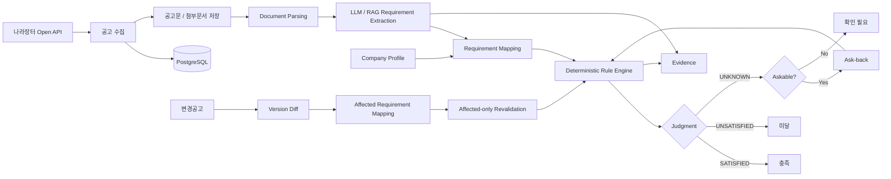

# 나라장터 변경공고 대응형 입찰 제출 검증기

> **변경공고가 올라온 뒤에도, 기존에 준비한 입찰이 여전히 유효한지 다시 확인합니다.**
> 나라장터 공고와 첨부문서를 분석해 참가자격과 원문 근거를 연결하고, 변경공고 발생 시 영향을 받은 요건을 추적하여 재검증하는 공공입찰 B2B 서비스입니다.

**SK Networks Family AI Camp 34기 · 3차 프로젝트 · 4팀**

> 현재 README는 최종 제출을 위한 기준선(Baseline) 문서입니다.
> 대표 UI, 최종 시스템 아키텍처, Golden Set 평가 수치, 실행 방법은 통합 검증 완료 후 순차적으로 보강합니다.

---

## 1. 프로젝트 개요

나라장터 입찰 공고는 최초 게시 이후에도 정정·변경·취소될 수 있습니다.

기업이 이미 참가자격을 검토하고 제출서류를 준비한 상황에서 변경공고가 발생하면, 담당자는 공고 전체를 다시 확인하면서 다음 질문에 답해야 합니다.

> **무엇이 바뀌었고, 기존에 준비한 입찰에 어떤 영향을 주는가?**

본 프로젝트는 실제 나라장터 공고와 첨부문서를 수집하고, 참가자격 요건과 원문 근거를 구조화하여 기업 정보를 기준으로 판정합니다.

이후 변경공고가 발생하면 이전 버전과 현재 버전을 비교하고, **실제로 영향을 받은 자격요건을 찾아 해당 항목만 다시 검증**합니다.

### 전체 흐름

```text
실제 나라장터 공고 조회
        ↓
공고문·첨부문서 수집
        ↓
공고 버전 및 원문 관리
        ↓
참가자격 Requirement 추출
        ↓
회사 프로필과 요건 비교
        ↓
참가자격 판정
        ↓
근거 원문 확인
        ↓
정보 부족 시 Ask-back
        ↓
변경공고 발생
        ↓
이전 버전 ↔ 최신 버전 비교
        ↓
영향받은 Requirement 식별
        ↓
영향 요건만 재검증
```

### 핵심 목표

* 공고문과 첨부문서에 흩어진 참가자격 조건을 구조화합니다.
* 판정 결과와 실제 공고 원문 근거를 함께 제공합니다.
* 정보가 부족한 경우 임의로 추정하지 않고 추가 확인이 필요한 상태로 처리합니다.
* 사용자가 답변할 수 있는 정보라면 Ask-back을 통해 보완하고 해당 요건을 다시 판정합니다.
* 변경공고 발생 시 변경된 Requirement와 기존 판정의 영향을 추적합니다.
* AI가 공고 해석과 설명을 돕되 최종 참가 가능 여부는 재현 가능한 규칙으로 처리합니다.

---

## 2. 프로젝트 배경 및 문제 정의

나라장터 입찰 담당자는 하나의 공고를 검토할 때 공고 제목이나 마감일만 확인하지 않습니다.

다음과 같은 조건을 함께 확인해야 합니다.

* 업종 및 면허 등록 조건
* 지역 제한
* 기업 규모
* 각종 인증 및 등록 여부
* 수행실적
* 인력 조건
* 제출서류
* 계약 관련 조건
* 공고 첨부문서
* 변경·정정·취소 공고 이력

문제는 최초 검토 이후에도 공고 내용이 변경될 수 있다는 점입니다.

예를 들어 기업이 이미 특정 공고에 대해

```text
참가 가능 판정
→ 제출서류 준비
→ 내부 검토
```

까지 완료했더라도, 이후 변경공고에서 지역이나 업종 조건이 수정되면 기존 판정 결과가 더 이상 유효하지 않을 수 있습니다.

그러나 사용자가 직접 변경 전·후 공고문을 비교하려면 상당한 시간이 필요합니다.

본 프로젝트는 단순히

> “공고가 변경되었습니다.”

를 알려주는 것에서 끝나지 않고,

> **“어떤 조건이 변경되었고, 그 변경으로 기존 참가자격 판정이 어떻게 달라졌는가?”**

를 원문 근거와 함께 보여주는 것을 목표로 합니다.

---

## 3. 핵심 기능

| 기능                  | 설명                                                 |
| ------------------- | -------------------------------------------------- |
| 나라장터 공고 조회          | 실제 나라장터 공고를 수집하고 검색하여 검토 대상을 선택합니다.                |
| 공고 버전 관리            | 최초공고·변경공고 등 동일 공고의 버전을 관리합니다.                      |
| 공고문·첨부문서 수집         | 공고 원문과 PDF/HWP/HWPX 등의 첨부문서를 함께 관리합니다.             |
| 문서 Parsing          | 공고문과 첨부문서를 분석 가능한 텍스트 구조로 변환합니다.                   |
| 참가자격 Requirement 추출 | 자연어 공고문에서 판정에 필요한 참가자격 요건과 근거를 구조화합니다.             |
| 회사 프로필 매칭           | 회사가 보유한 등록·인증·지역·실적 등의 정보를 공고 요건과 비교합니다.           |
| 결정론적 참가자격 판정        | Requirement와 회사 정보를 규칙으로 비교하여 상태를 판정합니다.           |
| Ask-back            | 판정에 필요한 회사 정보가 부족한 경우 사용자가 답변 가능한 항목을 추가로 확인합니다.   |
| 근거 원문 확인            | 판정 결과와 실제 공고 원문 Evidence를 연결하여 사용자가 직접 확인할 수 있습니다. |
| 변경공고 Diff           | 이전 공고 버전과 최신 버전을 비교하여 변경 내용을 식별합니다.                |
| 영향 요건 추적            | 변경 내용과 연결된 Requirement를 찾아 재검증 대상으로 지정합니다.         |
| 변경공고 재검증            | 영향을 받은 Requirement만 다시 판정하여 기존 결과의 유효성을 확인합니다.     |
| AI Copilot          | 자연어로 공고, 참가자격, 근거, 변경사항 등을 탐색하도록 지원합니다.            |

---

## 4. 대표 사용자 시나리오

### 4.1 최초 공고 검토

```text
사용자가 공고 검색
        ↓
검토할 공고 선택
        ↓
공고문 및 첨부문서 분석
        ↓
참가자격 Requirement 추출
        ↓
회사 프로필과 Requirement 비교
        ↓
참가자격 판정
        ↓
근거 원문 확인
```

### 4.2 회사 정보가 부족한 경우

공고에서 필요한 조건이 존재하지만 회사 프로필만으로 판단할 수 없는 경우 모든 `UNKNOWN`을 동일하게 처리하지 않습니다.

사용자가 직접 답변하여 해결할 수 있는 항목은 Ask-back 대상으로 구분합니다.

```text
Requirement 판정
      ↓
UNKNOWN
      ↓
사용자에게 확인 가능한 정보인가?
      ↓
Yes ──→ Ask-back
             ↓
        사용자 답변
             ↓
        해당 Requirement 재판정

No ──→ 확인 필요 상태 유지
```

### 4.3 변경공고 발생

```text
기준 공고 v1
        ↓
참가자격 판정 완료
        ↓
변경공고 v2 발생
        ↓
v1 ↔ v2 비교
        ↓
변경 내용 식별
        ↓
영향 Requirement 추적
        ↓
해당 Requirement만 재판정
        ↓
변경 전·후 판정 비교
        ↓
변경 근거 원문 확인
```

---

## 5. 시스템 흐름



---

## 6. AI 설계 원칙

### LLM이 잘하는 일과 규칙이 잘하는 일을 분리했습니다

본 프로젝트에서는 모든 판단을 LLM에게 맡기지 않습니다.

공고문처럼 자연어 해석이 필요한 영역과 동일 입력에 대해 일관된 결과가 필요한 판정 영역을 분리했습니다.

| 영역                    | 담당                         |
| --------------------- | -------------------------- |
| 공고 자연어 해석             | LLM                        |
| 참가자격 Requirement 추출   | LLM / RAG                  |
| 근거 탐색 및 설명            | RAG / LLM                  |
| 회사 정보와 Requirement 연결 | Backend                    |
| 최종 참가자격 판정            | Deterministic Rule Engine  |
| 정보 부족 상태 분류           | Rule / Policy              |
| 사용자 추가 정보 요청          | Ask-back / AI Copilot      |
| 공고 버전 비교              | Version Diff               |
| 변경 영향 Requirement 추적  | Diff + Requirement Mapping |
| 변경 후 재판정              | Rule Engine                |

> **LLM은 공고를 읽고 구조화하고 설명하지만, 최종 참가 가능/불가를 임의로 결정하지 않습니다.**

이 구조를 통해 다음을 확보하는 것을 목표로 했습니다.

* 동일 조건에 대한 판정 일관성
* 판정 과정 추적 가능성
* 오류 원인 분석 가능성
* 회귀 테스트(regression test) 가능성
* LLM 응답 변화와 비즈니스 판정 로직 분리

---

## 7. 판정 구조

참가자격은 기본적으로 다음 세 상태를 사용합니다.

| 상태            | 의미                           |
| ------------- | ---------------------------- |
| `SATISFIED`   | 현재 회사 정보 기준으로 해당 요건을 충족      |
| `UNSATISFIED` | 현재 회사 정보 기준으로 해당 요건을 충족하지 못함 |
| `UNKNOWN`     | 현재 정보만으로 판정할 수 없음            |

`UNKNOWN`이라고 해서 모든 항목을 사용자에게 다시 묻지는 않습니다.

```text
UNKNOWN
   ↓
사용자가 제공할 수 있는 정보인가?
   ↓
ASKABLE
   ↓
Ask-back
```

따라서 프로젝트에서는 다음 두 개념을 구분합니다.

```text
UNKNOWN ≠ ASKABLE
```

이는 사용자가 답변할 수 없는 정보를 반복해서 질문하거나, 근거가 없는 상태에서 임의 판정을 내리는 것을 방지하기 위한 정책입니다.

---

## 8. 변경공고 재검증

본 프로젝트에서 가장 중요한 기능 중 하나입니다.

기존 참가자격 결과 전체를 무조건 다시 만드는 대신 변경공고가 어떤 Requirement에 영향을 주었는지 먼저 찾습니다.

### 처리 흐름

```text
Previous Notice
      ↓
Current Notice
      ↓
Notice Version Diff
      ↓
Requirement Diff
      ↓
Affected Requirement
      ↓
Revalidation
```

예를 들어 변경공고에서

```text
지역 제한:
서울특별시
    ↓
서울특별시 또는 경기도
```

로 변경되었다면 지역 Requirement와 연결된 판정만 우선적으로 다시 검증할 수 있습니다.

반대로 입찰 제출 마감일만 변경되고 참가자격 Requirement에는 영향이 없다면 기존 자격 판정을 불필요하게 다시 생성하지 않는 방향을 지향합니다.

---

## 9. Evidence 중심 설계

참가자격 결과만 보여주는 것이 아니라 사용자가 직접 판단 근거를 확인할 수 있도록 설계했습니다.

```text
Requirement
      ↓
Judgment
      ↓
Evidence
      ↓
공고 원문
```

사용자는 다음 흐름으로 결과를 확인할 수 있습니다.

```text
참가 불가
   ↓
어떤 Requirement 때문인가?
   ↓
어떤 조건이 미달인가?
   ↓
공고 원문에서 어디에 작성되어 있는가?
```

LLM이 생성한 설명 자체를 근거로 사용하는 것이 아니라, 가능한 한 실제 공고 원문과 연결하는 것을 목표로 합니다.

---

## 10. 화면 구성

서비스는 입찰 검토 과정에 맞춰 다음 화면으로 구성합니다.

| 화면         | 주요 목적                    |
| ---------- | ------------------------ |
| 공고 찾기      | 실제 나라장터 공고 검색 및 검토 대상 선택 |
| 참가자격 검토    | 회사 프로필을 기준으로 참가자격 확인     |
| 확인 필요      | 부족한 회사 정보를 사용자에게 추가 확인   |
| 근거 원문      | 판정에 사용된 실제 공고 원문 확인      |
| 평가 대응      | 평가 관련 공고 정보를 확인          |
| 변경 이력      | 공고 버전별 변경사항 및 재검증 결과 확인  |
| 회사 프로필     | 판정에 사용하는 회사 정보 관리        |
| AI Copilot | 자연어 기반 서비스 탐색 및 질의       |

### 주요 사용자 흐름

```text
공고 검색
   ↓
참가자격 검토
   ↓
확인 필요
   ↓
근거 원문
   ↓
변경공고 발생
   ↓
변경 이력
   ↓
재검증 결과 확인
```

> **대표 UI 이미지 추가 예정**
>
> 최종 Frontend 확정 후 아래 흐름을 중심으로 화면 이미지를 배치합니다.
>
> `공고 찾기 → 참가자격 → Ask-back → Evidence → 변경공고 → 재검증`

---

## 11. 데이터 파이프라인

```text
나라장터 Open API
      ↓
Notice 수집
      ↓
Notice Version 관리
      ↓
공고 원문 / 첨부문서 다운로드
      ↓
원본 보존
      ↓
Document Parsing
      ↓
Requirement Extraction
      ↓
Company Profile Mapping
      ↓
Judgment
      ↓
Evidence
```

### 변경공고

```text
새로운 Notice Version 수집
        ↓
기존 Version과 비교
        ↓
변경 내용 추출
        ↓
Requirement 영향 분석
        ↓
Affected Requirement 재검증
```

---

## 12. 데이터 및 Evaluation

프로젝트에서는 단순히 기능을 구현하는 것에서 끝내지 않고 고정된 검증 데이터를 기준으로 개선 전·후 결과를 비교하는 것을 목표로 합니다.

### Golden Set

현재 팀 공통 평가용 데이터로 다음 기준을 사용하고 있습니다.

| 항목            |                     규모 |
| ------------- | ---------------------: |
| Golden Set 공고 |                    20건 |
| 회사 프로필        |                    32개 |
| 변경공고 사례       | 실제 나라장터 변경 이력 기반 검증 진행 |

Golden Set은 단순 랜덤 공고가 아니라 다음과 같은 사례를 포함할 수 있도록 선정했습니다.

* 참가자격 조건이 비교적 명확한 공고
* 업종·지역·인증 등 주요 Requirement가 포함된 공고
* 공고 원문과 첨부문서를 함께 확인할 수 있는 공고
* 변경공고가 존재하는 공고
* 변경 전·후 Requirement 비교가 가능한 사례

### Evaluation 방향

| 평가 대상                  | 주요 지표                         | 현재 상태      |
| ---------------------- | ----------------------------- | ---------- |
| Requirement Extraction | Precision / Recall / F1       | 최종 평가 후 반영 |
| Evidence 연결            | Citation Accuracy / Recall    | 최종 평가 후 반영 |
| 참가자격 판정                | Judgment Accuracy             | 최종 평가 후 반영 |
| 변경 탐지                  | Change Detection Recall       | 최종 평가 후 반영 |
| 변경 재검증                 | Affected Requirement Accuracy | 최종 평가 후 반영 |
| AI Copilot             | Task Success Rate             | 최종 평가 후 반영 |

### 개선 과정

최종 Evaluation은 다음 흐름으로 기록합니다.

```text
Baseline
   ↓
Golden Set Evaluation
   ↓
Failure Analysis
   ↓
Pipeline / Prompt / Rule 개선
   ↓
Regression Test
   ↓
동일 Golden Set 재평가
   ↓
Before / After 비교
```

최종 README에는 단순 최종 점수만 작성하지 않고 가능한 경우 개선 전·후 결과를 함께 제시합니다.

---

## 13. AI Copilot

AI Copilot은 서비스 기능을 자연어로 사용할 수 있도록 돕는 인터페이스입니다.

단순 자유 대화형 챗봇보다 다음과 같은 **사용자 작업(Task)** 수행을 목표로 합니다.

예:

```text
"이 공고 참가할 수 있어?"
"왜 미달이야?"
"두 번째 조건 근거 보여줘."
"변경공고에서 뭐가 바뀌었어?"
"그 조건 다시 확인해줘."
```

Copilot은 대화 맥락을 사용할 수 있지만 서비스의 사실 데이터를 대화 메모리에만 의존하지 않습니다.

### 핵심 원칙

> **대화는 기억하되, 사실은 Backend에서 다시 확인합니다.**

사용자가 말한

* “그 조건”
* “두 번째”
* “아까 변경된 항목”

등은 대화 맥락으로 연결할 수 있지만,

* 실제 Requirement
* 현재 판정
* Evidence
* 공고 Version
* Company Profile

등의 서비스 사실 정보는 Backend 기준으로 다시 확인하는 구조를 지향합니다.

---

## 14. 기술 스택

| 영역              | 기술                                              |
| --------------- | ----------------------------------------------- |
| Frontend        | React 19, TypeScript, Vinext, Vite              |
| UI              | Tailwind CSS, shadcn, Base UI                   |
| Document Viewer | rhwp                                            |
| Backend         | Python, FastAPI                                 |
| Database        | PostgreSQL 16                                   |
| DB Migration    | Alembic                                         |
| AI              | OpenAI API, LLM/RAG                             |
| Data Source     | 나라장터 Open API                                   |
| Infra           | Docker, Docker Compose                          |
| Collaboration   | GitHub, GitHub Projects, Figma, Discord, Notion |

> GitHub Projects는 프로젝트 전 기간의 주 관리 도구라기보다, 후반부에 Issue와 작업 상태를 연결하기 위해 보조적으로 도입했습니다.
>
> 최종 사용 모델, 배포 환경, RAG 세부 구성은 최종 코드 기준으로 다시 확인하여 확정합니다.

---

## 15. 시스템 구성

```text
Frontend
  React / TypeScript
        │
        │ API
        ▼
Backend
  FastAPI
        │
        ├─────────────┐
        │             │
        ▼             ▼
PostgreSQL        AI Analysis
                 LLM / RAG
        │             │
        └──────┬──────┘
               ▼
       Requirement / Judgment
               │
               ▼
             Evidence
```

### 수집 영역

```text
나라장터 Open API
        ↓
Notice Poller
        ↓
공고 및 Version 저장
        ↓
첨부문서 저장
        ↓
Parsing
        ↓
Analysis Pipeline
```

---

## 16. 프로젝트 구조

최종 제출 저장소의 디렉터리 구조는 코드 동기화 이후 확정합니다.

예정 구조:

```text
SKN34-3rd-4Team/
├── README.md
├── apps/
│   ├── web/                  # Frontend
│   └── api/                  # Backend
│
├── data/                     # 평가 및 프로젝트 데이터
├── db/                       # DB 관련 설정 및 seed
├── scripts/                  # 데이터/검증 유틸리티
├── samples/                  # Sample / Demo data
│
├── docs/
│   ├── architecture.md
│   ├── data-pipeline.md
│   ├── evaluation.md
│   ├── troubleshooting.md
│   └── collaboration.md
│
├── docker-compose.yml
└── .env.example
```

---

## 17. 팀 구성

| 팀원  | 주요 담당                                           |
| --- | ----------------------------------------------- |
| 김재현 | LLM / RAG · Requirement Extraction · Evaluation |
| 이홍규 | LLM / RAG · AI Copilot · 협업 인프라                 |
| 전진환 | Backend · API · 전체 시스템 구성                       |
| 정예린 | DB · Data Collection / Management               |
| 황수빈 | Frontend · UI/UX                                |

프로젝트는 각 파트가 독립적으로 결과물을 만드는 방식보다 다음 연결을 중요하게 두었습니다.

```text
Frontend
   ↕
Backend
   ↕
DB / Data
   ↕
LLM / RAG
```

각 파트의 출력이 실제 사용자 흐름에서 연결되는지를 기준으로 통합했습니다.

---

## 18. 협업 방식

프로젝트에서는 기능 구현뿐 아니라 여러 파트의 작업을 하나의 서비스로 통합하는 협업 과정을 중요하게 두었습니다.

실제 개발에서는 **GitHub Issue → Branch → Pull Request → Review → Merge** 흐름을 중심으로 작업했습니다.

```text
기획 / 화면 설계
      ↓
GitHub Issue
      ↓
Feature / Fix Branch
      ↓
Commit
      ↓
Pull Request
      ↓
Review / Test
      ↓
Merge
      ↓
통합 상태 확인
```

### 사용 도구

* **GitHub** — 코드, Branch, Pull Request, Issue 관리
* **GitHub Projects** — 일부 Issue와 작업 상태 관리 보조
* **Figma** — 화면 설계 및 UI/UX 기준 공유
* **Discord** — 작업현황 공유, 파트 간 요청사항 및 Blocker 논의
* **Notion** — 기획, 설계, Evaluation 및 프로젝트 문서 관리

### 실제 운영 방식

* 기능 또는 수정 단위로 Branch 생성
* GitHub Issue와 관련 Branch / Pull Request 연결
* Pull Request를 통한 변경사항 공유
* 주요 변경사항 Review 후 통합
* Frontend / Backend / DB / LLM-RAG 간 영향 범위를 PR에서 확인
* Discord 작업현황 공유를 통해 진행상황·Blocker·파트 간 요청사항 확인
* Figma를 화면 구성과 사용자 흐름 설계의 기준으로 활용
* Golden Set을 여러 파트가 함께 사용하는 공통 검증 데이터로 설정
* 통합 기준선(Baseline)을 확보한 뒤 파트별 고도화 진행

### 작업 관리 방식의 변화

프로젝트 초반에는 별도의 프로젝트 관리 도구 도입도 검토했지만, 실제 개발이 진행되면서 코드 변경과 가장 가까운 GitHub 중심으로 작업 방식을 단순화했습니다.

GitHub Projects도 처음부터 완전히 정착된 관리 체계는 아니었습니다.

후반부에 Issue와 작업 상태를 한 화면에서 확인하고 Discord의 작업현황과 맞춰보기 위한 보조 수단으로 활용했습니다.

따라서 프로젝트의 핵심 협업 경험은 특정 관리 도구 자체보다 다음 흐름에 있습니다.

> **작업을 Issue 단위로 나누고 → Branch에서 구현하고 → PR에서 공유·검토하고 → 실제 통합 상태를 다시 확인하는 과정**

---

## 19. 개발 및 통합 전략

프로젝트 초반에는 Frontend, Backend, DB/Data, LLM/RAG가 각자의 담당 영역을 중심으로 병렬 개발했습니다.

이 방식은 개별 기능을 빠르게 만드는 데에는 효과적이었지만, 시간이 지나면서 다음 문제가 생겼습니다.

* 각 파트의 기능이 실제 사용자 흐름에서 연결되는지 확인하기 어려움
* Frontend와 Backend의 데이터 계약 차이
* 별도 LLM/RAG 구현과 서비스 경로 사이의 차이
* 기능 추가가 기존 동작에 미치는 영향 확인 필요
* 팀원마다 바라보는 현재 기준 코드가 달라질 가능성

이에 중간부터 **통합 기준선(Integration Baseline)을 먼저 확보한 뒤 고도화하는 전략**으로 전환했습니다.

```text
파트별 병렬 개발
      ↓
Integration Baseline 구성
      ↓
Frontend ↔ Backend ↔ DB ↔ LLM/RAG 연결
      ↓
End-to-End 시나리오 검증
      ↓
회귀 테스트
      ↓
기준선 확보
      ↓
파트별 고도화
```

새로운 기능을 계속 추가하기보다 먼저 **실제로 처음부터 끝까지 동작하는 제품 기준선(Product Baseline)** 을 확보하고, 이후 변경이 기존 사용자 흐름을 깨뜨리지 않는지를 확인하면서 고도화하는 방식을 사용했습니다.

---

## 20. 주요 기술 의사결정

### 20.1 LLM이 최종 판정을 하지 않도록 분리

#### 문제

LLM이 참가 가능 여부까지 직접 결정하면 동일 조건에서도 응답이 달라질 가능성이 있습니다.

또한 잘못된 판정이 발생했을 때

* Requirement 추출이 잘못된 것인지
* 회사 정보 매핑이 잘못된 것인지
* 최종 판단 자체가 잘못된 것인지

원인을 구분하기 어려워집니다.

#### 결정

```text
LLM
→ Requirement Extraction

Rule Engine
→ Final Judgment
```

으로 역할을 분리했습니다.

#### 기대 효과

* 재현 가능한 판정
* 테스트 용이성
* 오류 원인 추적
* LLM 모델 교체 영향 감소
* 참가자격 규칙의 독립적인 개선 가능

---

### 20.2 `UNKNOWN`과 `ASKABLE` 분리

#### 문제

정보가 부족하다고 해서 모든 정보를 사용자에게 질문할 수 있는 것은 아닙니다.

모든 `UNKNOWN`을 Ask-back으로 보내면 사용자가 답할 수 없는 질문까지 반복적으로 나타날 수 있습니다.

#### 결정

```text
UNKNOWN
   ↓
Askable 여부 판단
   ↓
사용자가 답할 수 있는 경우에만 Ask-back
```

#### 기대 효과

* 불필요한 추가 질문 방지
* 추측 기반 판정 방지
* 사용자 경험 개선
* 미확인 상태와 실제 추가입력 가능 상태 분리

---

### 20.3 변경공고 전체 재판정 대신 영향 요건 재검증

#### 문제

변경공고가 발생할 때마다 전체 공고를 동일하게 다시 판정하면 어떤 변경이 실제 결과에 영향을 주었는지 알기 어렵습니다.

#### 결정

```text
Notice Diff
   ↓
Requirement Diff
   ↓
Affected Requirement
   ↓
Affected-only Revalidation
```

구조를 사용합니다.

#### 기대 효과

* 변경 원인 추적
* 판정 변화 설명 가능
* 불필요한 재처리 감소
* 사용자에게 중요한 변경사항 강조

---

### 20.4 Copilot의 대화 기억과 서비스 사실 분리

#### 문제

대화형 AI가 이전 답변을 그대로 사실처럼 기억하면 실제 Backend의 현재 상태와 달라질 수 있습니다.

#### 결정

```text
대화 맥락
→ "그 조건", "두 번째" 같은 참조 해석

실제 사실
→ Backend에서 다시 조회
```

#### 핵심 원칙

> **대화는 기억하되, 사실은 Backend에서 다시 확인합니다.**

---

## 21. 트러블슈팅 및 개선 과정

최종 프로젝트 문서에서는 단순 오류 목록이 아니라 다음 형식으로 주요 문제 해결 과정을 정리합니다.

```text
문제
↓
원인
↓
검토한 선택지
↓
선택한 해결 방법
↓
검증 결과
↓
남은 한계
```

현재 주요 정리 후보:

* 나라장터 공고 Version 및 변경공고 누락 검산
* 실제 변경공고 원문과 DB Version 불일치 확인
* LLM Extraction과 Rule Judgment 역할 분리
* `UNKNOWN != ASKABLE` 정책
* Evidence와 Requirement 연결
* 변경공고 Requirement Diff
* Golden Set 구축 및 공고 원문 검수
* Frontend ↔ Backend API 통합
* AI Copilot의 대화 Context와 Backend 사실 조회 분리
* 실제 사용자 시나리오 기준 Frontend 개선
* 병렬 개발 코드의 Integration Baseline 통합
* PR 간 의존성과 Merge 순서 관리

---

## 22. 프로젝트 산출물

SK Networks Family AI Camp 3차 프로젝트 가이드에 따라 다음 산출물을 정리합니다.

### 필수 산출물

* [ ] 데이터 수집 및 데이터 전처리 문서
* [ ] 시스템 아키텍처
* [ ] RAG 기반 LLM 및 데이터베이스 연동 구현 코드
* [ ] 테스트 계획 및 결과 보고서

### 추가 산출물

* [ ] UI / UX Flow
* [ ] 주요 실행 화면
* [ ] Evaluation 결과
* [ ] Golden Set 설명
* [ ] 트러블슈팅
* [ ] 기술 의사결정
* [ ] 역할 분담
* [ ] 협업 방식
* [ ] 향후 개선 계획

최종 제출 시 주요 내용은 README에서 요약하고 상세 내용은 `docs/` 문서로 분리합니다.

---

## 23. 실행 방법

최종 제출 코드가 공식 저장소에 동기화된 후 정확한 실행 절차를 다시 검증합니다.

현재 개발 환경 기준 전체 실행 흐름은 다음과 같습니다.

```text
환경 변수 설정
      ↓
PostgreSQL 실행
      ↓
DB Migration
      ↓
FastAPI Backend 실행
      ↓
나라장터 공고 수집
      ↓
Frontend 실행
      ↓
서비스 접속
```

### Backend / DB

```bash
docker compose up -d --build api
```

공고 수집기를 함께 사용하는 경우:

```bash
docker compose --profile collector up -d --build api notice-poller
```

### Frontend

```bash
cd apps/web

pnpm install
pnpm dev
```

### 기본 개발 주소

```text
Frontend
http://localhost:3000

Backend API
http://localhost:8000

Swagger
http://localhost:8000/docs
```

> 최종 제출 저장소 구조와 실행 방식이 확정되면 해당 기준으로 다시 검증하여 수정합니다.

---

## 24. 현재 구현 상태

최종 발표 기준으로 다시 검증하여 업데이트할 예정입니다.

| 영역                          | 상태            |
| --------------------------- | ------------- |
| 나라장터 공고 수집                  | 구현            |
| 공고 Version 관리               | 구현            |
| 첨부문서 수집                     | 구현            |
| 공고문 Parsing                 | 구현            |
| 참가자격 Requirement Extraction | 구현 / 고도화      |
| 회사 Profile Matching         | 구현            |
| Rule 기반 참가자격 판정             | 구현            |
| Ask-back                    | 구현            |
| Evidence 연결                 | 구현 / 검증       |
| 변경공고 Diff                   | 구현            |
| 변경공고 재검증                    | 구현 / 실제 사례 검증 |
| AI Copilot                  | 구현 / 고도화      |
| Golden Set Evaluation       | 진행 중          |
| 최종 UI                       | 고도화 중         |
| 배포                          | 최종 상태 확인 후 반영 |

> `구현`은 코드 존재와 기본 동작을 의미하며, 최종 품질 검증 완료를 의미하지 않습니다.

---

## 25. 프로젝트에서 중요하게 본 것

본 프로젝트는 단순히 RAG 챗봇 하나를 구현하는 것보다 다음 문제를 함께 다루는 것을 목표로 했습니다.

### 1. 실제 데이터

합성 문서만 사용하는 것이 아니라 실제 나라장터 공고와 변경공고를 수집하고 검산했습니다.

### 2. AI와 규칙의 경계

자연어 해석은 AI가 담당하되, 최종 판정까지 모두 생성형 AI에게 맡기지 않았습니다.

### 3. 근거 확인

사용자가 결과만 믿어야 하는 구조가 아니라 실제 공고 원문을 다시 확인할 수 있도록 했습니다.

### 4. 변경 추적

최초 공고만 분석하는 것이 아니라 변경공고 이후 기존 판정이 유효한지 다시 검증하는 문제를 다뤘습니다.

### 5. End-to-End 통합

각 파트가 만든 기능을 별도 데모로 끝내지 않고 하나의 사용자 흐름으로 연결하는 것을 중요하게 두었습니다.

### 6. Evaluation

기능 구현 여부뿐 아니라 Golden Set을 사용하여 실패 사례를 찾고 개선 전·후 결과를 비교하는 방향으로 진행했습니다.

---

## 26. 향후 개선

### 데이터

* 더 다양한 공고 유형 확보
* 변경공고 Golden Set 확대
* 공고 첨부문서 Parsing 품질 개선
* 실제 기업 데이터 기반 Company Profile 확장

### AI / RAG

* Requirement Extraction 품질 개선
* Evidence 연결 정확도 향상
* 검색 및 RAG Evaluation 확대
* 공고 유형별 실패 사례 분석

### AI Copilot

* 사용자 Task 기반 Evaluation 강화
* 멀티턴 Context 처리 개선
* 서비스 화면과 Copilot Action 연결 확대
* 자연어 기반 공고 탐색 기능 강화

### 서비스

* 변경공고 실시간 알림
* 변경 발생 시 자동 재검증
* 제출서류 검증 범위 확대
* 기업별 입찰 준비 상태 관리
* 다수 공고 Monitoring
* 실제 운영 환경의 권한·보안·모니터링 강화

---

## 27. 참고 링크

### 개발 저장소

https://github.com/gyuniverse-hq/bid-change-validator

### 공식 제출 저장소

https://github.com/SKNETWORKS-FAMILY-AICAMP/SKN34-3rd-4Team

### 프로젝트 관리 및 설계

최종 제출 시 공개 가능한 범위의 Notion, Figma, 발표자료 링크를 정리하여 추가합니다.

---

## README 작업 상태

**Draft v0.2 — Baseline**

현재 README는 최종 제출 문서의 구조를 먼저 확정하기 위한 기준선입니다.

### 다음 업데이트

* [ ] 서비스 대표 이미지
* [ ] 실제 사용자 흐름 UI
* [ ] 최종 시스템 아키텍처
* [ ] 데이터 파이프라인 도식
* [ ] Golden Set 상세 설명
* [ ] Evaluation 최종 수치
* [ ] Baseline → 개선 결과 비교
* [ ] 최종 기술 스택 검증
* [ ] 최종 실행 방법 검증
* [ ] 주요 트러블슈팅 작성
* [ ] 팀원별 최종 기여 내용 보강
* [ ] 발표자료 / 시연 링크 추가
