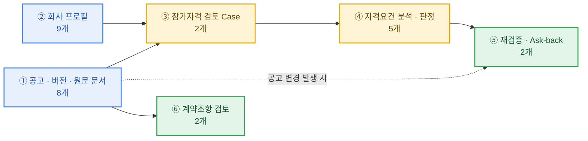
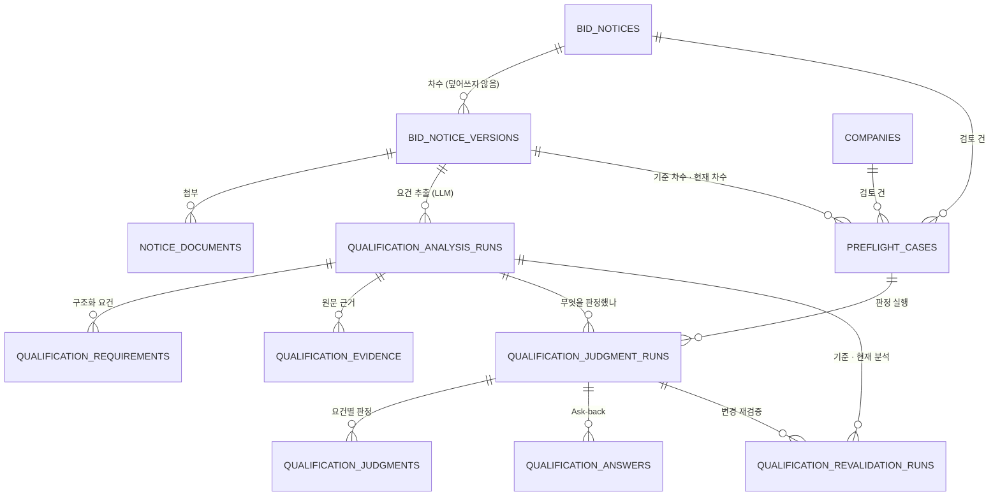
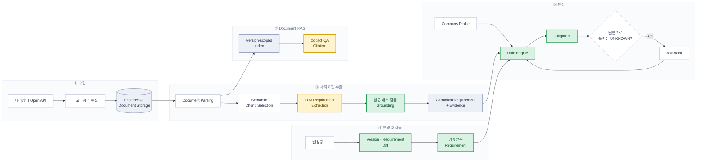

<div align="center">

# 🔍 비드체크 · BidCheck

**나라장터 변경공고 대응형 입찰 제출 검증기**

회사 정보를 기준으로 공고 참가자격을 원문 근거와 함께 판정하고,<br/>공고가 바뀌면 영향받은 요건만 다시 검증합니다.

`SK Networks Family AI Camp 34기` &nbsp;·&nbsp; `3차 프로젝트` &nbsp;·&nbsp; `4팀`

<br/>

[](https://github.com/gyuniverse-hq/bid-change-validator/actions/workflows/golden-regression.yml)
[](https://github.com/gyuniverse-hq/bid-change-validator/actions/workflows/mvp-integration-baseline.yml)
[](https://github.com/gyuniverse-hq/bid-change-validator/actions/workflows/copilot-integration.yml)

<br/>


</div>

> **README v0.5 · 구현 기준: `gyuniverse-hq/bid-change-validator` `develop` (`c26cdca`, 2026-09-14)**
> 코드 구현, 회귀 검증, 실데이터 검수 완료 여부를 구분하여 표시합니다.

<details>
<summary><b>목차</b></summary>

<br>

- [핵심 결과](#-핵심-결과)
- [시연 영상](#-시연-영상)
- [1. 팀 소개](#-1-팀-소개)
- [2. 프로젝트 개요](#-2-프로젝트-개요)
- [3. 기술 스택](#️-3-기술-스택)
- [4. WBS](#-4-wbs)
- [5. 요구사항 명세서](#-5-요구사항-명세서)
- [6. ERD](#️-6-erd)
- [7. 주요 프로시저](#-7-주요-프로시저)
- [프로젝트 구조](#-프로젝트-구조)
- [실행 방법](#️-실행-방법)
- [8. 수행결과](#-8-수행결과-테스트-및-시연-페이지)
- [검토했지만 쓰지 않은 것](#-검토했지만-쓰지-않은-것)
- [트러블슈팅](#-트러블슈팅)
- [현재 구현 상태와 한계](#-현재-구현-상태와-한계)
- [9. 한 줄 회고](#-9-한-줄-회고)

</details>

---

## 프로젝트 한눈에 보기

| 질문 | 답변 |
| --- | --- |
| 어떤 문제를 해결하나요? | 변경공고 이후 기존 입찰 준비가 여전히 유효한지 다시 확인합니다. |
| 무엇을 비교하나요? | 이전·최신 공고 버전, 참가자격 Requirement, 회사 프로필을 비교합니다. |
| 무엇을 다시 검증하나요? | 변경의 영향을 받은 Requirement만 추적하여 재판정합니다. |
| AI는 어디에 사용하나요? | 문서에서 Requirement를 구조화하고, 근거 탐색과 사용자 질의를 지원합니다. |
| 최종 판정은 어떻게 하나요? | 구조화된 Requirement와 회사 정보를 결정론적 Rule로 비교합니다. |
| 현재 검증 수준은 무엇인가요? | 합성 회귀는 운영 중이며, 실제 변경공고 Ground Truth와 사용자 E2E는 검증 중입니다. |

---

## 📊 핵심 결과

| 항목 | 결과 |
| --- | --- |
| 판정 회귀 기대값 일치 | **110 / 138** 요건 (초기 기준선 104/138) |
| 잘못된 확정 판정 | **0건** — 기준선·최신 회귀 모두 |
| 안전한 보류 | 28 / 138 |
| 공고 단위 상태 일치 | **37 / 40** |
| 근거 인용 버전 무결성 | **100%** |
| DB 규모 | 도메인 테이블 **30개** + 코드표 4개 · 마이그레이션 022 |
| 요구사항 | 비기능 11건 · 기능 **70건**(8영역) |
| 제품 화면 | **7종** |

> 위 수치는 승인 전 `DRAFT` Golden Fixture에 Canonical Requirement를 직접 입력한 **Rule 회귀 지표**입니다.
> Requirement Extraction 성능이나 서비스 전체 정확도가 아닙니다. 공고 20건 · 요건 138행 기준입니다.

---

## 🎥 시연 영상

> 🚧 **팀 결정 대기** — 촬영 여부. 찍기로 하면 YouTube 링크, 안 찍으면 이 섹션 삭제

---

## 👥 1. 팀 소개

**팀명** SKN34 3차 4팀

| 팀원 | 주요 담당 | GitHub |
| --- | --- | --- |
| 김재현 | LLM / RAG · Requirement Extraction · Evaluation | [@kim-4480](https://github.com/kim-4480) |
| 이홍규 | LLM / RAG · AI Copilot · 협업 인프라 | [@4hglee-ops](https://github.com/4hglee-ops) |
| 전진환 | Backend · API · 전체 시스템 구성 | [@dfs32dfs](https://github.com/dfs32dfs) |
| 정예린 | DB · Data Collection / Management | [@yerin816](https://github.com/yerin816) |
| 황수빈 | 기획 · Frontend · UI/UX | [@subinss838](https://github.com/subinss838) |

프로젝트는 각 파트가 독립적으로 결과물을 만드는 방식보다 다음 연결을 중요하게 두었습니다.

```text
Frontend
   ↕
Backend
   ↕
DB / Data
   ↕
LLM / RAG
```

각 파트의 출력이 실제 사용자 흐름에서 연결되는지를 기준으로 통합했습니다.

### 협업 방식

실제 개발은 다음 GitHub 중심 흐름으로 진행했습니다.

```text
GitHub Issue
    ↓
Feature / Fix Branch
    ↓
Pull Request
    ↓
Review / Test
    ↓
Merge
    ↓
통합 상태 확인
```

- 기능 또는 수정 단위로 Branch와 Pull Request를 만들었습니다.
- Frontend, Backend, DB/Data, LLM·RAG 간 계약과 영향 범위를 Review에서 확인했습니다.
- 자동 테스트 통과와 실제 사용자 E2E 완료를 같은 의미로 처리하지 않았습니다.
- GitHub Projects는 후반부에 일부 Issue와 작업 상태를 연결하는 보조 수단으로 사용했습니다.
- Figma는 화면 기준 공유, Discord는 진행 상황과 Blocker 공유, Notion은 기획·설계 문서 정리에 사용했습니다.

> 협업의 중심은 도구의 수가 아니라 **Issue → Branch → Pull Request → Review / Test → Merge** 흐름입니다.

---

## 📌 2. 프로젝트 개요

입찰 담당자는 공고 하나를 검토할 때 업종·지역·실적·인증 같은 참가자격 조건을 공고문과 첨부문서에서 찾아 회사 정보와 하나씩 맞춰봅니다. 문제는 나라장터 공고가 최초 게시 이후에도 정정·변경·취소된다는 점입니다. 조건이 바뀌면 이미 끝낸 검토가 조용히 무효가 됩니다.

**비드체크는 그 검토를 한 번 하고 끝내지 않습니다.** 공고문과 첨부문서에서 참가자격 요건을 근거가 되는 원문 위치와 함께 뽑아 회사 프로필과 대조하고, 변경공고가 올라오면 **그 변경이 기존 판정의 무엇을 무효로 만드는지**를 찾아 해당 요건만 다시 판정합니다.

요건을 구조화하는 일은 AI가 하고, **참가 가능 여부는 결정론적 규칙이 정합니다.** 같은 입력이면 같은 결과가 나오며, 근거를 찾지 못한 항목은 판정하지 않습니다.

### 전체 흐름

```text
실제 나라장터 공고 조회
        ↓
공고문·첨부문서 수집
        ↓
공고 버전 및 원문 관리
        ↓
참가자격 Requirement 추출
        ↓
회사 프로필과 요건 비교
        ↓
참가자격 판정
        ↓
근거 원문 확인
        ↓
정보 부족 시 Ask-back
        ↓
변경공고 발생
        ↓
이전 버전 ↔ 최신 버전 비교
        ↓
영향받은 Requirement 식별
        ↓
영향 요건만 재검증
```

### 💡 배경 — 담당자가 실제로 확인하는 것

공고 하나에서 확인해야 하는 참가자격 조건은 다음과 같습니다.

* 업종 및 면허 등록 조건
* 지역 제한
* 기업 규모
* 각종 인증 및 등록 여부
* 수행실적
* 인력 조건
* 제출서류
* 계약 관련 조건
* 공고 첨부문서
* 변경·정정·취소 공고 이력

이 조건들은 공고문 본문과 여러 개의 첨부문서에 흩어져 있습니다. 담당자가 이미

```text
참가 가능 판정 → 제출서류 준비 → 내부 검토
```

까지 마친 뒤에 변경공고가 올라오면, 어느 조건이 달라졌는지 확인하기 위해 전·후 공고문을 처음부터 다시 대조해야 합니다. **조건이 실제로 바뀐 것인지 문구만 다듬어진 것인지는 읽어보기 전까지 알 수 없습니다.**

### 🎯 프로젝트 목표

* 공고문과 첨부문서에 흩어진 참가자격 조건을 구조화합니다.
* 판정 결과와 실제 공고 원문 근거를 함께 제공합니다.
* 정보가 부족한 경우 임의로 추정하지 않고 추가 확인이 필요한 상태로 처리합니다.
* 사용자가 답변할 수 있는 정보라면 Ask-back을 통해 보완하고 해당 요건을 다시 판정합니다.
* 변경공고 발생 시 변경된 Requirement와 기존 판정의 영향을 추적합니다.
* AI가 공고 해석과 설명을 돕되 최종 참가 가능 여부는 재현 가능한 규칙으로 처리합니다.

### 핵심 기능

| 기능                  | 설명                                                 |
| ------------------- | -------------------------------------------------- |
| 나라장터 공고 조회          | 실제 나라장터 공고를 수집하고 검색하여 검토 대상을 선택합니다.                |
| 공고 버전 관리            | 최초공고·변경공고 등 동일 공고의 버전을 관리합니다.                      |
| 공고문·첨부문서 수집         | 공고 원문과 PDF/HWP/HWPX 등의 첨부문서를 함께 관리합니다.             |
| 문서 Parsing          | 공고문과 첨부문서를 분석 가능한 텍스트 구조로 변환합니다.                   |
| 참가자격 Requirement 추출 | 자연어 공고문에서 판정에 필요한 참가자격 요건과 근거를 구조화합니다.             |
| 회사 프로필 매칭           | 회사가 보유한 등록·인증·지역·실적 등의 정보를 공고 요건과 비교합니다.           |
| 결정론적 참가자격 판정        | Requirement와 회사 정보를 규칙으로 비교하여 상태를 판정합니다.           |
| Ask-back            | 판정에 필요한 회사 정보가 부족한 경우 사용자가 답변 가능한 항목을 추가로 확인합니다.   |
| 근거 원문 확인            | 판정 결과와 실제 공고 원문 Evidence를 연결하여 사용자가 직접 확인할 수 있습니다. |
| 변경공고 Diff           | 이전 공고 버전과 최신 버전을 비교하여 변경 내용을 식별합니다.                |
| 영향 요건 추적            | 변경 내용과 연결된 Requirement를 찾아 재검증 대상으로 지정합니다.         |
| 변경공고 재검증            | 영향을 받은 Requirement만 다시 판정하여 기존 결과의 유효성을 확인합니다.     |
| AI Copilot          | 현재 검토 건의 판정·근거·확인 필요 항목·회사 정보·변경 내역 조회를 지원합니다.     |

### 대표 사용자 시나리오

**최초 공고 검토**

```text
사용자가 공고 검색
        ↓
검토할 공고 선택
        ↓
공고문 및 첨부문서 분석
        ↓
참가자격 Requirement 추출
        ↓
회사 프로필과 Requirement 비교
        ↓
참가자격 판정
        ↓
근거 원문 확인
```

**회사 정보가 부족한 경우**

공고에서 필요한 조건이 존재하지만 회사 프로필만으로 판단할 수 없는 경우 모든 `UNKNOWN`을 동일하게 처리하지 않습니다.

사용자가 직접 답변하여 해결할 수 있는 항목은 Ask-back 대상으로 구분합니다.

```text
Requirement 판정
      ↓
UNKNOWN
      ↓
사용자에게 확인 가능한 정보인가?
      ↓
Yes ──→ Ask-back
             ↓
        사용자 답변
             ↓
        해당 Requirement 재판정

No ──→ 확인 필요 상태 유지
```

**변경공고 발생**

```text
기준 공고 v1
        ↓
참가자격 판정 완료
        ↓
변경공고 v2 발생
        ↓
v1 ↔ v2 비교
        ↓
변경 내용 식별
        ↓
영향 Requirement 추적
        ↓
해당 Requirement만 재판정
        ↓
변경 전·후 판정 비교
        ↓
변경 근거 원문 확인
```

### 🚫 이 서비스가 하지 않는 것

기대를 잘못 세우면 판정을 믿을 수 없습니다. 하지 않는 것을 먼저 적습니다.

- **근거가 없으면 판정하지 않습니다.** 억지로 결론 내지 않고 「확인 필요」로 남깁니다
- **평가 점수를 예측하지 않습니다.** 제안서에서 관련 위치만 찾아주고, 다뤘는지는 담당자가 판단합니다
- **표준값이 없는 계약조항은 표시하지 않습니다.** 확실하지 않은 값을 「표준」이라고 부르지 않습니다
- **나라장터 전체 공고 검색 포털이 아닙니다.** 회사 프로필로 걸러진 공고를 다룹니다
- **최종 판단은 담당자 몫입니다.** 제출 전 공고 원문을 다시 확인해야 합니다

---

## 🛠️ 3. 기술 스택

| 영역 | 기술 |
| --- | --- |
| Frontend | React 19, TypeScript, Vinext, Vite |
| UI | Tailwind CSS, shadcn, Base UI |
| Document Viewer | `@rhwp/core` |
| Backend | Python, FastAPI, SQLAlchemy |
| Database / Migration | PostgreSQL 16, Alembic, Supabase(공용 DB) |
| AI | OpenAI API, LangChain Core |
| Document RAG | OpenAI Embedding, FAISS, Hybrid Retrieval |
| Document Parsing | pypdf, olefile |
| Data Source | 나라장터 Open API |
| Infra | Docker, Docker Compose, GitHub Actions |
| 품질 도구 | pytest, oxlint, oxfmt |
| 협업 | GitHub Projects, Discord, Notion, Figma |

---

## 📅 4. WBS

기획 → 설계 → 구현 → 검증 → 제출 5단계로 진행했습니다. 담당은 파트 단위로 적었습니다.

| 단계 | 기간 | 핵심 산출물 |
| --- | --- | --- |
| 1. 기획 | 09-01 ~ 09-03 | 주제 확정 · 요구사항 명세서 · 팀 운영 규칙 |
| 2. 설계 | 09-04 ~ 09-08 | 화면설계서 · DB 스키마 v2 · API 명세 · 추출 계약 |
| 3. 구현 | 09-08 ~ 09-14 | 수집 · 추출 · 판정 엔진 · 화면 7종 · 인증 · Copilot |
| 4. 검증 | 09-11 ~ 09-16 | Golden Fixture v0.2 · Flow QA · 실공고 E2E |
| 5. 제출 | 09-15 ~ 09-17 | 최종 수정 · 캡처 · 측정 · README · 발표 |

<details>
<summary><b>전체 WBS 펼치기</b> (25개 작업)</summary>

<br>

| 단계 | 작업 | 파트 | 기간 | 산출물 |
| --- | --- | --- | --- | --- |
| **1. 기획** | 주제 선정 (후보 ~100개 → 8차 라운드) | 전원 | 09-01 ~ 09-02 | 주제 검증 문서 5건 |
| | 주제 확정 · 역할 분담 | 전원 | 09-02 | 회의록 |
| | 기획안 · 요구사항 명세서 · 팀 운영 규칙 | 기획 | 09-03 | 기획안 v1 · 요구사항 명세서 |
| | 도메인 리서치 (나라장터 · 입찰 절차) | 전원 | 09-02 ~ 09-03 | 도메인 리서치 문서 |
| **2. 설계** | 화면 설계서 시안 4종 | Frontend | 09-04 ~ 09-06 | 화면설계서 |
| | DB 스키마 v2 (차수별 저장 구조) | DB · 기획 | 09-06 | 스키마 v2 |
| | 화면별 데이터·API 명세 · Figma 규격 | Frontend | 09-07 | API 명세 · 컴포넌트 규격 |
| | 백엔드 구조 · 프로토타입 | Backend | 09-04 ~ 09-08 | API 스켈레톤 · 마이그레이션 001~005 |
| | LLM 추출 파이프라인 설계 | LLM·RAG | 09-04 ~ 09-08 | 추출 계약 · 가드레일 설계 |
| **3. 구현** | 공고 수집 (Open API 폴링) · 문서 저장 | Backend | 09-08 ~ 09-10 | notice-poller |
| | 자격요건 추출기 · 가드레일 | LLM·RAG | 09-08 ~ 09-12 | Analysis Run |
| | 판정 엔진 (결정론적 Rule) | Backend | 09-09 ~ 09-12 | Judgment Run · 판정 규칙 v0.2 → v0.3 |
| | 공용 DB 구축 · 마이그레이션 006~022 | DB | 09-09 ~ 09-14 | 분석 · 판정 · Ask-back · 재검증 · 계약조항 · 인증 |
| | 제품 화면 7종 구현 | Frontend | 09-09 ~ 09-14 | 공고 찾기 ~ 회사 프로필 |
| | 로그인 · 세션 인증 · 회사별 권한 | Backend · DB | 09-11 ~ 09-13 | app_users · auth_sessions |
| | 계약조항 검토 9종 | Backend · LLM·RAG | 09-11 ~ 09-13 | contract_clause_findings |
| | AI Copilot | LLM·RAG · 통합 | 09-12 ~ 09-14 | Copilot v3 |
| **4. 검증** | Golden Fixture 라벨링 · 검수 | 전원 분담 | 09-11 ~ 09-14 | Golden Fixture v0.2 |
| | 첨부 원본 재확보 130건 | DB | 09-13 | 첨부 130/130 |
| | Flow QA 20문항 | Frontend | 09-13 | Flow QA 체크리스트 |
| | 실공고 E2E · 데모 리허설 | 전원 | 09-13 ~ 09-16 | QA 리포트 · 시연 시나리오 |
| **5. 제출** | P0 개선 · 프론트 최종 수정 | 전원 | 09-15 ~ 09-16 | PR |
| | 화면 캡처 · ERD · 아키텍처 | Frontend · DB | 09-16 | 다이어그램 · 캡처 |
| | 수치 확정 (테스트 · 회귀 결과) | Backend · LLM·RAG | 09-16 | 측정 결과 |
| | README 최종 조립 | 기획 | 09-16 | README |
| | 발표 자료 | 전원 | 09-16 ~ 09-17 | 발표 |

</details>

---

## 🧾 5. 요구사항 명세서

요구사항은 **비기능 11건 + 기능 8영역(70건)**으로 관리했습니다.
**완료조건은 전부 O/X로 갈리게 썼습니다** — 「잘 동작한다」는 완료조건으로 인정하지 않았습니다.

### 비기능 요구사항 (전 기능 적용)

기능보다 먼저입니다. 아래와 충돌하는 기능 요구사항은 폐기했습니다. **11건 중 핵심 4건:**

| ID | 요구사항 |
| --- | --- |
| NFR-1 | 화면에 나가는 모든 판정 항목에 원문과 근거가 있다 |
| NFR-2 | 판정 함수에 LLM 호출이 없다 |
| NFR-4 | 값이 없거나 신뢰도가 낮으면 판정하지 않고 「확인 필요」로 넘긴다 |
| NFR-6 | 정답이 없는 것은 판정하지 않는다 |

<details>
<summary><b>비기능 요구사항 11건 전체 + 완료조건</b></summary>

<br>

| ID | 요구사항 | 완료조건 |
| --- | --- | --- |
| NFR-1 | 화면에 나가는 모든 판정 항목에 원문과 근거(조항·페이지)가 있다 | 근거 없는 항목이 화면에 하나도 없다. 필터된 개수를 로그로 남긴다 |
| NFR-2 | 판정 함수에 LLM 호출이 없다 | 판정 모듈 의존성 그래프에 LLM 클라이언트가 없다. 같은 입력 → 같은 출력 |
| NFR-3 | 판정은 **항목 단위**로 실행된다 | 항목 1개의 입력만 바뀌면 그 항목만 재계산된다 |
| NFR-4 | 값이 없거나 신뢰도가 낮으면 판정하지 않고 「확인 필요」로 넘긴다 | 프로필 필드를 비우면 해당 항목이 「확인 필요」가 된다 |
| NFR-5 | 사용자 답변 기반 판정은 별도 표시되고 「증빙 필요」가 붙는다 | 답변으로 채운 항목이 확정 충족으로 표시되는 경우 0건 |
| NFR-6 | 정답이 없는 것은 판정하지 않는다 | 평가 대응 화면에 「충분/부족」류 판정 상태가 없다 |
| NFR-7 | 시스템 상태를 보고할 때 주어는 시스템이다 | 금지 문구가 코드·프롬프트에 0건 |
| NFR-8 | 요건 유형은 닫힌 목록이며 예시에서도 지킨다 | 스키마 밖 유형이 코드·문서·테스트 데이터에 0건 |
| NFR-9 | 표준값이 없는 계약조항 유형은 화면에 나가지 않는다 | 기준값 미확보 유형이 렌더링되지 않는다 |
| NFR-10 | 색은 판정에만 쓴다 | 평가 대응 화면에 판정 색이 0건 |
| NFR-11 | 로딩은 항목 단위 스켈레톤. 전체 화면 스피너 없음 | 파싱 중에도 이미 판정된 항목이 보인다 |

</details>

### 기능 요구사항 — 영역과 개수

| 영역 | ID | 건수 | 대표 요구사항 |
| --- | --- | --- | --- |
| 회사 프로필 | FR-P | 7 | 업종코드는 검색으로 고른다 · 실적은 **건별로** 저장한다(합계 아님) |
| 공고 찾기 | FR-F | 10 | **차수별로 저장하고 덮어쓰지 않는다** · 자격 미달 공고를 숨기지 않고 접어둔다 |
| 참가자격 검토 | FR-J | 12 | 자격 7유형을 프로필과 비교해 판정 · 실적 기간은 판정 시점에 계산 · 판정 줄마다 근거 칩 |
| 확인 필요(Ask-back) | FR-A | 8 | 폼형 카드로 묻는다(채팅 아님) · **질문에도 근거를 붙인다** · 답하면 그 항목만 재판정 |
| 근거 원문 | FR-E | 4 | 근거 칩 → 좌우 대조 · 해당 조항 강조 · 인용 조항·페이지가 실제 원문과 일치 |
| 평가 대응 | FR-C | 12 | 제안서에서 **관련 위치만** 찾는다 · 충분한지 판정하지 않는다 · 배점은 원문 그대로 병기만 |
| 변경 이력 | FR-D | 11 | 차수 증가 감지 → **구조 비교**(텍스트 diff 아님) → 영향 요건만 재판정 · 영향 없는 변경도 표시 |
| 실패 경로 | FR-X | 6 | 첨부를 못 읽으면 「읽지 못했습니다」와 원문 링크 · 기본값으로 채우지 않는다 |

우선순위 — Must = 없으면 데모 성립 안 됨 · Should = 데모를 완성시킴 · Could = 있으면 좋음

---

## 🗂️ 6. ERD

도메인 테이블 **30개** + 코드표 4개. 라이브 DB 스키마와 직접 대조해 만들었고 마이그레이션 022까지 반영돼 있습니다.

### 도메인 지도



| 도메인 | 테이블 | 수 |
| --- | --- | --- |
| ① 공고 · 버전 · 원문 문서 | `bid_notices` `bid_notice_versions` `notice_documents` `notice_collection_runs` `notice_change_histories` `notice_facts` `notice_history_backfill_jobs` `notice_relations` | 8 |
| ② 회사 프로필 | `companies` `company_industries` `company_staff` `company_staff_roles` `company_sw_engineer_grades` `company_performances` `company_performance_fields` `company_certifications` `company_qualification_profile_completeness` | 9 |
| ③ 참가자격 검토 Case | `preflight_cases` `proposal_documents` | 2 |
| ④ 자격요건 분석 · 판정 | `qualification_analysis_runs` `qualification_requirements` `qualification_evidence` `qualification_judgment_runs` `qualification_judgments` | 5 |
| ⑤ 재검증 · Ask-back | `qualification_answers` `qualification_revalidation_runs` | 2 |
| ⑥ 계약조항 검토 | `contract_clause_review_runs` `contract_clause_findings` | 2 |
| ⑦ 인증 | `app_users` `auth_sessions` | 2 |

⑦ 인증은 회사 프로필과 연결되지만 검증기 도메인 흐름과는 독립적입니다.

### 뼈대 — 공고가 차수별로 쌓이고, 판정이 그 차수에 묶인다

**이 구조가 이 서비스의 전제입니다.** `bid_notices`(공고) 아래 `bid_notice_versions`(차수)를 두고 덮어쓰지 않습니다. 공고를 덮어쓰면 1차와 2차를 비교할 수 없고, 변경 재검증이 원천적으로 불가능해집니다.



**판정 하나가 무엇에 묶여 있는지** — `qualification_judgment_runs`는 검토 건 · 분석 Run · 회사 · 공고 차수를 모두 참조하고, `profile_snapshot`에 판정 시점의 회사 정보를 통째로 남깁니다. 회사 정보가 나중에 바뀌어도 과거 판정이 **어떤 회사 정보로 계산됐는지** 그대로 남습니다.

**변경 재검증** — `qualification_revalidation_runs`가 기준 분석 · 현재 분석 · 직전 판정을 함께 참조하고, `revalidated_keys`에 **영향받은 요건 키만** 기록합니다.

**전체 ERD** — 도메인 7개 · 다이어그램 10장 · 테이블별 컬럼과 제약까지: [db-erd-current.md](https://github.com/gyuniverse-hq/bid-change-validator/blob/develop/docs/04_contracts/db-erd-current.md)

---

## 📚 7. 주요 프로시저

### 7.1 시스템 아키텍처



🟡 LLM이 하는 일 &nbsp;·&nbsp; 🟢 코드가 결정론적으로 하는 일

### 7.2 AI·Rule 설계

| 영역 | 실제 담당 |
| --- | --- |
| 공고문 구조화 해석 | LLM |
| 참가자격 Requirement 추출 | LLM Structured Extraction |
| 추출 결과 원문 검증·정규화 | Deterministic Grounding / Validation |
| 회사 정보 매핑 | Backend |
| 최종 참가자격 판정 | Deterministic Rule Engine |
| 원문 검색·질의응답 | Version-scoped Document RAG / LLM |
| 변경 영향 분석 | Requirement Diff + Rule Engine |

> **LLM은 공고를 구조화하고 설명하지만 최종 참가 가능/불가를 임의로 결정하지 않습니다.**

판정 상태는 다음 세 가지입니다.

| 상태 | 의미 |
| --- | --- |
| `SATISFIED` | 현재 회사 정보로 요건 충족을 확인 |
| `UNSATISFIED` | 현재 회사 정보로 요건 미충족을 확인 |
| `UNKNOWN` | 현재 정보만으로 확정할 수 없음 |

`UNKNOWN`이 곧 사용자 질문 대상이라는 뜻은 아닙니다. 단일 사용자 사실로 안전하게 해소할 수 있는 요건만 `ASKABLE`로 분류합니다.

```text
UNKNOWN ≠ ASKABLE
```

판정에는 Requirement, 회사 정보 또는 사용자 답변, 원문 Evidence와 버전 정보를 함께 남깁니다. 생성된 설명 자체가 아니라 공고 원문의 문서·페이지·문단 위치를 근거로 사용합니다.

> 화면에는 위 영어 상태값이 그대로 나가지 않습니다. `apps/web/lib/status-copy.ts`에서 한국어 라벨로 바꿉니다.

### 7.3 변경공고 재검증

```text
기준 공고 분석·판정
        ↓
변경공고 수집·버전 생성
        ↓
Canonical Requirement Diff
        ↓
ADDED / MODIFIED / REMOVED 식별
        ↓
영향받은 현재 Requirement만 재판정
        ↓
변경 전·후 결과와 Evidence 비교
```

코드 경로와 합성 회귀 테스트는 구현되어 있습니다. 변경되지 않은 요건은 기존 판정을 승계하고, 추가·수정된 요건만 현재 회사 프로필로 다시 판정합니다. 기준 판정 이후 회사 프로필이나 판정 기준일이 바뀌었다면 부분 재검증을 중단하고 전체 재판정을 요구합니다.

실제 공고 `R26BK01686455`에서 강원도 지역 제한 문구가 변경 차수에서 사라진 사례를 G2 후보로 확보했습니다. 다만 현재 관찰 라벨은 `DRAFT / not_ground_truth`이며, 의미상 요건 삭제와 법적 효력은 사람 검수 전이므로 실사례 검증 완료로 표시하지 않습니다.

| 검증 단계 | 상태 |
| --- | --- |
| 변경 Diff·affected-only 코드 | 구현 |
| 합성 G0 회귀 | 통과 |
| 실제 변경공고 후보 데이터 | 확보 |
| 실제 Ground Truth·Human Validation | 진행 중 |

### 7.4 AI Copilot

AI Copilot은 현재 검토 건을 중심으로 판정·근거·확인 필요 항목·회사 프로필·변경 내역을 조회하는 작업형 인터페이스입니다.

```text
"이 공고 참가할 수 있어?"
"왜 미달이야?"
"두 번째 조건 근거 보여줘."
"변경공고에서 뭐가 바뀌었어?"
"전체 변경 요건을 다시 검증해줘."
```

- 제한된 회신 컨텍스트로 "그 조건", "두 번째" 같은 참조를 해석합니다.
- 실제 Requirement, 판정, Evidence, 공고 Version, Company Profile은 Backend에서 다시 조회합니다.
- 현재 공고 버전의 공개 문서 QA는 사용자 동의 후 Document RAG를 사용합니다.
- 답변 반영과 재검증은 먼저 제안만 보여주며, 사용자가 별도 확인한 뒤 실행합니다.
- Citation이 검증되지 않은 생성 답변은 사실 답변으로 노출하지 않습니다.

> **대화 맥락은 제한적으로 사용하고, 서비스 사실은 Backend에서 다시 확인합니다.**

일반 목적 Agent, 장기 기억, 여러 공고 버전을 동시에 검색하는 Document QA까지 구현됐다는 의미는 아닙니다.

---

## 📁 프로젝트 구조

```
bid-change-validator/
├── apps/
│   ├── api/                      # FastAPI 백엔드
│   │   ├── alembic/versions/     # 마이그레이션 001~022
│   │   ├── app/
│   │   │   ├── ai/               # LLM 추출 · 계약조항 검토 · 품질 평가
│   │   │   ├── copilot/          # AI Copilot (의도 분류 · 도구 · 답변)
│   │   │   ├── document_rag/     # 문서 검색 · 근거 연결
│   │   │   ├── qualification/    # 분석 · 판정 · Ask-back · 재검증 (Rule)
│   │   │   ├── routers/          # HTTP 경계
│   │   │   ├── services/         # 수집 · 문서 저장 · 텍스트 추출
│   │   │   └── workers/          # 공고 폴링
│   │   ├── eval/                 # Golden 평가 하네스
│   │   └── tests/
│   └── web/                      # vinext (Vite + RSC) 프론트엔드
│       ├── app/                  # 라우트 — notices · qualification · ask-back
│       │                         #         evidence · evaluation · changes
│       │                         #         company · guide · login
│       ├── components/product/   # 제품 공용 컴포넌트
│       ├── lib/                  # API 클라이언트 · 상태 · 라벨(status-copy.ts)
│       └── tests/
├── services/document-ai/         # 문서 파싱 서비스
├── db/                           # 시드 · 마스터 코드
├── data/                         # 마스터 데이터
├── contracts/                    # 파트 간 계약
├── docs/                         # 01_product ~ 09_roadmap
├── samples/golden/               # Golden Fixture
├── infra/
├── scripts/
└── docker-compose.yml
```

---

## ⚙️ 실행 방법

> 아래 명령은 실제 개발 저장소 [`gyuniverse-hq/bid-change-validator`](https://github.com/gyuniverse-hq/bid-change-validator/tree/develop)의 `develop` 브랜치 기준입니다. 현재 공식 제출 저장소에는 코드가 동기화되지 않았으므로 이 저장소에서 바로 실행할 수 없습니다.

### 요구 환경

- Docker / Docker Compose
- Node.js 22.13 이상
- pnpm
- 나라장터 Open API Service Key
- OpenAI API Key

### Backend / Database

저장소 루트의 `.env.example`을 `.env`로 복사한 뒤 환경변수를 설정합니다.

```powershell
Copy-Item .env.example .env
docker compose up -d --build api
```

API 시작 전에 Alembic migration이 자동 적용됩니다. 변경공고 수집기를 함께 실행하려면 다음 명령을 사용합니다.

```powershell
docker compose --profile collector up -d --build api notice-poller
```

### Frontend

```powershell
cd apps/web
Copy-Item .env.example .env.local
pnpm install
pnpm dev
```

| 서비스 | 주소 |
| --- | --- |
| Frontend | http://localhost:3000 |
| Backend API | http://localhost:8000 |
| Swagger | http://localhost:8000/docs |
| Health Check | http://localhost:8000/health |

OpenAI API Key가 없으면 자격요건 분석과 Document RAG처럼 외부 모델이 필요한 경로는 실행되지 않습니다.

### 프로덕션 구동

정적 파일만 서빙하면 화면 이동이 동작하지 않습니다 — RSC 응답을 서버가 만들어야 합니다.

```powershell
pnpm build
pnpm exec vinext start --hostname 0.0.0.0 --port 3000
```

앞단 nginx가 경로로 나눠 보냅니다. 프론트와 백엔드가 같은 도메인을 쓰므로 세션 쿠키가 그대로 붙습니다.

| 경로 | 보내는 곳 |
| --- | --- |
| `/api/*` | Backend `:8000` |
| 나머지 · RSC 요청 | Frontend `:3000` |

> 배포 자동화는 아직 없습니다. compose·워크플로 정리는 후속 작업입니다.

---

## ✅ 8. 수행결과 (테스트 및 시연 페이지)

### 8.1 서비스 화면

| 화면 | Route | 현재 범위 |
| --- | --- | --- |
| 공고 찾기 | `/notices` | 실제 공고 검색·버전 조회·분석된 공고 매칭 |
| 참가자격 검토 | `/qualification` | Analysis → Judgment와 요건·근거 확인 |
| 확인 필요 | `/ask-back` | `ASKABLE UNKNOWN` 답변과 부분 재판정 |
| 근거 원문 | `/evidence` | Requirement·판정·원문 Evidence 연결 |
| 평가 대응 | `/evaluation` | 참가자격 기반 참고 정보 제공; 평가 전용 추출·점수 예측 미지원 |
| 변경 이력 | `/changes` | 버전·Requirement Diff와 재검증 결과 |
| 회사 프로필 | `/company` | 회사 정보·업종·실적·인증/등록 관리 |

7개 Route의 이동과 주요 API 연결은 구현되어 있습니다. 실제 G2와 안전한 Ask-back 답변을 포함한 전체 Human Click E2E는 최종 검증 대기 상태입니다.

> 🚧 **화면 캡처 5장 작성 예정** — 사용 흐름 순서대로
>
> 공고 찾기 → 참가자격 검토 → 확인 필요 → 근거 원문 → 변경 이력

### 8.2 시연 시나리오

데모 케이스는 Golden Fixture **J14 · `R26BK01684863`** 전북대학교 남원글로컬캠퍼스 본관동 생활폐기물 처리 용역입니다.
1차 → 2차에서 폐기물 운반업 등록코드가 **1224 → 1227**로 바뀐 사례입니다.

> 🚧 **흐름 요약 작성 예정**

### 8.3 데이터 및 Evaluation

**Rule 회귀용 Golden Fixture v0.2**

| 항목 | 규모·상태 |
| --- | ---: |
| 고유 공고 | 20건 |
| 합성 회사 프로필 | 32세트 |
| 이전 차수 입력 | 8건 |
| 전체 판정 입력 | 40건 / 138개 요건 행 |
| 검수 상태 | `DRAFT_NOT_APPROVED` |

이 Fixture는 Canonical Requirement를 Rule Engine에 직접 입력하여 판정 회귀를 확인합니다. 따라서 Requirement Extraction 성능이나 승인된 최종 Ground Truth를 의미하지 않습니다.

| 측정 시점 | 기대값 일치 | 안전한 보류 | 잘못된 확정 판정 | 공고 단위 일치 | 해석 |
| --- | ---: | ---: | ---: | ---: | --- |
| E0 초기 기준선 | 104/138 (75.4%) | 34/138 (24.6%) | 0건 | 36/40 (90.0%) | 안전성 보완 전 고정 기준선 |
| 2026-09-13 회귀 | 110/138 (79.7%) | 28/138 (20.3%) | 0건 | 37/40 (92.5%) | 보류 6건을 확정으로 옮기면서 오판 0건 유지 |

<picture>
  <source media="(prefers-color-scheme: dark)" srcset="docs/assets/regression-dark.png">
  
</picture>

> **결과를 읽을 때의 주의사항**
> 승인 전 `DRAFT` Fixture에 Canonical Requirement를 직접 입력한 **Rule 회귀 지표**입니다.
> Requirement Extraction·LLM·서비스 전체 정확도를 의미하지 않습니다.
> 분모는 공고 20건에서 뽑은 요건 138행이며, 공고 단위 일치의 분모는 판정 입력 40건입니다.

**평가 레이어**

| 평가 레이어 | 현재 확인 범위 | 상태 |
| --- | --- | --- |
| Rule / Judgment | 기대값 일치, safe abstention, wrong determinate | 회귀 기준선 운영 |
| Requirement Extraction | 합성 selection harness와 실제 snapshot 확보 | 최종 실공고 라벨·F1 미확정 |
| Document RAG | Recall@4, Citation 구조·버전 무결성 | 정량 평가 수행, 의미 정답률 별도 검수 필요 |
| AI Copilot | Routing 및 시나리오 계약 평가 | 사용자 Task 평가 대기 |
| 변경공고 G2 | 실제 변경 후보와 원문 Diff | Human Validation 진행 중 |
| User E2E | 화면 Route와 일부 흐름 | 전체 성공 시나리오 검증 대기 |

**Document RAG 검색 지표**

<picture>
  <source media="(prefers-color-scheme: dark)" srcset="docs/assets/rag-dark.png">
  
</picture>

기본 Hybrid Retrieval의 Evidence Recall@4는 50.00%입니다. LLM rerank가 55.56%로 5.56%p 높았지만 지연과 호출 비용이 커 기본 경로에는 적용하지 않았습니다. **Citation Version Integrity는 100%** 이며, 이는 인용이 올바른 공고 차수를 가리키는지를 보는 **구조 지표**로 답변 정답률이 아닙니다.

상세 근거:

- [Golden Fixture v0.2](https://github.com/gyuniverse-hq/bid-change-validator/tree/develop/samples/golden/qualification-v0.2)
- [실공고 Snapshot Dataset](https://github.com/gyuniverse-hq/bid-change-validator/tree/develop/samples/golden/qualification-real-v0.1)
- [Document RAG Evaluation](https://github.com/gyuniverse-hq/bid-change-validator/blob/develop/docs/08_qa_reports/ai-copilot-v2/e3-rag-evaluation.md)

> 🚧 **최종 측정값 확정 후 갱신** — Backend 테스트 통과 수 · 최신 Golden 회귀 결과 · 기준 커밋 SHA · 측정 일자

### 8.4 프로젝트 결과

- 공고 원문에서 참가자격 Requirement와 Evidence를 구조화하고 회사 프로필과 연결했습니다.
- 변경 전·후 Requirement Diff를 기반으로 영향 요건만 식별하여 재검증하는 흐름을 구현했습니다.
- 부족한 정보는 추정하지 않고 Ask-back 또는 안전한 보류로 처리하는 판정 기준을 마련했습니다.
- Golden Fixture 회귀에서 잘못된 확정 판정 0건을 유지하면서 기대값 일치를 104/138에서 110/138로 개선했습니다.
- 판정·근거·확인 필요 항목·변경 내역을 현재 검토 건 중심으로 조회하는 AI Copilot을 연결했습니다.

실공고 Ground Truth, 사용자 Task 평가, 전체 Human Click E2E는 아직 진행 중이며 완료된 성과와 구분합니다.

---

## 🚫 검토했지만 쓰지 않은 것

검토한 뒤 의도적으로 채택하지 않은 선택입니다. 안 한 이유를 남겨 두면 판정 결과를 읽는 기준이 분명해집니다.

| 기술·방식 | 검토한 이유 | 쓰지 않은 이유 |
| --- | --- | --- |
| Document RAG의 LLM rerank | Evidence Recall@4가 50.00% → 55.56%로 올랐습니다 | 지연과 호출 비용이 커 기본 경로에 부적합합니다. 측정값은 비교용으로 남겨 두었습니다 |
| 판정 단계에서의 LLM 호출 | 자연어 조건을 유연하게 해석할 수 있습니다 | NFR-2 위반입니다. 같은 입력에 같은 출력이 보장되지 않아 판정을 재현할 수 없습니다 |
| 텍스트 diff 기반 변경 감지 | 구현이 단순합니다 | 문구만 바뀐 변경과 요건이 바뀐 변경을 구분하지 못합니다. 구조 비교로 갔습니다 |
| Cross-version Document RAG | 차수 간 질의가 가능해집니다 | 인용이 어느 차수의 원문인지 보장할 수 없어, 현재 차수로 범위를 닫았습니다 |
| 평가항목 전용 추출·점수 예측 | 제안서 대응을 자동화할 수 있습니다 | 정답이 없는 영역입니다(NFR-6). 관련 위치만 찾아주고 판정하지 않습니다 |

---

## 🔑 트러블슈팅

| 문제 | 원인 | 해결 |
| --- | --- | --- |
| 공고의 참가자격 요건이 판정기까지 하나도 도달하지 않음 | 청크 선별기가 `3. 입찰참가자격` 아래 `가./나./다.`를 다음 상위 제목으로 판단해 LLM에 보내지 않음 | 숫자·한글·괄호형 제목의 위계를 분리해 자격 절 하위 항목이 함께 전달되도록 수정 |
| 행정통합 지역에서 자격 있는 회사를 「미달」로 확정 | 지역 판정이 글자 비교라 「전남광주통합특별시」와 「종전 광주광역시」의 포함 관계를 모름 | 하위→상위 표를 두고, 프로필이 상위 단위라 가를 수 없으면 미달이 아니라 「확인 필요」로 넘김 |
| 같은 표현인데 근거 검증 실패 | 원문의 `수집․운반업`과 추출 결과의 `수집·운반업`이 가운데점 문자가 다름 | 비교할 때만 NFKC와 가운데점 변형을 정규화. 저장되는 원문은 바꾸지 않음 |
| 같은 버전에 분석이 밀리초 단위로 두 번 생성 | 기준 차수와 현재 차수가 같은 검토 건에서 화면이 두 분석을 병렬 실행해 동일 API를 동시에 두 번 호출 | 기준 ≥ 현재인 검토 건 생성을 백엔드에서 차단하고, 동일 버전은 한 번만 분석하도록 방어 |
| 이동 버튼을 눌러도 서버 요청이 발생하지 않음 | `Link`/`a` 안에 `Button`을 중첩한 구조. `a` 안의 `button`은 HTML에서 무효라 클릭이 삼켜짐 | Base UI Button의 `render` prop으로 감싸 실제 렌더가 단일 `a` 요소가 되게 수정 (11곳) |
| 자격 있는 회사인데 업종 요건이 「미달」로 확정될 수 있었음 | 업종 판정이 코드와 이름을 둘 다 대조하는데, 공용 DB 업종 마스터 14건의 이름 자리에 코드가 그대로 들어가 있었음. 공고가 업종을 이름으로 적으면 매칭이 실패 | 마스터 CSV의 정상 이름으로 되돌림. 이름이 코드와 같은 행만 고치고, CSV에 없는 코드는 이름을 지어내지 않고 남겨둠 |
| **같은 문서·같은 청크인데 추출 결과가 실행마다 다름** | 문서 해시·청크 목록이 모두 동일한데 구조화 요건 수가 `3·1·3·3`처럼 흔들림. 복합조건 처리와 관련된 것으로 보임 | **진행 중.** 조건을 하나 바꾸면 다른 쪽이 깨지는 구조라 원인 분리 중 |

---

## 📈 현재 구현 상태와 한계

| 영역 | 코드·연결 상태 | 최종 검증 상태 |
| --- | --- | --- |
| 나라장터 공고·변경공고 수집 | 구현 | 운영 범위 확대 검증 필요 |
| 공고 Version·첨부문서 관리 | 구현 | 실데이터 검산 진행 |
| PDF/HWP/HWPX Parsing | 구현 | 문서 유형별 품질 개선 필요 |
| Requirement Extraction | 구현 | 실공고 정답 라벨·F1 미확정 |
| Company Profile Matching | 구현 | 전체 사용자 E2E 추가 검증 |
| Deterministic Rule Judgment | 구현·Golden 회귀 운영 | Fixture 독립 승인 대기 |
| Ask-back | 구현·회귀 확인 | 실공고 safe-answer E2E 대기 |
| Evidence 연결 | 구현 | 의미 단위 정확도 검수 진행 |
| Requirement Diff·재검증 | 구현·합성 회귀 통과 | 실제 G2 Human Validation 진행 |
| AI Copilot | 현재 Case 중심 조회·확인형 Action 구현 | 사용자 Task 평가 대기 |
| 7개 제품 화면 | Route와 주요 API 연결 | 전체 Human Click E2E 대기 |
| 배포 | vinext + nginx 구성 운영 중 | 배포 자동화 미확정 |

### 현재 한계

- Golden Fixture의 기대값은 독립 검수자 승인 전 초안입니다.
- 실제 변경공고 G2는 후보를 확보했지만 Ground Truth 확정 전입니다.
- Requirement Extraction, Copilot, 사용자 E2E의 최종 성능 수치는 아직 확정하지 않았습니다.
- 동일 입력에서 Requirement 추출 결과가 실행마다 달라지는 문제를 확인했고 개선 진행 중입니다.
- Document RAG는 현재 공고 버전 범위에서 동작하며 cross-version QA는 지원하지 않습니다.
- 평가 대응 화면은 참가자격 기반 참고 정보이며 평가항목 전용 추출이나 점수 예측 기능이 아닙니다.
- 외부 운영 배포 완료를 주장하지 않습니다.

### 다음 개선

- 추출 결정성 확보 — 같은 입력에서 같은 Requirement가 나오도록
- 실제 공고 Requirement·Evidence 라벨 독립 검수와 Extraction 평가
- 변경공고 G2 Ground Truth 확정 및 전체 재검증 E2E
- Copilot 사용자 Task 평가와 문서 QA 품질 개선
- 대표 UI, 최종 아키텍처, 배포 결과 확정 후 README 반영

---

## 💬 9. 한 줄 회고

> 🚧 **제출 직전에 각자 작성** — 1인 2~3줄

**김재현**

**이홍규**

**전진환**

**정예린**

**황수빈**

---

## 📄 참고 자료

실제 구현과 검증 근거는 개발 저장소에 있습니다.

- [개발 저장소 `gyuniverse-hq/bid-change-validator`](https://github.com/gyuniverse-hq/bid-change-validator)
- [Product Baseline 문서](https://github.com/gyuniverse-hq/bid-change-validator/tree/develop/docs/mvp-baseline)
- [QA · Evaluation 문서](https://github.com/gyuniverse-hq/bid-change-validator/tree/develop/docs/08_qa_reports)
- [DB ERD](https://github.com/gyuniverse-hq/bid-change-validator/blob/develop/docs/04_contracts/db-erd-current.md)

---
