<div align="center">

# 🔍 비드체크 · BidCheck

**나라장터 변경공고 대응형 입찰 제출 검증기**

회사 정보를 기준으로 공고 참가자격을 원문 근거와 함께 판정하고,<br/>공고가 바뀌면 영향받은 요건만 다시 검증합니다.

`SK Networks Family AI Camp 34기` &nbsp;·&nbsp; `3차 프로젝트` &nbsp;·&nbsp; `4팀`

<br/>

[](https://github.com/gyuniverse-hq/bid-change-validator/actions/workflows/golden-regression.yml)
[](https://github.com/gyuniverse-hq/bid-change-validator/actions/workflows/mvp-integration-baseline.yml)
[](https://github.com/gyuniverse-hq/bid-change-validator/actions/workflows/copilot-integration.yml)

<br/>


</div>

구현 기준 — [`gyuniverse-hq/bid-change-validator@develop`](https://github.com/gyuniverse-hq/bid-change-validator/tree/develop) (`c26cdca`, 2026-09-14)

> 코드 구현 / 회귀 검증 / 실데이터 검수
> 완료 여부를 구분하여 표시합니다.

<details>
<summary><b>목차</b></summary>

<br>

- [프로젝트 한눈에 보기](#프로젝트-한눈에-보기)
- [핵심 결과](#-핵심-결과)
- [1. 팀 소개](#-1-팀-소개)
- [2. 프로젝트 개요](#-2-프로젝트-개요)
- [3. 기술 스택](#️-3-기술-스택)
- [4. WBS](#-4-wbs)
- [5. 요구사항 명세서](#-5-요구사항-명세서)
- [6. ERD](#️-6-erd)
- [7. 주요 프로시저](#-7-주요-프로시저)
- [프로젝트 구조](#-프로젝트-구조)
- [실행 방법](#️-실행-방법)
- [8. 수행결과](#-8-수행결과-테스트-및-시연-페이지)
- [검토했지만 쓰지 않은 것](#-검토했지만-쓰지-않은-것)
- [트러블슈팅](#-트러블슈팅)
- [현재 구현 상태와 한계](#-현재-구현-상태와-한계)
- [9. 한 줄 회고](#-9-한-줄-회고)

</details>

---

## 프로젝트 한눈에 보기

| 질문 | 답변 |
| --- | --- |
| 어떤 문제를 해결하나요? | 변경공고 이후 기존 입찰 준비가 여전히 유효한지 다시 확인합니다. |
| AI는 어디에 사용하나요? | 문서에서 Requirement를 구조화하고, 근거 탐색과 사용자 질의를 지원합니다. |
| 최종 판정은 어떻게 하나요? | 구조화된 Requirement와 회사 정보를 결정론적 Rule로 비교합니다. |
| 현재 검증 수준은 무엇인가요? | 합성 회귀는 운영 중이며, 실제 변경공고 Ground Truth와 사용자 E2E는 검증 중입니다. |

---

현재 ## 📊 핵심 결과 아래의 표를 아래 표로 교체합니다.

## 📊 핵심 결과

| 항목 | 결과 |
| --- | --- |
| Golden Rule 회귀 기대값 일치 | **110 / 138** |
| 안전한 보류 | **28 / 138** |
| 잘못된 확정 판정 | **0건** |
| 자유질문 Routing | **1 / 100 → 41 / 100 → 100 / 100** |
| Document Retrieval | Dense Recall@4 **29.17% → Hybrid 50.00%** |
| LLM Rerank 비교 | Recall@4 **55.56%** · 성능은 높지만 지연 때문에 기본 경로 미채택 |
| 근거 인용 Version 무결성 | **100%** |
| Copilot Guided Job | **23 / 24 COMPLETE** · 1건 safe PARTIAL |
| DB Snapshot | 공고 **1,132건** · 차수 **1,265건** · 첨부 **4,826건** |
| 요구사항 | 비기능 11건 · 기능 **70건**(8영역) |
| 제품 화면 | **8종** |

> 각 수치는 서로 다른 평가를 의미합니다.  
> `110/138`은 Canonical Requirement를 직접 입력한 **Rule 회귀**,  
> `100/100`은 자유질문의 **Intent Routing exact match**,  
> `50.00%`는 **Evidence Retrieval Recall@4**,  
> `23/24`는 남원 Demo 합성 Profile 기반 **Actual Model Task 평가**입니다. 

---

## 👥 1. 팀 소개

**팀명** 사고치지마
<p align="center">
  
</p>

| 팀원 | 김재현 | 👑이홍규 | 전진환 | 정예린 | 황수빈 |
| --- | --- | --- | --- | --- | --- |
| 사진 |  |  |  |  |  |
| GitHub | [@kim-4480](https://github.com/kim-4480) | [@4hglee-ops](https://github.com/4hglee-ops) | [@dfs32dfs](https://github.com/dfs32dfs) | [@yerin816](https://github.com/yerin816) | [@subinss838](https://github.com/subinss838) |
| 주요 담당 | LLM / RAG · Requirement<br>Extraction ·<br>Evaluation | Team Lead · AI Copilot<br>· Product Integration ·<br>Collaboration & Workflow | Backend · API ·<br>전체 시스템 구성 | DataBase ·<br>Data Collection /<br>Management | 기획 · Frontend · UI/UX |

각 파트가 독립적으로 결과물을 만드는 방식보다 파트 사이의 연결을 중요하게 두었습니다.

`Frontend ↔ Backend ↔ DB/Data ↔ LLM/RAG`

각 파트의 출력이 실제 사용자 흐름에서 연결되는지를 기준으로 통합했습니다.

### 협업 및 프로젝트 운영

프로젝트의 기획, 개발, 소통, 작업 관리가 분리되지 않도록  **GitHub 개발 흐름을 중심으로 Discord, Notion, GitHub Projects, Figma와 MCP를 역할별로 연결해 협업 환경을 구성했습니다.**

<p align="center">
  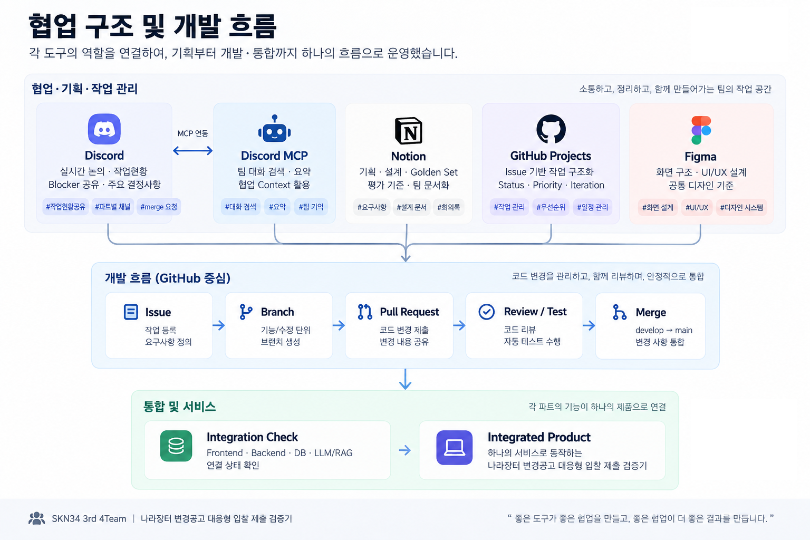
</p>

<p align="center">
  <b>협업 구조 및 개발 흐름</b>
</p>

| 도구 | 활용 방식 |
| --- | --- |
| **GitHub** | `Issue → Branch → Pull Request → Review / Test → Merge` 흐름을 기준으로 개발하고, 파트 간 변경 영향과 통합 상태를 함께 확인 |
| **GitHub Projects** | Issue를 Status, Priority, Iteration 등으로 구조화하고, MCP 기반 조회를 통해 프로젝트 상태와 작업 우선순위를 관리 |
| **Discord** | 파트별 논의, 작업현황, Blocker, Merge 요청 및 주요 결정사항을 공유하는 실시간 협업 공간으로 활용 |
| **Discord MCP** | 누적된 팀 대화를 AI가 검색·요약할 수 있도록 연결하여 진행상황, Blocker, 파트 간 요청사항과 이전 논의 맥락을 Team Context로 활용 |
| **Notion** | 프로젝트 기획, 기능 설계, Golden Set, 평가 기준 등 팀이 반복적으로 참고하는 문서를 정리 |
| **Figma** | 화면 구조와 UI/UX 설계 기준을 공유하고 Frontend 구현의 공통 기준으로 활용 |

> 각 도구를 독립적으로 사용하는 것이 아니라  
> **소통 → 작업 구조화 → 개발·리뷰 → 통합 → 문서화가 이어지는 협업 흐름**을 만드는 데 초점을 두었습니다.
---

## 📌 2. 프로젝트 개요

입찰 담당자는 공고 하나를 검토할 때 업종·지역·실적·인증 같은 참가자격 조건을 공고문과 첨부문서에서 찾아 회사 정보와 하나씩 맞춰봅니다. 문제는 나라장터 공고가 최초 게시 이후에도 정정·변경·취소된다는 점입니다. 조건이 바뀌면 이미 끝낸 검토가 조용히 무효가 됩니다.

**비드체크는 그 검토를 한 번 하고 끝내지 않습니다.** 공고문과 첨부문서에서 참가자격 요건을 근거가 되는 원문 위치와 함께 뽑아 회사 프로필과 대조하고, 변경공고가 올라오면 **그 변경이 기존 판정의 무엇을 무효로 만드는지**를 찾아 해당 요건만 다시 판정합니다.

요건을 구조화하는 일은 AI가 하고, **참가 가능 여부는 결정론적 규칙이 정합니다.** 같은 입력이면 같은 결과가 나오며, 근거를 찾지 못한 항목은 판정하지 않습니다.

### 전체 흐름

한 번 판정하고 끝나는 직선이 아닙니다. **정보가 부족하면 Ask-back으로, 공고가 바뀌면 재검증으로 판정 단계에 다시 돌아옵니다.**

<p align="center">
  
</p>

### 💡 배경 — 담당자가 실제로 확인하는 것

공고 하나에서 확인해야 하는 참가자격 조건은 다음과 같습니다.

* 업종 및 면허 등록 조건
* 지역 제한
* 기업 규모
* 각종 인증 및 등록 여부
* 수행실적
* 인력 조건
* 제출서류
* 계약 관련 조건
* 공고 첨부문서
* 변경·정정·취소 공고 이력

이 조건들은 공고문 본문과 여러 개의 첨부문서에 흩어져 있습니다. 담당자가 이미 **참가 가능 판정 → 제출서류 준비 → 내부 검토**까지 마친 뒤에 변경공고가 올라오면, 어느 조건이 달라졌는지 확인하기 위해 전·후 공고문을 처음부터 다시 대조해야 합니다. **조건이 실제로 바뀐 것인지 문구만 다듬어진 것인지는 읽어보기 전까지 알 수 없습니다.**

### 🎯 프로젝트 목표

* 공고문과 첨부문서에 흩어진 참가자격 조건을 구조화합니다.
* 판정 결과와 실제 공고 원문 근거를 함께 제공합니다.
* 정보가 부족한 경우 임의로 추정하지 않고 추가 확인이 필요한 상태로 처리합니다.
* 사용자가 답변할 수 있는 정보라면 Ask-back을 통해 보완하고 해당 요건을 다시 판정합니다.
* 변경공고 발생 시 변경된 Requirement와 기존 판정의 영향을 추적합니다.
* AI가 공고 해석과 설명을 돕되 최종 참가 가능 여부는 재현 가능한 규칙으로 처리합니다.

### 핵심 기능

**핵심 처리 흐름** — 위 다이어그램의 각 단계가 실제로 하는 일입니다.

| 기능 | 설명 |
| --- | --- |
| 나라장터 공고 조회 | 실제 나라장터 공고를 수집하고 검색하여 검토 대상을 선택합니다. |
| 공고 버전 관리 | 최초공고·변경공고 등 동일 공고의 버전을 관리합니다. |
| 공고문·첨부문서 수집 | 공고 원문과 PDF/HWP/HWPX 등의 첨부문서를 함께 관리합니다. |
| 문서 Parsing | 공고문과 첨부문서를 분석 가능한 텍스트 구조로 변환합니다. |
| 참가자격 Requirement 추출 | 자연어 공고문에서 판정에 필요한 참가자격 요건과 근거를 구조화합니다. |
| 회사 프로필 매칭 | 회사가 보유한 등록·인증·지역·실적 등의 정보를 공고 요건과 비교합니다. |
| 결정론적 참가자격 판정 | Requirement와 회사 정보를 규칙으로 비교하여 상태를 판정합니다. |
| 근거 원문 확인 | 판정 결과와 실제 공고 원문 Evidence를 연결하여 사용자가 직접 확인할 수 있습니다. |

**지원 기능** — 판정이 막히거나 공고가 바뀔 때 동작합니다.

| 기능 | 설명 |
| --- | --- |
| Ask-back | 판정에 필요한 회사 정보가 부족한 경우 사용자가 답변 가능한 항목을 추가로 확인합니다. |
| 변경공고 Diff | 이전 공고 버전과 최신 버전을 비교하여 변경 내용을 식별합니다. |
| 영향 요건 추적 | 변경 내용과 연결된 Requirement를 찾아 재검증 대상으로 지정합니다. |
| 변경공고 재검증 | 영향을 받은 Requirement만 다시 판정하여 기존 결과의 유효성을 확인합니다. |
| AI Copilot | 현재 검토 건의 판정·근거·확인 필요 항목·회사 정보·변경 내역 조회를 지원합니다. |

### 회사 정보가 부족한 경우

공고에서 필요한 조건이 존재하지만 회사 프로필만으로 판단할 수 없는 경우, 모든 `UNKNOWN`을 동일하게 처리하지 않습니다. 사용자가 직접 답변하여 해결할 수 있는 항목만 Ask-back 대상으로 구분합니다.

<p align="center">
  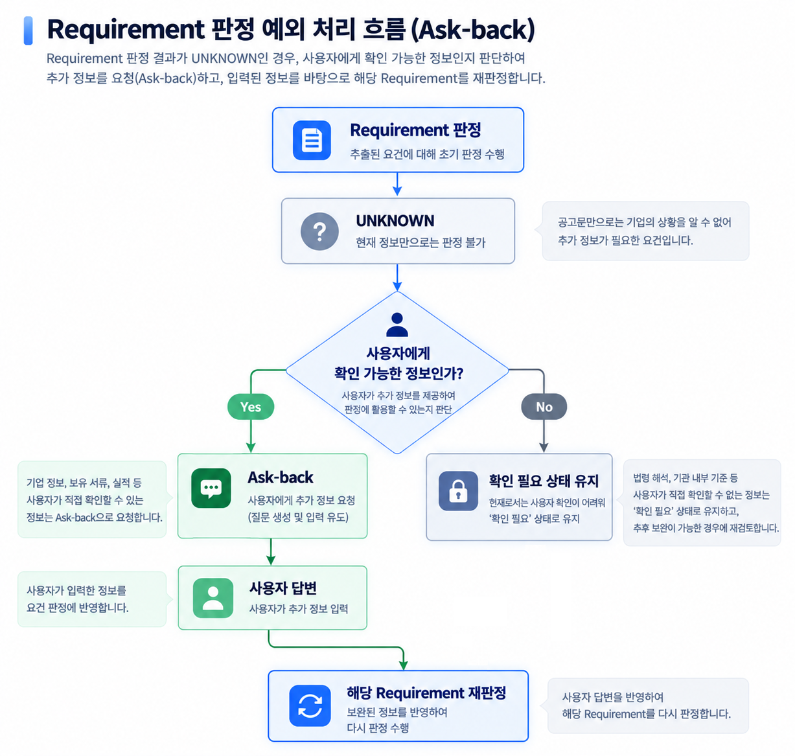
</p>

### 🚫 이 서비스가 하지 않는 것

기대를 잘못 세우면 판정을 믿을 수 없습니다. 하지 않는 것을 먼저 적습니다.

- **근거가 없으면 판정하지 않습니다.** 억지로 결론 내지 않고 「확인 필요」로 남깁니다
- **평가 점수를 예측하지 않습니다.** 제안서에서 관련 위치만 찾아주고, 다뤘는지는 담당자가 판단합니다
- **표준값이 없는 계약조항은 표시하지 않습니다.** 확실하지 않은 값을 「표준」이라고 부르지 않습니다
- **나라장터 전체 공고 검색 포털이 아닙니다.** 회사 프로필로 걸러진 공고를 다룹니다
- **최종 판단은 담당자 몫입니다.** 제출 전 공고 원문을 다시 확인해야 합니다

---

## 🛠️ 3. 기술 스택

**Frontend**

       

**Backend · API**

   

**AI · RAG**

    

**Database · Migration**

  

**Document Parsing**

  

**Data Source**


**Infrastructure · Deployment**

    

**품질 도구**

  

**협업**

   

> 스택 선택에서 두 가지만 고정했습니다. **판정 경로에는 LLM 클라이언트가 들어가지 않습니다**(NFR-2) — LangChain·OpenAI는 추출과 Copilot 경로에만 묶여 있습니다. 그리고 DB는 로컬 PostgreSQL이 아니라 **공용 Supabase**를 기준으로 삼아, 네 파트가 같은 데이터를 보고 작업했습니다.

---

## 📅 4. WBS

기획 → 설계 → 구현 → 검증 → 제출 5단계로 진행합니다. 담당은 파트 단위로 적었습니다.

<picture>
  <source media="(prefers-color-scheme: dark)" srcset="docs/assets/wbs-dark.png">
  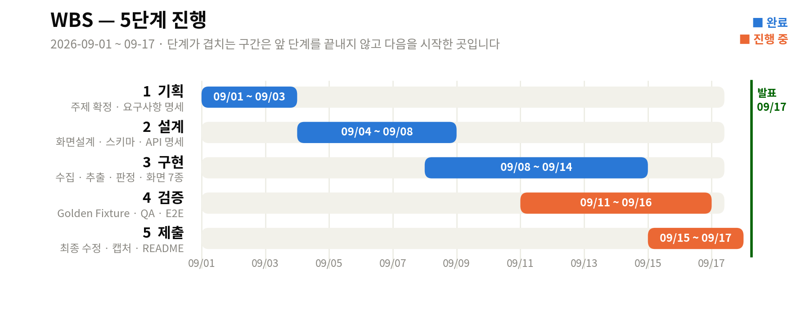
</picture>

| 단계 | 기간 | 핵심 산출물 |
| --- | --- | --- |
| 1. 기획 | 09-01 ~ 09-03 | 주제 확정 · 요구사항 명세서 · 팀 운영 규칙 |
| 2. 설계 | 09-04 ~ 09-08 | 화면설계서 · DB 스키마 v2 · API 명세 · 추출 계약 |
| 3. 구현 | 09-08 ~ 09-14 | 수집 · 추출 · 판정 엔진 · 화면 8종 · 인증 · Copilot |
| 4. 검증 | 09-11 ~ 09-16 | Golden Fixture v0.2 · Flow QA · 실공고 E2E |
| 5. 제출 | 09-15 ~ 09-17 | 최종 수정 · 캡처 · 측정 · README · 발표 |

<details>
<summary><b>전체 WBS 펼치기</b> (25개 작업)</summary>

<br>

| 단계 | 작업 | 파트 | 기간 | 산출물 |
| --- | --- | --- | --- | --- |
| **1. 기획** | 주제 선정 (후보 ~100개 → 8차 라운드) | 전원 | 09-01 ~ 09-02 | 주제 검증 문서 5건 |
| | 주제 확정 · 역할 분담 | 전원 | 09-02 | 회의록 |
| | 기획안 · 요구사항 명세서 · 팀 운영 규칙 | 기획 | 09-03 | 기획안 v1 · 요구사항 명세서 |
| | 도메인 리서치 (나라장터 · 입찰 절차) | 전원 | 09-02 ~ 09-03 | 도메인 리서치 문서 |
| **2. 설계** | 화면 설계서 시안 4종 | Frontend | 09-04 ~ 09-06 | 화면설계서 |
| | DB 스키마 v2 (차수별 저장 구조) | DB · 기획 | 09-06 | 스키마 v2 |
| | 화면별 데이터·API 명세 · Figma 규격 | Frontend | 09-07 | API 명세 · 컴포넌트 규격 |
| | 백엔드 구조 · 프로토타입 | Backend | 09-04 ~ 09-08 | API 스켈레톤 · 마이그레이션 001~005 |
| | LLM 추출 파이프라인 설계 | LLM·RAG | 09-04 ~ 09-08 | 추출 계약 · 가드레일 설계 |
| **3. 구현** | 공고 수집 (Open API 폴링) · 문서 저장 | Backend | 09-08 ~ 09-10 | notice-poller |
| | 자격요건 추출기 · 가드레일 | LLM·RAG | 09-08 ~ 09-12 | Analysis Run |
| | 판정 엔진 (결정론적 Rule) | Backend | 09-09 ~ 09-12 | Judgment Run · 판정 규칙 v0.2 → v0.3 |
| | 공용 DB 구축 · 마이그레이션 006~022 | DB | 09-09 ~ 09-14 | 분석 · 판정 · Ask-back · 재검증 · 계약조항 · 인증 |
| | 제품 화면 8종 구현 | Frontend | 09-09 ~ 09-14 | 공고 찾기 ~ 회사 프로필 · 이용안내 |
| | 로그인 · 세션 인증 · 회사별 권한 | Backend · DB | 09-11 ~ 09-13 | app_users · auth_sessions |
| | 계약조항 검토 9종 | Backend · LLM·RAG | 09-11 ~ 09-13 | contract_clause_findings |
| | AI Copilot | LLM·RAG · 통합 | 09-12 ~ 09-14 | Copilot v3 |
| **4. 검증** | Golden Fixture 라벨링 · 검수 | 전원 분담 | 09-11 ~ 09-14 | Golden Fixture v0.2 |
| | 첨부 원본 재확보 130건 | DB | 09-13 | 첨부 130/130 |
| | Flow QA 20문항 | Frontend | 09-13 | Flow QA 체크리스트 |
| | 실공고 E2E · 데모 리허설 | 전원 | 09-13 ~ 09-16 | QA 리포트 · 시연 시나리오 |
| **5. 제출** | P0 개선 · 프론트 최종 수정 | 전원 | 09-15 ~ 09-16 | PR |
| | 화면 캡처 · ERD · 아키텍처 | Frontend · DB | 09-16 | 다이어그램 · 캡처 |
| | 수치 확정 (테스트 · 회귀 결과) | Backend · LLM·RAG | 09-16 | 측정 결과 |
| | README 최종 조립 | 기획 | 09-16 | README |
| | 발표 자료 | 전원 | 09-16 ~ 09-17 | 발표 |

</details>

---

## 🧾 5. 요구사항 명세서

요구사항은 **비기능 11건 + 기능 8영역(70건)**으로 관리했습니다.
**완료조건은 전부 O/X로 갈리게 썼습니다** — 「잘 동작한다」는 완료조건으로 인정하지 않았습니다.

### 비기능 요구사항 (전 기능 적용)

기능보다 먼저입니다. 아래와 충돌하는 기능 요구사항은 폐기했습니다. **11건 중 핵심 4건:**

| ID | 요구사항 |
| --- | --- |
| NFR-1 | 화면에 나가는 모든 판정 항목에 원문과 근거가 있다 |
| NFR-2 | 판정 함수에 LLM 호출이 없다 |
| NFR-4 | 값이 없거나 신뢰도가 낮으면 판정하지 않고 「확인 필요」로 넘긴다 |
| NFR-6 | 정답이 없는 것은 판정하지 않는다 |

<details>
<summary><b>비기능 요구사항 11건 전체 + 완료조건</b></summary>

<br>

| ID | 요구사항 | 완료조건 |
| --- | --- | --- |
| NFR-1 | 화면에 나가는 모든 판정 항목에 원문과 근거(조항·페이지)가 있다 | 근거 없는 항목이 화면에 하나도 없다. 필터된 개수를 로그로 남긴다 |
| NFR-2 | 판정 함수에 LLM 호출이 없다 | 판정 모듈 의존성 그래프에 LLM 클라이언트가 없다. 같은 입력 → 같은 출력 |
| NFR-3 | 판정은 **항목 단위**로 실행된다 | 항목 1개의 입력만 바뀌면 그 항목만 재계산된다 |
| NFR-4 | 값이 없거나 신뢰도가 낮으면 판정하지 않고 「확인 필요」로 넘긴다 | 프로필 필드를 비우면 해당 항목이 「확인 필요」가 된다 |
| NFR-5 | 사용자 답변 기반 판정은 별도 표시되고 「증빙 필요」가 붙는다 | 답변으로 채운 항목이 확정 충족으로 표시되는 경우 0건 |
| NFR-6 | 정답이 없는 것은 판정하지 않는다 | 평가 대응 화면에 「충분/부족」류 판정 상태가 없다 |
| NFR-7 | 시스템 상태를 보고할 때 주어는 시스템이다 | 금지 문구가 코드·프롬프트에 0건 |
| NFR-8 | 요건 유형은 닫힌 목록이며 예시에서도 지킨다 | 스키마 밖 유형이 코드·문서·테스트 데이터에 0건 |
| NFR-9 | 표준값이 없는 계약조항 유형은 화면에 나가지 않는다 | 기준값 미확보 유형이 렌더링되지 않는다 |
| NFR-10 | 색은 판정에만 쓴다 | 평가 대응 화면에 판정 색이 0건 |
| NFR-11 | 로딩은 항목 단위 스켈레톤. 전체 화면 스피너 없음 | 파싱 중에도 이미 판정된 항목이 보인다 |

</details>

### 기능 요구사항 — 영역과 개수

<picture>
  <source media="(prefers-color-scheme: dark)" srcset="docs/assets/requirements-dark.png">
  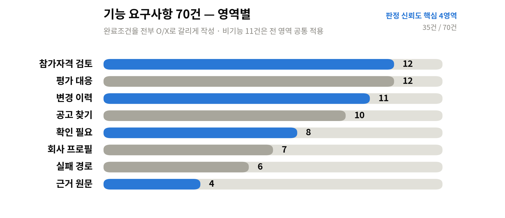
</picture>

판정을 믿을 수 있게 만드는 네 영역(참가자격 검토 · 변경 이력 · 확인 필요 · 근거 원문)에 **35건**, 전체의 절반을 뒀습니다.

| 영역 | ID | 건수 | 대표 요구사항 |
| --- | --- | --- | --- |
| 회사 프로필 | FR-P | 7 | 업종코드는 검색으로 고른다 · 실적은 **건별로** 저장한다(합계 아님) |
| 공고 찾기 | FR-F | 10 | **차수별로 저장하고 덮어쓰지 않는다** · 자격 미달 공고를 숨기지 않고 접어둔다 |
| 참가자격 검토 | FR-J | 12 | 자격 7유형을 프로필과 비교해 판정 · 실적 기간은 판정 시점에 계산 · 판정 줄마다 근거 칩 |
| 확인 필요(Ask-back) | FR-A | 8 | 폼형 카드로 묻는다(채팅 아님) · **질문에도 근거를 붙인다** · 답하면 그 항목만 재판정 |
| 근거 원문 | FR-E | 4 | 근거 칩 → 좌우 대조 · 해당 조항 강조 · 인용 조항·페이지가 실제 원문과 일치 |
| 평가 대응 | FR-C | 12 | 제안서에서 **관련 위치만** 찾는다 · 충분한지 판정하지 않는다 · 배점은 원문 그대로 병기만 |
| 변경 이력 | FR-D | 11 | 차수 증가 감지 → **구조 비교**(텍스트 diff 아님) → 영향 요건만 재판정 · 영향 없는 변경도 표시 |
| 실패 경로 | FR-X | 6 | 첨부를 못 읽으면 「읽지 못했습니다」와 원문 링크 · 기본값으로 채우지 않는다 |

우선순위 — Must = 없으면 데모 성립 안 됨 · Should = 데모를 완성시킴 · Could = 있으면 좋음

---

## 🗂️ 6. ERD

도메인 테이블 **30개** + 코드표 4개. 라이브 DB 스키마와 직접 대조해 만들었고 마이그레이션 024까지 반영돼 있습니다.

### 도메인 지도

<p align="center">
  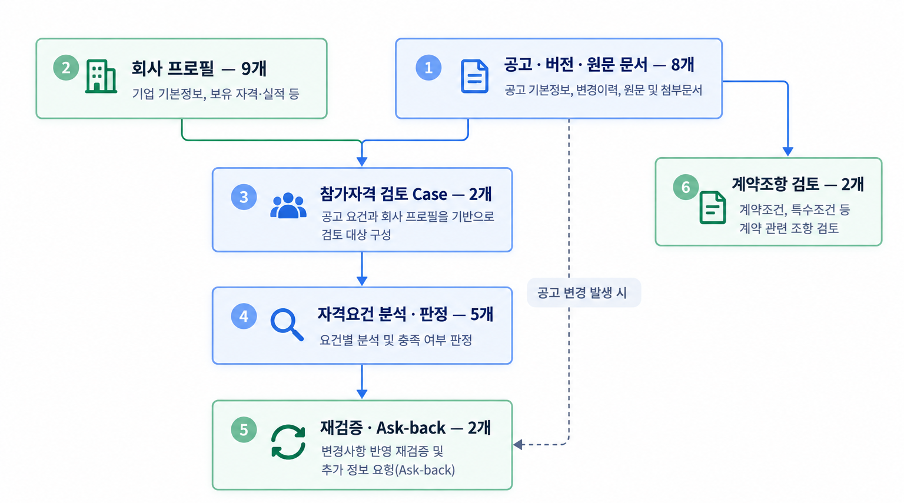
</p>

| 도메인 | 테이블 | 수 |
| --- | --- | --- |
| ① 공고 · 버전 · 원문 문서 | `bid_notices` `bid_notice_versions` `notice_documents` `notice_collection_runs` `notice_change_histories` `notice_facts` `notice_history_backfill_jobs` `notice_relations` | 8 |
| ② 회사 프로필 | `companies` `company_industries` `company_staff` `company_staff_roles` `company_sw_engineer_grades` `company_performances` `company_performance_fields` `company_certifications` `company_qualification_profile_completeness` | 9 |
| ③ 참가자격 검토 Case | `preflight_cases` `proposal_documents` | 2 |
| ④ 자격요건 분석 · 판정 | `qualification_analysis_runs` `qualification_requirements` `qualification_evidence` `qualification_judgment_runs` `qualification_judgments` | 5 |
| ⑤ 재검증 · Ask-back | `qualification_answers` `qualification_revalidation_runs` | 2 |
| ⑥ 계약조항 검토 | `contract_clause_review_runs` `contract_clause_findings` | 2 |
| ⑦ 인증 | `app_users` `auth_sessions` | 2 |

⑦ 인증은 회사 프로필과 연결되지만 검증기 도메인 흐름과는 독립적입니다.

### 뼈대 — 공고가 차수별로 쌓이고, 판정이 그 차수에 묶인다

**이 구조가 이 서비스의 전제입니다.** `bid_notices`(공고) 아래 `bid_notice_versions`(차수)를 두고 덮어쓰지 않습니다. 공고를 덮어쓰면 1차와 2차를 비교할 수 없고, 변경 재검증이 원천적으로 불가능해집니다.

<p align="center">
  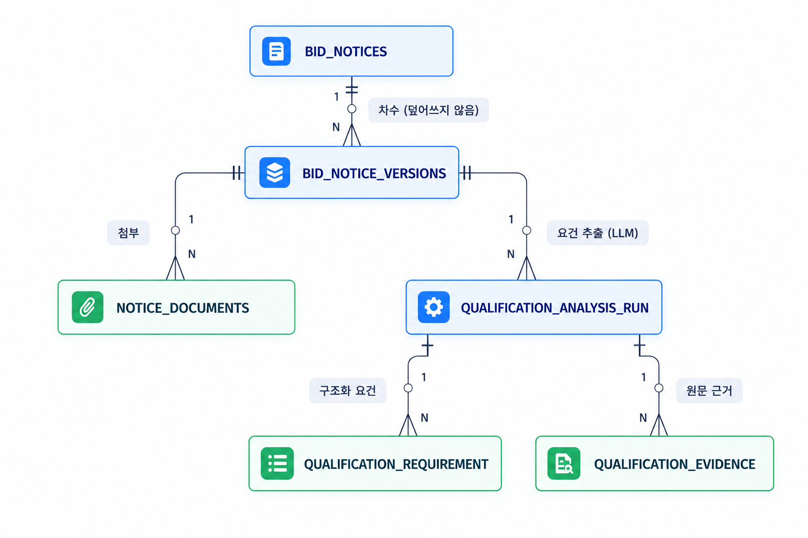
</p>

**검토 건 하나에 판정이 매달리는 구조** — 회사와 공고가 만나 검토 건이 되고, 그 아래로 판정 · Ask-back · 재검증이 붙습니다.

<p align="center">
  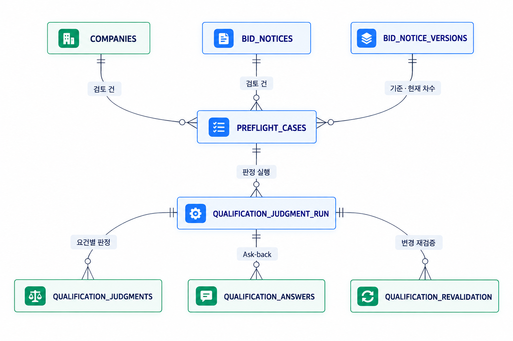
</p>

**판정 하나가 무엇에 묶여 있는지** — `qualification_judgment_runs`는 검토 건 · 분석 Run · 회사 · 공고 차수를 모두 참조하고, `profile_snapshot`에 판정 시점의 회사 정보를 통째로 남깁니다. 회사 정보가 나중에 바뀌어도 과거 판정이 **어떤 회사 정보로 계산됐는지** 그대로 남습니다.

**변경 재검증** — `qualification_revalidation_runs`가 기준 분석 · 현재 분석 · 직전 판정을 함께 참조하고, `revalidated_keys`에 **영향받은 요건 키만** 기록합니다.

**전체 ERD** — 도메인 7개 · 다이어그램 10장 · 테이블별 컬럼과 제약까지: [db-erd-current.md](https://github.com/gyuniverse-hq/bid-change-validator/blob/develop/docs/04_contracts/db-erd-current.md)

---

## 📚 7. 주요 프로시저

### 7.1 시스템 아키텍처

비드체크는 운영 환경과 로컬 개발 환경에서 동일한 Frontend·Backend 코드와 핵심 처리 흐름을 사용합니다. 운영 환경에서는 Nginx를 HTTPS 진입점으로 사용하고, 데이터베이스와 문서 저장소는 환경에 맞게 구성했습니다.

#### 7.1.1 실제 배포 환경

실제 서비스는 OCI Compute에서 Frontend, Backend API, 공고 수집기를 운영합니다. 사용자의 HTTPS 요청은 Nginx가 화면·RSC 요청과 API 요청으로 분기합니다.

공고 정보, 추출 텍스트, 분석 및 판정 결과 등 구조화 데이터는 Supabase PostgreSQL에 저장하고, 수집된 첨부파일 원본은 OCI Object Storage에 저장합니다.

<p align="center">
  
</p>

운영 환경의 주요 처리 흐름은 다음과 같습니다.

1. Notice Poller가 나라장터 Open API에서 공고, 변경 차수, 첨부문서를 수집합니다.
2. 공고 정보와 추출 텍스트는 Supabase PostgreSQL에 저장하고, 첨부파일 원본은 OCI Object Storage에 저장합니다.
3. Backend가 첨부문서를 Parsing하고, Section/Keyword 기반 후보 선택과 LLM을 통해 참가자격 Requirement와 Evidence를 구조화합니다.
4. Rule Engine이 구조화된 Requirement와 회사 프로필을 비교하여 결정론적으로 판정합니다.
5. Copilot의 공고문 질의 기능은 준비된 FAISS/Hybrid 검색 경로를 이용해 관련 원문 근거를 조회합니다.
6. Frontend는 판정 결과, 원문 근거와 변경공고 재검증 결과를 제공합니다.

#### 7.1.2 로컬 개발 환경

로컬 개발 환경에서도 운영 환경과 동일한 Frontend·Backend 코드와 핵심 처리 흐름을 사용합니다.

Frontend는 Vinext 개발 서버로 실행하고, Backend API, PostgreSQL, Notice Poller는 Docker Compose로 실행합니다. 운영 환경의 OCI Object Storage 대신 로컬 Docker Volume에 첨부파일 원본을 저장합니다.

<p align="center">
  
</p>

로컬 환경의 주요 처리 흐름은 다음과 같습니다.

1. Notice Poller가 나라장터에서 공고, 변경 차수, 첨부문서를 수집합니다.
2. 공고 정보와 추출 텍스트는 로컬 PostgreSQL에 저장합니다.
3. 첨부파일 원본은 로컬 Docker Volume에 저장합니다.
4. Backend가 첨부문서를 Parsing하고 참가자격 요건과 근거를 구조화합니다.
5. Rule Engine이 구조화된 요건과 회사 프로필을 비교하여 판정합니다.
6. Frontend에서 판정 결과, 원문 근거, Ask-back 및 변경공고 재검증 결과를 확인합니다.

운영 환경과 로컬 개발 환경은 동일한 애플리케이션 코드와 판정 흐름을 사용합니다. 운영 환경에서는 데이터베이스와 문서 저장소를 각각 Supabase PostgreSQL과 OCI Object Storage로 분리하고, 로컬 환경에서는 Docker Compose의 PostgreSQL과 Docker Volume을 사용합니다.

### 7.2 AI·Rule 설계

어디까지가 LLM이고 어디부터가 코드인지를 한 장으로 보면 다음과 같습니다. **노란 테두리가 LLM이 하는 일, 초록 테두리가 코드가 결정론적으로 하는 일입니다.**

<p align="center">
  
</p>

🟡 노란 테두리 — LLM이 하는 일 &nbsp;·&nbsp; 🟢 초록 테두리 — 코드가 결정론적으로 하는 일

| 영역 | 실제 담당 |
| --- | --- |
| 공고문 구조화 해석 | LLM |
| 참가자격 Requirement 추출 | LLM Structured Extraction |
| 추출 결과 원문 검증·정규화 | Deterministic Grounding / Validation |
| 회사 정보 매핑 | Backend |
| 최종 참가자격 판정 | Deterministic Rule Engine |
| 원문 검색·질의응답 | Version-scoped Document RAG / LLM |
| 변경 영향 분석 | Requirement Diff + Rule Engine |

> **LLM은 공고를 구조화하고 설명하지만 최종 참가 가능/불가를 임의로 결정하지 않습니다.**

판정 상태는 다음 세 가지입니다.

| 상태 | 의미 |
| --- | --- |
| `SATISFIED` | 현재 회사 정보로 요건 충족을 확인 |
| `UNSATISFIED` | 현재 회사 정보로 요건 미충족을 확인 |
| `UNKNOWN` | 현재 정보만으로 확정할 수 없음 |

**`UNKNOWN` ≠ `ASKABLE`** — `UNKNOWN`이 곧 사용자 질문 대상이라는 뜻은 아닙니다. 단일 사용자 사실로 안전하게 해소할 수 있는 요건만 `ASKABLE`로 분류합니다.

판정에는 Requirement, 회사 정보 또는 사용자 답변, 원문 Evidence와 버전 정보를 함께 남깁니다. 생성된 설명 자체가 아니라 공고 원문의 문서·페이지·문단 위치를 근거로 사용합니다.

> 화면에는 위 영어 상태값이 그대로 나가지 않습니다. `apps/web/lib/status-copy.ts`에서 한국어 라벨로 바꿉니다.

### 7.3 변경공고 재검증

<p align="center">
  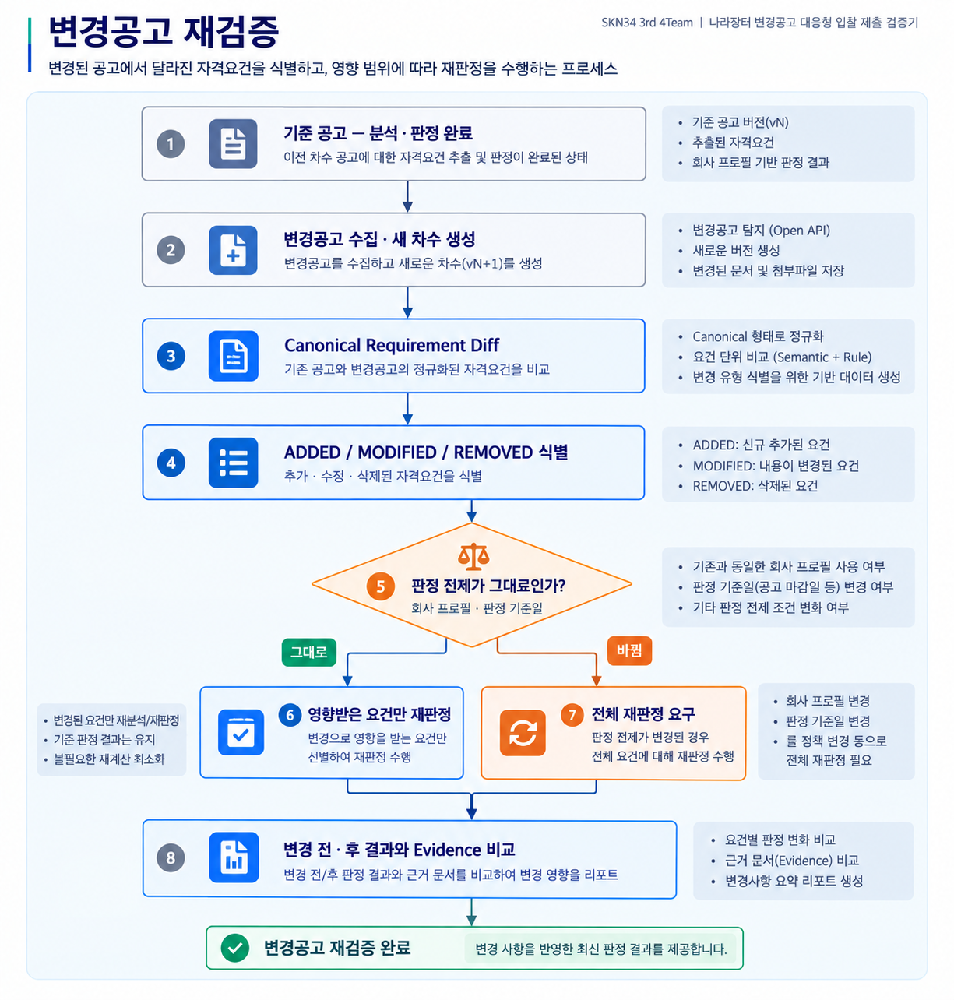
</p>
코드 경로와 합성 회귀 테스트는 구현되어 있습니다. 변경되지 않은 요건은 기존 판정을 승계하고, 추가·수정된 요건만 현재 회사 프로필로 다시 판정합니다. 기준 판정 이후 회사 프로필이나 판정 기준일이 바뀌었다면 부분 재검증을 중단하고 전체 재판정을 요구합니다.

실제 공고 `R26BK01686455`에서 강원도 지역 제한 문구가 변경 차수에서 사라진 사례를 G2 후보로 확보했습니다. 다만 현재 관찰 라벨은 `DRAFT / not_ground_truth`이며, 의미상 요건 삭제와 법적 효력은 사람 검수 전이므로 실사례 검증 완료로 표시하지 않습니다.

| 검증 단계 | 상태 |
| --- | --- |
| 변경 Diff·affected-only 코드 | 구현 |
| 합성 G0 회귀 | 통과 |
| 실제 변경공고 후보 데이터 | 확보 |
| 실제 Ground Truth·Human Validation | 진행 중 |

### 7.4 AI Copilot

AI Copilot은 범용 챗봇이 아니라 **현재 입찰 검토 Case를 자연어로 탐색하기 위한 업무 인터페이스**입니다.

참가 가능 여부를 새로 판정하는 대신 Backend에 저장된 현재 Judgment, Company Profile, 확인 필요 항목, 변경 결과와 공고 원문을 다시 조회해 설명합니다.

#### Guided Job 2종 · 추천 질문 6개

**변경공고 대응**

1. 무엇이 바뀌었나요?
2. 우리 회사에 어떤 영향이 있나요?
3. 무엇을 확인해야 하나요?

**입찰 참여 준비**

1. 필요한 서류·기한·방법은?
2. 준비 순서는?
3. 아직 확인하지 못한 것은?

추천 질문뿐 아니라 자유 입력도 함께 지원합니다.

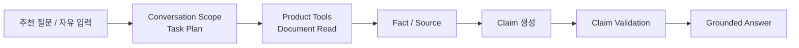

#### Product Read Tool

```text
READ_JUDGMENT
READ_PROFILE
READ_CHECKS
READ_DOCUMENT
READ_CHANGES
```

Copilot은 대화 History 자체를 서비스 사실로 사용하지 않습니다.

예를 들어 사용자가:

> “두 번째 조건은 왜 확인 필요야?”

라고 물으면 직전 답변에서 실제로 보여준 두 번째 Target을 찾고, 현재 Case의 Product 상태와 Source를 Backend에서 다시 조회합니다.

#### Fact · Source · Claim Validation

생성 답변을 그대로 사용자에게 보여주지 않고 다음 구조로 검증합니다.

```text
Server Fact / Document Source
→ Model Draft
→ Claim Validation
→ Supported Claim만 게시
```

검증되지 않은 Claim은 제거하거나 `PARTIAL`로 반환합니다.

#### Write Safety

사용자의 자연어 동의를 바로 저장 명령으로 처리하지 않습니다.

```text
/chat
→ Read / Explain / Action Proposal

/actions/confirm
→ 명시적 사용자 확인
→ 최신 상태 재검증
→ Product Service 실행
```

따라서 `"응"`, `"그래"` 같은 자연어만으로 회사정보 저장이나 재검증이 실행되지 않습니다.

> **대화는 기억하되, 사실은 Backend에서 다시 확인합니다.**

상세 구조와 안전 설계는 [`docs/04-AI-Core-Copilot.md`](./docs/04-AI-Core-Copilot.md)를 참고합니다.

---

## 📁 프로젝트 구조

```
bid-change-validator/
├── apps/api/     # FastAPI — 수집 · 추출 · 판정 · Copilot · 문서 RAG
├── apps/web/     # vinext(Vite + RSC) — 제품 화면 8종
├── services/     # 문서 파싱
├── db/ data/     # 시드 · 마스터 코드
├── contracts/    # 파트 간 계약
├── docs/         # 01_product ~ 09_roadmap
└── samples/golden/
```

<details>
<summary><b>전체 트리 펼치기</b></summary>

<br>

```
bid-change-validator/
├── apps/
│   ├── api/                      # FastAPI 백엔드
│   │   ├── alembic/versions/     # 마이그레이션 001~024
│   │   ├── app/
│   │   │   ├── ai/               # LLM 추출 · 계약조항 검토 · 품질 평가
│   │   │   ├── copilot/          # AI Copilot (의도 분류 · 도구 · 답변)
│   │   │   ├── document_rag/     # 문서 검색 · 근거 연결
│   │   │   ├── qualification/    # 분석 · 판정 · Ask-back · 재검증 (Rule)
│   │   │   ├── routers/          # HTTP 경계
│   │   │   ├── services/         # 수집 · 문서 저장 · 텍스트 추출
│   │   │   └── workers/          # 공고 폴링
│   │   ├── eval/                 # Golden 평가 하네스
│   │   └── tests/
│   └── web/                      # vinext (Vite + RSC) 프론트엔드
│       ├── app/                  # 라우트 — notices · qualification · ask-back
│       │                         #         evidence · evaluation · changes
│       │                         #         company · guide · login
│       ├── components/product/   # 제품 공용 컴포넌트
│       ├── lib/                  # API 클라이언트 · 상태 · 라벨(status-copy.ts)
│       └── tests/
├── services/document-ai/         # 문서 파싱 서비스
├── db/                           # 시드 · 마스터 코드
├── data/                         # 마스터 데이터
├── contracts/                    # 파트 간 계약
├── docs/                         # 01_product ~ 09_roadmap
├── samples/golden/               # Golden Fixture
├── infra/
├── scripts/
└── docker-compose.yml
```

</details>

---

## ⚙️ 실행 방법

> 아래 명령은 실제 개발 저장소 [`gyuniverse-hq/bid-change-validator`](https://github.com/gyuniverse-hq/bid-change-validator/tree/develop)의 `develop` 브랜치 기준입니다. 현재 공식 제출 저장소에는 코드가 동기화되지 않았으므로 이 저장소에서 바로 실행할 수 없습니다.

### 요구 환경

- Docker / Docker Compose
- Node.js 22.13 이상
- pnpm
- 나라장터 Open API Service Key
- OpenAI API Key

### Backend / Database

저장소 루트의 `.env.example`을 `.env`로 복사한 뒤 환경변수를 설정합니다.

```bash
cp .env.example .env          # PowerShell: Copy-Item .env.example .env
docker compose up -d --build api
```

API 시작 전에 Alembic migration이 자동 적용됩니다. 변경공고 수집기를 함께 실행하려면 다음 명령을 사용합니다.

```bash
docker compose --profile collector up -d --build api notice-poller
```

### Frontend

```bash
cd apps/web
cp .env.example .env.local    # PowerShell: Copy-Item .env.example .env.local
pnpm install
pnpm dev
```

| 서비스 | 주소 |
| --- | --- |
| Frontend | http://localhost:3000 |
| Backend API | http://localhost:8000 |
| Swagger | http://localhost:8000/docs |
| Health Check | http://localhost:8000/health |

OpenAI API Key가 없으면 자격요건 분석과 Document RAG처럼 외부 모델이 필요한 경로는 실행되지 않습니다.

### 프로덕션 구동

정적 파일만 서빙하면 화면 이동이 동작하지 않습니다 — RSC 응답을 서버가 만들어야 합니다.

```bash
pnpm build
pnpm exec vinext start --hostname 0.0.0.0 --port 3000
```

앞단 nginx가 경로로 나눠 보냅니다. 프론트와 백엔드가 같은 도메인을 쓰므로 세션 쿠키가 그대로 붙습니다.

| 경로 | 보내는 곳 |
| --- | --- |
| `/api/*` | Backend `:8000` |
| 나머지 · RSC 요청 | Frontend `:3000` |

> 배포 자동화는 아직 없습니다. compose·워크플로 정리는 후속 작업입니다.

---

## ✅ 8. 수행결과 (테스트 및 시연 페이지)

### 8.1 화면 흐름 (UX Flow)

로그인으로 들어와 제품 화면 8종이 이어지는 순서입니다. **한 번 판정하고 끝나는 직선이 아니라, 확인 필요와 변경 이력에서 판정 화면으로 되돌아옵니다.**

<p align="center">
  
</p>

| 되돌아오는 경로 | 무엇이 다시 도나 |
| --- | --- |
| 확인 필요 → 참가자격 검토 | 사용자가 답한 **그 요건 하나만** 재판정합니다. 전체를 다시 돌리지 않습니다 |
| 변경 이력 → 참가자격 검토 | 차수 Diff로 **영향받은 요건만** 재검증합니다. 판정 전제가 바뀌었으면 전체 재판정을 요구합니다 |
| 회사 프로필 → 참가자격 검토 | 비어 있던 값을 채우면 그 값을 쓰는 요건이 다시 판정됩니다 |

설계 단계의 화면 시안·필드 명세·화면별 API 명세는 개발 저장소 `docs/` 에 있습니다.

### 8.2 서비스 화면


| 화면 | Route | 현재 범위 |
| --- | --- | --- |
| 공고 찾기 | `/notices` | 실제 공고 검색·버전 조회·분석된 공고 매칭 |
| 참가자격 검토 | `/qualification` | Analysis → Judgment와 요건·근거 확인 |
| 확인 필요 | `/ask-back` | `ASKABLE UNKNOWN` 답변과 부분 재판정 |
| 근거 원문 | `/evidence` | Requirement·판정·원문 Evidence 연결 |
| 평가 대응 | `/evaluation` | 참가자격 기반 참고 정보 제공 · 평가 전용 추출과 점수 예측은 미지원 |
| 변경 이력 | `/changes` | 버전·Requirement Diff와 재검증 결과 |
| 회사 프로필 | `/company` | 회사 정보·업종·실적·인증/등록 관리 |
| 이용안내 | `/guide` | 처음 쓰는 사용자를 위한 3단계 흐름과 화면별 안내 |

제품 화면 8종의 이동과 주요 API 연결은 구현되어 있습니다. 실제 G2와 안전한 Ask-back 답변을 포함한 전체 Human Click E2E는 최종 검증 대기 상태입니다.

제품에 처음 들어오면 **이용안내**가 먼저 보입니다. 3단계 흐름과 화면별로 하는 일, 그리고 「이 서비스가 하지 않는 것」을 제품 안에서도 같은 문장으로 적어 두었습니다.

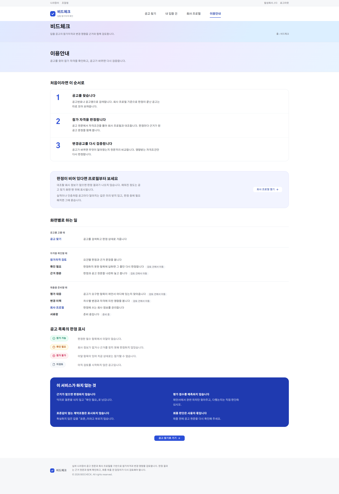

아래 캡처 6장 중 첫 장은 판정에 들어가는 입력값이고, 나머지 5장은 8.3 시연 시나리오와 같은 순서입니다.

**S0 · 회사 프로필** — 판정에 쓰이는 회사 값을 출처·갱신일과 함께 관리합니다. 비어 있는 값은 미달로 만들지 않고 「확인 필요」로 남깁니다.

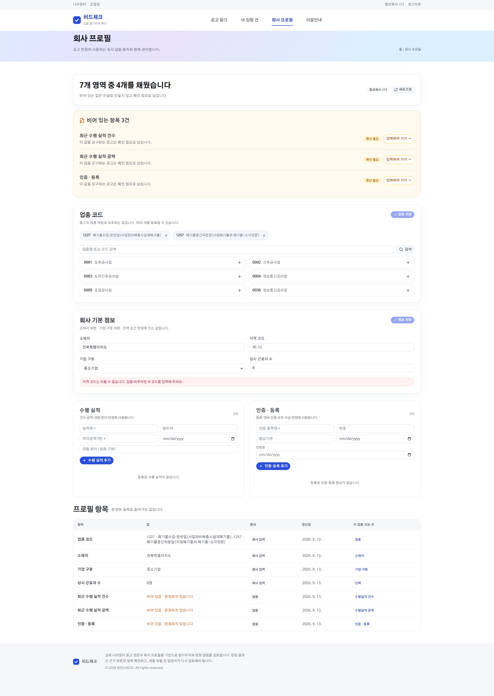

**S1 · 공고 찾기** — 회사 프로필로 걸러진 공고 목록에서 대상 공고를 엽니다.

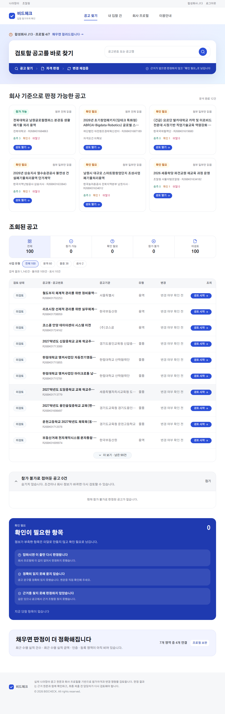

**S2 · 참가자격 검토 (기준 v1)** — 1차 공고 기준 판정입니다. 화면 위 `기준 v1 / 현재 v2` 버튼으로 차수를 바꿉니다.

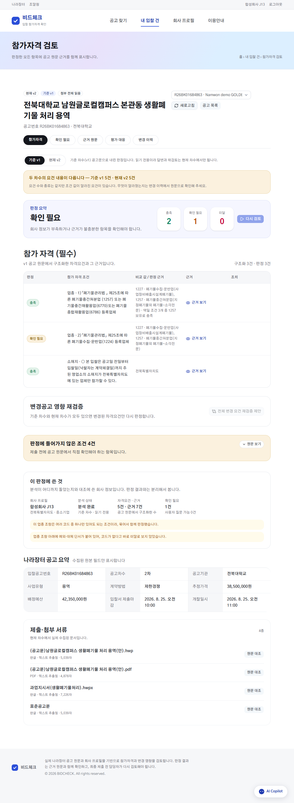

**S3 · 근거 원문** — 판정 옆 「근거 보기」를 누르면 그 판정이 나온 공고 원문 문장이 그대로 열립니다.

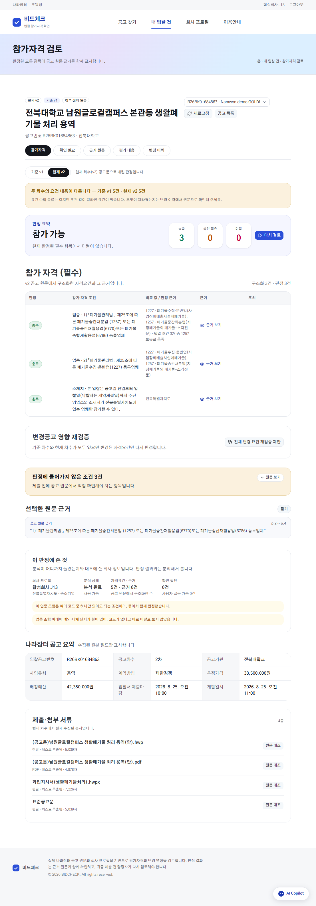

**S4 · 참가자격 검토 (현재 v2)** — 2차 공고 기준으로 바꾼 결과입니다. 1차에서 보류했던 항목이 충족으로 확정됩니다.

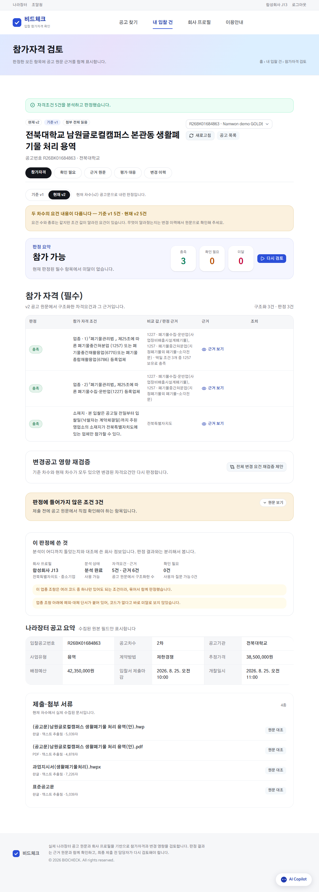

**S5 · 변경 이력** — 1차와 2차 원문을 좌우로 대조합니다. 등록코드 요구가 1224에서 1227로 바뀐 지점입니다.

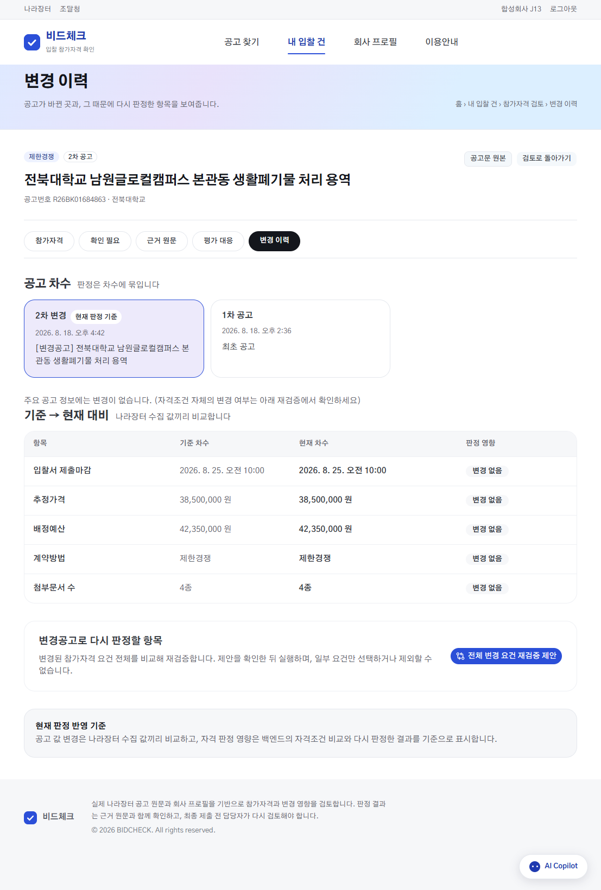

### 8.3 시연 시나리오

데모 케이스는 Golden Fixture **J13 · `R26BK01684863`** 전북대학교 남원글로컬캠퍼스 본관동 생활폐기물 처리 용역입니다.
1차 → 2차에서 폐기물 운반업 등록코드가 **1224 → 1227**로 바뀐 사례입니다.

| # | 화면 | 보는 것 |
| --- | --- | --- |
| S1 | 공고 찾기 `/notices` | 회사 프로필로 걸러진 목록에서 대상 공고를 엽니다 |
| S2 | 참가자격 검토 `/qualification` · 기준 v1 | 1차 공고는 1224 등록업체를 요구하고 이 회사는 1224가 없습니다. 다만 같은 조항에 「장비를 갖춘 경우 등록을 별도로 요구하지 않을 수 있다」는 예외가 붙어 있어 공고문만으로 가를 수 없습니다. 그래서 미달로 확정하지 않고 **확인 필요**로 남깁니다 |
| S3 | 근거 원문 | 판정 옆 「근거 보기」를 누르면 그 판정이 나온 공고 원문 문장이 그대로 열립니다 |
| S4 | 참가자격 검토 · 현재 v2 | 화면 위 `기준 v1 / 현재 v2` 버튼으로 차수를 바꿉니다. 2차가 요구하는 **1227**을 이 회사가 보유하고 있어, 1차에서 보류했던 항목이 2차 기준으로는 **충족으로 확정**됩니다 |
| S5 | 변경 이력 `/changes` | 1차 원문과 2차 원문을 좌우로 대조합니다. 텍스트를 통째로 비교하지 않고 원문에서 구조화한 요건을 비교하기 때문에, 문구만 바뀐 변경과 요건이 바뀐 변경이 갈립니다 |

> 1차 판정은 미달이 아니라 **보류**였습니다. 「참가 불가였는데 가능해졌다」가 아니라 「1차에서는 판단을 보류했고, 2차 공고 기준으로는 충족으로 확정됐다」가 정확한 표현입니다.

### 8.4 데이터 및 Evaluation

> 📄 수집 과정과 전처리 8단계, 데이터 출처·라이선스는 [데이터 수집·전처리 문서](docs/데이터-수집-전처리.md)에 따로 정리했습니다.

**실제 수집 데이터**

| 항목 | 규모 |
| --- | ---: |
| 공고 | 1,132건 |
| 차수 | 1,265건 |
| 첨부문서 | 4,826건 |

차수가 공고보다 많은 것은 정정·변경공고가 실제로 발생했기 때문입니다(공고당 평균 1.12차수). 이 프로젝트가 다루는 「변경공고 대응」 상황이 합성이 아니라 실데이터에 존재한다는 뜻입니다.

정기 수집 대상은 **용역 · 물품 · 공사 · 외자** 4개 유형이며, 기타(OTHER)는 응답 구조가 일정하지 않아 기본 폴링 범위에서 제외했습니다.

| 첨부문서 텍스트 추출 | 건수 | 비율 |
| --- | ---: | ---: |
| 성공 | 4,529 | 93.8% |
| 미지원 포맷 | 220 | 4.6% |
| 실패 | 42 | 0.9% |
| 빈 문서 | 29 | 0.6% |
| 대기 | 6 | 0.1% |

**Rule 회귀용 Golden Fixture v0.2**

| 항목 | 규모·상태 |
| --- | ---: |
| 고유 공고 | 20건 |
| 합성 회사 프로필 | 32세트 |
| 이전 차수 입력 | 8건 |
| 전체 판정 입력 | 40건 / 138개 요건 행 |
| 검수 상태 | `DRAFT_NOT_APPROVED` |

이 Fixture는 Canonical Requirement를 Rule Engine에 직접 입력하여 판정 회귀를 확인합니다. 따라서 Requirement Extraction 성능이나 승인된 최종 Ground Truth를 의미하지 않습니다.

| 측정 시점 | 기대값 일치 | 안전한 보류 | 잘못된 확정 판정 | 공고 단위 일치 | 해석 |
| --- | ---: | ---: | ---: | ---: | --- |
| E0 초기 기준선 | 104/138 (75.4%) | 34/138 (24.6%) | 0건 | 36/40 (90.0%) | 안전성 보완 전 고정 기준선 |
| 2026-09-13 회귀 | 110/138 (79.7%) | 28/138 (20.3%) | 0건 | 37/40 (92.5%) | 보류 6건을 확정으로 옮기면서 오판 0건 유지 |
| 2026-09-16 재확인 | 110/138 (79.7%) | 28/138 (20.3%) | 0건 | 37/40 (92.5%) | 업종 마스터 14건 수정 후 재확인 · 변동 없음 · Golden gate 통과 |

**최신 측정 근거**

| 항목 | 값 |
| --- | --- |
| 측정 일자 | 2026-09-15 18:42 KST |
| 기준 커밋 | `ee8dd7a3888d350fe597e177f89c4935f5d1f00f` |
| Fixture SHA-256 | `552eb031612e5004efc67adbaeb0f015fad73de714e807014c4cf61d391efe9c` |
| 게이트 | Golden gate 통과 |

> 이 회귀는 DB의 업종 마스터를 조회하지 않고 frozen canonical requirement를 판정기에 직접 입력합니다.
> 그래서 9/15의 업종 마스터 14건 수정은 이 수치를 움직이지 않습니다. 마스터 수정이 바꾸는 것은 라이브 판정입니다.
> 그래서 9/15에 고친 업종 마스터 명칭 14건은 위 숫자를 움직이지 않습니다. 마스터 수정의 실제 효과는
> 마스터를 조회하는 제품 추출 경로에서 live recall을 따로 재야 확인됩니다.

<picture>
  <source media="(prefers-color-scheme: dark)" srcset="docs/assets/regression-dark.png">
  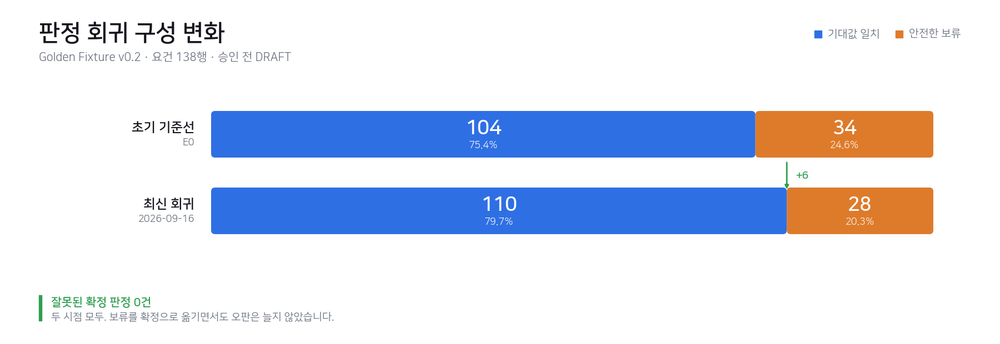
</picture>

> **결과를 읽을 때의 주의사항**
> 승인 전 `DRAFT` Fixture에 Canonical Requirement를 직접 입력한 **Rule 회귀 지표**입니다.
> Requirement Extraction·LLM·서비스 전체 정확도를 의미하지 않습니다.
> 분모는 공고 20건에서 뽑은 요건 138행이며, 공고 단위 일치의 분모는 판정 입력 40건입니다.

**평가 레이어**

| 평가 레이어 | 현재 확인 범위 | 상태 |
| --- | --- | --- |
| Rule / Judgment | 기대값 일치, safe abstention, wrong determinate | 회귀 기준선 운영 |
| Requirement Extraction | 합성 selection harness와 실제 snapshot 확보 | 최종 실공고 라벨·F1 미확정 |
| Document RAG | Recall@4, Citation 구조·버전 무결성 | 정량 평가 수행, 의미 정답률 별도 검수 필요 |
| AI Copilot | Routing 및 시나리오 계약 평가 | 사용자 Task 평가 대기 |
| 변경공고 G2 | 실제 변경 후보와 원문 Diff | Human Validation 진행 중 |
| User E2E | 화면 Route와 일부 흐름 | 전체 성공 시나리오 검증 대기 |

**Document RAG 검색 지표**

<picture>
  <source media="(prefers-color-scheme: dark)" srcset="docs/assets/rag-dark.png">
  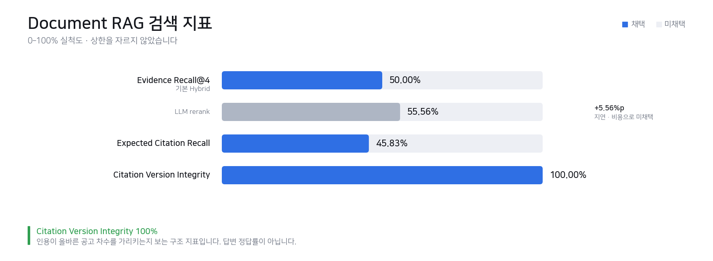
</picture>

기본 Hybrid Retrieval의 Evidence Recall@4는 50.00%입니다. LLM rerank가 55.56%로 5.56%p 높았지만 지연과 호출 비용이 커 기본 경로에는 적용하지 않았습니다. **Citation Version Integrity는 100%** 이며, 이는 인용이 올바른 공고 차수를 가리키는지를 보는 **구조 지표**로 답변 정답률이 아닙니다.

상세 근거:

- [Golden Fixture v0.2](https://github.com/gyuniverse-hq/bid-change-validator/tree/develop/samples/golden/qualification-v0.2)
- [실공고 Snapshot Dataset](https://github.com/gyuniverse-hq/bid-change-validator/tree/develop/samples/golden/qualification-real-v0.1)
- [Document RAG Evaluation](https://github.com/gyuniverse-hq/bid-change-validator/blob/develop/docs/08_qa_reports/ai-copilot-v2/e3-rag-evaluation.md)

### AI Copilot · Document Retrieval 개선 결과

AI Copilot은 처음부터 자유질문을 잘 처리한 것이 아니라, 고정 평가셋에서 실패를 측정한 뒤 단계적으로 개선했습니다.

#### 자유질문 Routing

100개 자유입력 평가셋:

```text
Document QA           60
Judgment Explanation  32
Change Comparison      8
-------------------------
Total                 100
```

| 단계 | Routing Exact Match | 주요 변경 |
| --- | ---: | --- |
| E0 Baseline | **1 / 100** | Keyword 중심 Router |
| E1 | **41 / 100** | 명확한 Alias 및 실패 UX 보완 |
| E2 | **100 / 100** | Weak Read에만 Semantic Router 재검토 |

모든 요청을 LLM Router에 넘기지 않고 다음 방식을 선택했습니다.

```text
명확한 UI Intent / Write
→ Deterministic

UNKNOWN / Weak Read
→ Semantic Recheck
```

> `100/100`은 챗봇 답변 정확도가 아니라 **고정 100문항의 Intent Routing Exact Match**입니다.

#### Document Retrieval 비교

동일한 Document QA Fixture에서 `k=4`로 비교했습니다.

| 검색 방식 | Recall@4 | p50 Latency |
| --- | ---: | ---: |
| Dense | **29.17%** | 144.50ms |
| Hybrid | **50.00%** | 170.58ms |
| Hybrid + LLM Rerank | **55.56%** | 2849.73ms |

LLM Rerank가 가장 높은 Recall을 기록했지만 Hybrid 대비 개선 폭은 `+5.56%p`인 반면 p50 응답시간은 약 `2.85초`까지 증가했습니다.

따라서 기본 검색 전략은 **Dense + BM25 Hybrid Retrieval**을 선택했습니다.

> 가장 높은 Offline Metric보다 **검색 품질 · Latency · 비용 · 운영 복잡도**를 함께 고려했습니다.

#### Grounded Answer 개선

초기에는 Citation 존재 여부만 확인했지만 다음 문제가 있었습니다.

- 질문과 관계없는 Source를 Citation
- 일부 근거만 있는데 전체 조건을 확정
- 원문의 불완전한 코드·숫자를 모델이 임의로 보정

이를 다음과 같이 개선했습니다.

```text
Prompt v1
Citation 존재

↓ v2

직접 근거가 없으면 Abstain

↓ v3

Partial Evidence를 전체 결론으로 확대 금지

↓ v4

원문 값의 임의 복구 금지

↓ v3.1

Fact / Source / Claim Validation
```

최종 평가에서 Citation Version Integrity는 **100%**를 유지했습니다.

#### Guided Job Actual Model 평가

최종 Demo 대상인 전북대학교 남원글로컬캠퍼스 사례에서 합성 Company Profile J13~J16을 사용했습니다.

```text
4 Profiles
×
6 Guided Questions
=
24 Turns
```

결과:

```text
23 / 24 COMPLETE
1 / 24 PARTIAL
```

PARTIAL 1건은 잘못된 Fact 참조가 포함된 추천 Claim을 Validation 단계에서 제거한 사례입니다.

- 예상하지 않은 Write Action: **0건**
- 내부 식별자 노출 오류: **0건**
- 평균 Latency: 약 **26.92초**
- 최대 Latency: 약 **54.13초**

> `23/24`는 사람 사용자 성공률이 아니라 **합성 Company Profile 기반 Actual Model Task 실행 결과**입니다.

평가 과정과 지표 정의는 [`docs/05-테스트-평가.md`](./docs/05-테스트-평가.md)에 자세히 정리했습니다.

**Backend 테스트**

| 항목 | 값 |
| --- | --- |
| 전체 통과 | **905 passed · 0 failed** (`apps/api/tests` 전체, deselect 없음) |
| 기준 커밋 | `5f2a73eaa5b225385d3795133c12fffdae7e25b3` |
| 측정 일자 | 2026-09-16 |
| 실행 환경 | Python 3.14 로컬 (`PYTHONIOENCODING=utf-8`) |

> 로컬 실행 기준입니다. CI(Linux)는 환경 차이로 통과 수가 몇 건 다를 수 있습니다.
> PR CI 결과로 구분해 기록할 예정입니다.

### 8.5 프로젝트 결과

- 공고 원문에서 참가자격 Requirement와 Evidence를 구조화하고 회사 프로필과 연결했습니다.
- 변경 전·후 Requirement Diff를 기반으로 영향 요건만 식별하여 재검증하는 흐름을 구현했습니다.
- 부족한 정보는 추정하지 않고 Ask-back 또는 안전한 보류로 처리하는 판정 기준을 마련했습니다.
- Golden Fixture 회귀에서 잘못된 확정 판정 0건을 유지하면서 기대값 일치를 104/138에서 110/138로 개선했습니다.
- 판정·근거·확인 필요 항목·변경 내역을 현재 검토 건 중심으로 조회하는 AI Copilot을 연결했습니다.

---

## 🧭 검토했지만 쓰지 않은 것

검토한 뒤 의도적으로 채택하지 않은 선택입니다. 안 한 이유를 남겨 두면 판정 결과를 읽는 기준이 분명해집니다.

| 기술·방식 | 검토한 이유 | 쓰지 않은 이유 |
| --- | --- | --- |
| Document RAG의 LLM rerank | Evidence Recall@4가 50.00% → 55.56%로 올랐습니다 | 지연과 호출 비용이 커 기본 경로에 부적합합니다. 측정값은 비교용으로 남겨 두었습니다 |
| 판정 단계에서의 LLM 호출 | 자연어 조건을 유연하게 해석할 수 있습니다 | NFR-2 위반입니다. 같은 입력에 같은 출력이 보장되지 않아 판정을 재현할 수 없습니다 |
| 텍스트 diff 기반 변경 감지 | 구현이 단순합니다 | 문구만 바뀐 변경과 요건이 바뀐 변경을 구분하지 못합니다. 구조 비교로 갔습니다 |
| Cross-version Document RAG | 차수 간 질의가 가능해집니다 | 인용이 어느 차수의 원문인지 보장할 수 없어, 현재 차수로 범위를 닫았습니다 |
| 평가항목 전용 추출·점수 예측 | 제안서 대응을 자동화할 수 있습니다 | 정답이 없는 영역입니다(NFR-6). 관련 위치만 찾아주고 판정하지 않습니다 |

---

## 🔑 트러블슈팅

실제로 막혔던 7건과, 아직 잡고 있는 1건입니다.

<details>
<summary><b>공고의 참가자격 요건이 판정기까지 하나도 도달하지 않음</b></summary>

<br>

- **원인** 청크 선별기가 `3. 입찰참가자격` 아래 `가./나./다.`를 다음 상위 제목으로 판단해 LLM에 보내지 않음
- **해결** 숫자·한글·괄호형 제목의 위계를 분리해 자격 절 하위 항목이 함께 전달되도록 수정

</details>

<details>
<summary><b>행정통합 지역에서 자격 있는 회사를 「미달」로 확정</b></summary>

<br>

- **원인** 지역 판정이 글자 비교라 「전남광주통합특별시」와 「종전 광주광역시」의 포함 관계를 모름
- **해결** 하위→상위 표를 두고, 프로필이 상위 단위라 가를 수 없으면 미달이 아니라 「확인 필요」로 넘김

</details>

<details>
<summary><b>같은 표현인데 근거 검증 실패</b></summary>

<br>

- **원인** 원문의 `수집․운반업`과 추출 결과의 `수집·운반업`이 가운데점 문자가 다름
- **해결** 비교할 때만 NFKC와 가운데점 변형을 정규화. 저장되는 원문은 바꾸지 않음

</details>

<details>
<summary><b>같은 버전에 분석이 밀리초 단위로 두 번 생성</b></summary>

<br>

- **원인** 기준 차수와 현재 차수가 같은 검토 건에서 화면이 두 분석을 병렬 실행해 동일 API를 동시에 두 번 호출
- **해결** 기준 ≥ 현재인 검토 건 생성을 백엔드에서 차단하고, 동일 버전은 한 번만 분석하도록 방어

</details>

<details>
<summary><b>택일 조건(A 또는 B 또는 C)을 가진 회사를 미달로 표시</b></summary>

<br>

- **원인** 백엔드는 요건 하나하나에 판정을 내려주는데, 화면이 `requirement_group_key`·`group_operator`를 보지 않고 요건별 판정을 단순 합산. 「폐기물중간처분업(1257) 또는 폐기물중간재활용업(6770) 또는 폐기물종합재활용업(6786)」처럼 하나만 충족하면 되는 묶음에서, 1257을 보유한 회사가 나머지 두 개 미보유 때문에 미달로 표시됨
- **해결** `group_operator`가 `ANY_OF`인 요건을 그룹으로 묶어 하나라도 충족이면 그룹 전체를 충족으로 판정. 결론 요약의 건수도 구성원 수가 아니라 그룹당 한 건으로 계산하고, 개별 요건 행에는 어느 요건으로 충족됐는지 표시

</details>

<details>
<summary><b>이동 버튼을 눌러도 서버 요청이 발생하지 않음</b></summary>

<br>

- **원인** `Link`/`a` 안에 `Button`을 중첩한 구조. `a` 안의 `button`은 HTML에서 무효라 클릭이 삼켜짐
- **해결** Base UI Button의 `render` prop으로 감싸 실제 렌더가 단일 `a` 요소가 되게 수정 (11곳)

</details>

<details>
<summary><b>자격 있는 회사인데 업종 요건이 「미달」로 확정될 수 있었음</b></summary>

<br>

- **원인** 업종 판정이 코드와 이름을 둘 다 대조하는데, 공용 DB 업종 마스터 14건의 이름 자리에 코드가 그대로 들어가 있었음. 공고가 업종을 이름으로 적으면 매칭이 실패
- **해결** 마스터 CSV의 정상 이름으로 되돌림. 이름이 코드와 같은 행만 고치고, CSV에 없는 코드는 이름을 지어내지 않고 남겨둠
- **주의** Golden 회귀는 마스터를 조회하지 않으므로 8.3의 회귀 수치는 이 수정으로 바뀌지 않음

</details>

<details>
<summary><b>⚠️ 같은 문서·같은 청크인데 추출 결과가 실행마다 다름 — 진행 중</b></summary>

<br>

- **원인** 문서 해시·청크 목록이 모두 동일한데 구조화 요건 수가 `3·1·3·3`처럼 흔들림. 복합조건 처리와 관련된 것으로 보임
- **현재** 조건을 하나 바꾸면 다른 쪽이 깨지는 구조라 원인 분리 중

</details>

---

## 📈 현재 구현 상태와 한계

| 영역 | 코드·연결 상태 | 최종 검증 상태 |
| --- | --- | --- |
| 나라장터 공고·변경공고 수집 | 구현 | 운영 범위 확대 검증 필요 |
| 공고 Version·첨부문서 관리 | 구현 | 실데이터 검산 진행 |
| PDF/HWP/HWPX Parsing | 구현 | 문서 유형별 품질 개선 필요 |
| Requirement Extraction | 구현 | 실공고 정답 라벨·F1 미확정 |
| Company Profile Matching | 구현 | 전체 사용자 E2E 추가 검증 |
| Deterministic Rule Judgment | 구현·Golden 회귀 운영 | Fixture 독립 승인 대기 |
| Ask-back | 구현·회귀 확인 | 실공고 safe-answer E2E 대기 |
| Evidence 연결 | 구현 | 의미 단위 정확도 검수 진행 |
| Requirement Diff·재검증 | 구현·합성 회귀 통과 | 실제 G2 Human Validation 진행 |
| AI Copilot | 현재 Case 중심 조회·확인형 Action 구현 | 사용자 Task 평가 대기 |
| 제품 화면 8종 | Route와 주요 API 연결 | 전체 Human Click E2E 대기 |
| 배포 | vinext + nginx 구성 운영 중 | 배포 자동화 미확정 |

### 현재 한계

- Golden Fixture의 기대값은 독립 검수자 승인 전 초안이며, 실제 변경공고 G2도 Ground Truth 확정 전입니다.
- Requirement Extraction·Copilot·사용자 E2E의 최종 성능 수치는 아직 확정하지 않았습니다.
- 동일 입력에서 Requirement 추출 결과가 실행마다 달라지는 문제를 확인했고 개선 진행 중입니다.
- Document RAG는 현재 공고 버전 범위에서 동작하며 cross-version QA는 지원하지 않습니다.
- 평가 대응 화면은 참가자격 기반 참고 정보이며 평가항목 전용 추출이나 점수 예측 기능이 아닙니다.

### 다음 개선

- 추출 결정성 확보 — 같은 입력에서 같은 Requirement가 나오도록
- 실제 공고 Requirement·Evidence 라벨 독립 검수와 Extraction 평가
- 변경공고 G2 Ground Truth 확정 및 전체 재검증 E2E
- Copilot 사용자 Task 평가와 문서 QA 품질 개선
- 대표 UI, 최종 아키텍처, 배포 결과 확정 후 README 반영

---

## 💬 9. 한 줄 회고

**김재현**

예상했던 것보다 구현의 난이도가 높았다.
모델의 성능을 너무 믿고 분석 자체는 쉬운 과제일 거라고 생각했는데 문맥을 이해하지 못하는 경우가 많아 실제 서비스에서는 LLM 호출보다 코드 비중이 높아진 점이 매우 아쉽다.
또한 사람에게는 단순한 선별 문제인데도 컴퓨터가 판별할 수 있는 단위로 쪼개는 작업에서 저마다 다른 형식으로 작성된 문서를 일관되게 처리하지 못하는 한계로 발생한 오류들이 많았으며, 이 부분에 대한 사전 이해도를 먼저 갖추고 작업에 임했더라면 시행착오가 줄었을 것으로 판단되어 아쉬움으로 남는다.
또한 파인 튜닝 등의 성능 향상 작업도 계획하였으나 구현하지 못하여 아쉬웠으며, 당초 계획했던 로컬 모델 적용과 API 모델과의 성능 비교를 진행하지 못한 점, 회사 프로필을 공고와 대조하여 사업계획서의 초안을 작성해주는 기능은 일단 구현에는 성공하였으나 미흡한 성능, 팀의 일정 상 추가하지 못한 점 역시도 아쉬웠다.

**이홍규**

이번 프로젝트를 진행하며 가장 크게 느낀 점은 협업에서 소통이 생각보다 훨씬 중요하다는 것이었다. 각자 맡은 기능을 잘 구현하는 것도 중요하지만, 진행상황이나 변경사항, 막힌 부분이 제때 공유되지 않으면 다른 파트의 작업과 전체 일정에도 영향을 줄 수 있다는 것을 여러 번 경험했다. 또한 Frontend, Backend, DB, LLM/RAG가 서로 연결되는 과정에서도 각자가 같은 기준과 맥락을 이해하고 있는지가 중요하다는 점을 느꼈다. AI와 다양한 협업 도구를 활용하면서도 결국 도구보다 중요한 것은 필요한 정보를 서로 정확하게 공유하고 이해하는 과정이라는 생각이 들었다. 앞으로는 내 역할을 잘 수행하는 것뿐 아니라, 함께 일하는 사람들이 같은 상황을 이해하고 움직일 수 있도록 소통하는 방식도 중요하게 가져가고 싶다.

**전진환**

Backend/API와 전체 시스템 구성을 맡아 공고·변경이력 수집과 인증·세션부터 OCI 문서 저장소 연동과 실서버 배포까지 서비스가 실제로 운영되는 흐름을 만들었다. 특히 뒤늦게 발견된 공고의 과거 차수가 누락되지 않도록 전체 이력 백필과 실패 시 롤백·재시도 구조를 보완하며 데이터가 끊기지 않게 하는 데 집중했다. 막판 통합 과정에서는 DB 연결 제한, 중복 분석, HWP 파싱, 배포 환경의 화면 이동처럼 한 영역만 봐서는 찾기 어려운 오류가 계속 발생해 로그와 실데이터를 따라가며 해결했다. 이번 프로젝트를 통해 백엔드는 API를 만드는 데서 끝나는 것이 아니라 여러 파트를 안정적으로 연결하고 실제 환경에서 끝까지 동작하게 만드는 역할이라는 점을 배웠다. 다음에는 운영 환경과 실패 상황까지 초기 설계에 포함해, 통합 단계에서 발생할 문제를 더 일찍 발견하고 안정적으로 대응하고 싶다.

**정예린**

DB/Data 파트를 맡으며 가장 크게 느낀 건, 「데이터가 있어 보이는 것」과 「실제로 맞는 데이터」는 다르고 이 차이를 매 단계 검증하지 않으면 그 오차가 그대로 판정 결과까지 흘러간다는 점이었다. 골든셋 20건 중 우치공원 공고를 검수하다가, 팀 DB엔 버전이 4개뿐인데 실제 나라장터엔 변경·취소가 더 있었다는 걸 발견했다. 원본 PDF와 수집 로그를 직접 대조해서 「새 공고를 뒤늦게 발견하면 과거 이력을 안 훑는」 구조적 사각지대를 찾아냈고, 이걸 고쳐서 팀이 쓰는 골든셋 기준 자체의 신뢰도를 한 단계 올릴 수 있었다.
이 경험 이후로 확인된 내용도 한 번 더 검증하는 방식으로 작업했는데, 실제로 공용 Supabase 커넥션 풀 제한으로 팀원 작업이 멈췄던 일을 겪으면서 데이터 이슈 하나가 나 혼자의 문제가 아니라 팀 전체 진행 속도에 직결된다는 걸 체감했다.

**황수빈**

기획부터 화면까지 같이 붙잡고 있었는데, 두 일이 생각보다 붙어 있었다. 화면을 그리기 전에 「이 서비스가 하지 않을 것」을 먼저 정해뒀더니 구현하다 막힐 때마다 그게 기준이 됐고, 반대로 화면을 만들다 보면 기획에서 대충 넘어간 부분이 바로 드러났다. 제일 어려웠던 건 문제의 주인을 찾는 일이었다. 화면이 이상해 보여도 원인은 추출이나 판정에 있는 경우가 많아서, 어디까지가 내 몫인지 가르는 데 시간을 꽤 썼다. 서로 맞췄다고 생각한 부분이 나중에 보면 조금씩 달랐던 적도 있었다. 만들기 전에 한 번만 더 얘기해봤으면 좋았겠다 싶다. 다음에는 파트 간 인터페이스를 먼저 문서로 합의한 뒤에 구현을 시작하려고 한다.

---

## 📄 참고 자료

실제 구현과 검증 근거는 개발 저장소에 있습니다.

- [개발 저장소 `gyuniverse-hq/bid-change-validator`](https://github.com/gyuniverse-hq/bid-change-validator)
- [Product Baseline 문서](https://github.com/gyuniverse-hq/bid-change-validator/tree/develop/docs/mvp-baseline)
- [QA · Evaluation 문서](https://github.com/gyuniverse-hq/bid-change-validator/tree/develop/docs/08_qa_reports)
- [DB ERD](https://github.com/gyuniverse-hq/bid-change-validator/blob/develop/docs/04_contracts/db-erd-current.md)

---
