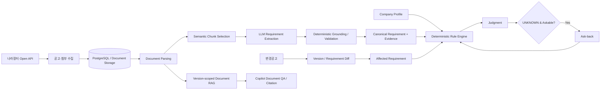

# 나라장터 변경공고 대응형 입찰 제출 검증기

> **변경공고가 올라온 뒤에도, 기존에 준비한 입찰이 여전히 유효한지 다시 확인합니다.**
> 나라장터 공고와 첨부문서를 분석해 참가자격과 원문 근거를 연결하고, 변경공고 발생 시 영향을 받은 요건을 추적하여 재검증하는 공공입찰 B2B 서비스입니다.

**SK Networks Family AI Camp 34기 · 3차 프로젝트 · 4팀**

> **README v0.3 · 구현 기준: `gyuniverse-hq/bid-change-validator` `develop` (`c26cdca`, 2026-09-14)**
> 코드 구현, 회귀 검증, 실데이터 검수 완료 여부를 구분하여 표시합니다.

---

## 1. 프로젝트 개요

나라장터 입찰 공고는 최초 게시 이후에도 정정·변경·취소될 수 있습니다.

기업이 이미 참가자격을 검토하고 제출서류를 준비한 상황에서 변경공고가 발생하면, 담당자는 공고 전체를 다시 확인하면서 다음 질문에 답해야 합니다.

> **무엇이 바뀌었고, 기존에 준비한 입찰에 어떤 영향을 주는가?**

본 프로젝트는 실제 나라장터 공고와 첨부문서를 수집하고, 참가자격 요건과 원문 근거를 구조화하여 기업 정보를 기준으로 판정합니다.

이후 변경공고가 발생하면 이전 버전과 현재 버전을 비교하고, **실제로 영향을 받은 자격요건을 찾아 해당 항목만 다시 검증**합니다.

### 전체 흐름

```text
실제 나라장터 공고 조회
        ↓
공고문·첨부문서 수집
        ↓
공고 버전 및 원문 관리
        ↓
참가자격 Requirement 추출
        ↓
회사 프로필과 요건 비교
        ↓
참가자격 판정
        ↓
근거 원문 확인
        ↓
정보 부족 시 Ask-back
        ↓
변경공고 발생
        ↓
이전 버전 ↔ 최신 버전 비교
        ↓
영향받은 Requirement 식별
        ↓
영향 요건만 재검증
```

### 핵심 목표

* 공고문과 첨부문서에 흩어진 참가자격 조건을 구조화합니다.
* 판정 결과와 실제 공고 원문 근거를 함께 제공합니다.
* 정보가 부족한 경우 임의로 추정하지 않고 추가 확인이 필요한 상태로 처리합니다.
* 사용자가 답변할 수 있는 정보라면 Ask-back을 통해 보완하고 해당 요건을 다시 판정합니다.
* 변경공고 발생 시 변경된 Requirement와 기존 판정의 영향을 추적합니다.
* AI가 공고 해석과 설명을 돕되 최종 참가 가능 여부는 재현 가능한 규칙으로 처리합니다.

---

## 2. 프로젝트 배경 및 문제 정의

나라장터 입찰 담당자는 하나의 공고를 검토할 때 공고 제목이나 마감일만 확인하지 않습니다.

다음과 같은 조건을 함께 확인해야 합니다.

* 업종 및 면허 등록 조건
* 지역 제한
* 기업 규모
* 각종 인증 및 등록 여부
* 수행실적
* 인력 조건
* 제출서류
* 계약 관련 조건
* 공고 첨부문서
* 변경·정정·취소 공고 이력

문제는 최초 검토 이후에도 공고 내용이 변경될 수 있다는 점입니다.

예를 들어 기업이 이미 특정 공고에 대해

```text
참가 가능 판정
→ 제출서류 준비
→ 내부 검토
```

까지 완료했더라도, 이후 변경공고에서 지역이나 업종 조건이 수정되면 기존 판정 결과가 더 이상 유효하지 않을 수 있습니다.

그러나 사용자가 직접 변경 전·후 공고문을 비교하려면 상당한 시간이 필요합니다.

본 프로젝트는 단순히

> “공고가 변경되었습니다.”

를 알려주는 것에서 끝나지 않고,

> **“어떤 조건이 변경되었고, 그 변경으로 기존 참가자격 판정이 어떻게 달라졌는가?”**

를 원문 근거와 함께 보여주는 것을 목표로 합니다.

---

## 3. 핵심 기능

| 기능                  | 설명                                                 |
| ------------------- | -------------------------------------------------- |
| 나라장터 공고 조회          | 실제 나라장터 공고를 수집하고 검색하여 검토 대상을 선택합니다.                |
| 공고 버전 관리            | 최초공고·변경공고 등 동일 공고의 버전을 관리합니다.                      |
| 공고문·첨부문서 수집         | 공고 원문과 PDF/HWP/HWPX 등의 첨부문서를 함께 관리합니다.             |
| 문서 Parsing          | 공고문과 첨부문서를 분석 가능한 텍스트 구조로 변환합니다.                   |
| 참가자격 Requirement 추출 | 자연어 공고문에서 판정에 필요한 참가자격 요건과 근거를 구조화합니다.             |
| 회사 프로필 매칭           | 회사가 보유한 등록·인증·지역·실적 등의 정보를 공고 요건과 비교합니다.           |
| 결정론적 참가자격 판정        | Requirement와 회사 정보를 규칙으로 비교하여 상태를 판정합니다.           |
| Ask-back            | 판정에 필요한 회사 정보가 부족한 경우 사용자가 답변 가능한 항목을 추가로 확인합니다.   |
| 근거 원문 확인            | 판정 결과와 실제 공고 원문 Evidence를 연결하여 사용자가 직접 확인할 수 있습니다. |
| 변경공고 Diff           | 이전 공고 버전과 최신 버전을 비교하여 변경 내용을 식별합니다.                |
| 영향 요건 추적            | 변경 내용과 연결된 Requirement를 찾아 재검증 대상으로 지정합니다.         |
| 변경공고 재검증            | 영향을 받은 Requirement만 다시 판정하여 기존 결과의 유효성을 확인합니다.     |
| AI Copilot          | 자연어로 공고, 참가자격, 근거, 변경사항 등을 탐색하도록 지원합니다.            |

---

## 4. 대표 사용자 시나리오

### 4.1 최초 공고 검토

```text
사용자가 공고 검색
        ↓
검토할 공고 선택
        ↓
공고문 및 첨부문서 분석
        ↓
참가자격 Requirement 추출
        ↓
회사 프로필과 Requirement 비교
        ↓
참가자격 판정
        ↓
근거 원문 확인
```

### 4.2 회사 정보가 부족한 경우

공고에서 필요한 조건이 존재하지만 회사 프로필만으로 판단할 수 없는 경우 모든 `UNKNOWN`을 동일하게 처리하지 않습니다.

사용자가 직접 답변하여 해결할 수 있는 항목은 Ask-back 대상으로 구분합니다.

```text
Requirement 판정
      ↓
UNKNOWN
      ↓
사용자에게 확인 가능한 정보인가?
      ↓
Yes ──→ Ask-back
             ↓
        사용자 답변
             ↓
        해당 Requirement 재판정

No ──→ 확인 필요 상태 유지
```

### 4.3 변경공고 발생

```text
기준 공고 v1
        ↓
참가자격 판정 완료
        ↓
변경공고 v2 발생
        ↓
v1 ↔ v2 비교
        ↓
변경 내용 식별
        ↓
영향 Requirement 추적
        ↓
해당 Requirement만 재판정
        ↓
변경 전·후 판정 비교
        ↓
변경 근거 원문 확인
```

---

## 5. 시스템 아키텍처



자격요건 추출과 Document RAG는 서로 다른 경로입니다. 자격요건은 선택된 원문 청크를 LLM으로 구조화한 뒤 코드로 원문 일치 여부를 검증합니다. FAISS 기반 Document RAG는 현재 공고 버전의 원문을 검색하여 Copilot 답변과 Citation을 지원하며 최종 자격판정을 수행하지 않습니다.

---

## 6. AI·Rule 설계

| 영역 | 실제 담당 |
| --- | --- |
| 공고문 구조화 해석 | LLM |
| 참가자격 Requirement 추출 | LLM Structured Extraction |
| 추출 결과 원문 검증·정규화 | Deterministic Grounding / Validation |
| 회사 정보 매핑 | Backend |
| 최종 참가자격 판정 | Deterministic Rule Engine |
| 원문 검색·질의응답 | Version-scoped Document RAG / LLM |
| 변경 영향 분석 | Requirement Diff + Rule Engine |

> **LLM은 공고를 구조화하고 설명하지만 최종 참가 가능/불가를 임의로 결정하지 않습니다.**

판정 상태는 다음 세 가지입니다.

| 상태 | 의미 |
| --- | --- |
| `SATISFIED` | 현재 회사 정보로 요건 충족을 확인 |
| `UNSATISFIED` | 현재 회사 정보로 요건 미충족을 확인 |
| `UNKNOWN` | 현재 정보만으로 확정할 수 없음 |

`UNKNOWN`이 곧 사용자 질문 대상이라는 뜻은 아닙니다. 단일 사용자 사실로 안전하게 해소할 수 있는 요건만 `ASKABLE`로 분류합니다.

```text
UNKNOWN ≠ ASKABLE
```

판정에는 Requirement, 회사 정보 또는 사용자 답변, 원문 Evidence와 버전 정보를 함께 남깁니다. 생성된 설명 자체가 아니라 공고 원문의 문서·페이지·문단 위치를 근거로 사용합니다.

---

## 7. 변경공고 재검증

```text
기준 공고 분석·판정
        ↓
변경공고 수집·버전 생성
        ↓
Canonical Requirement Diff
        ↓
ADDED / MODIFIED / REMOVED 식별
        ↓
영향받은 현재 Requirement만 재판정
        ↓
변경 전·후 결과와 Evidence 비교
```

코드 경로와 합성 회귀 테스트는 구현되어 있습니다. 변경되지 않은 요건은 기존 판정을 승계하고, 추가·수정된 요건만 현재 회사 프로필로 다시 판정합니다. 기준 판정 이후 회사 프로필이나 판정 기준일이 바뀌었다면 부분 재검증을 중단하고 전체 재판정을 요구합니다.

실제 공고 `R26BK01686455`에서 강원도 지역 제한 문구가 변경 차수에서 사라진 사례를 G2 후보로 확보했습니다. 다만 현재 관찰 라벨은 `DRAFT / not_ground_truth`이며, 의미상 요건 삭제와 법적 효력은 사람 검수 전이므로 실사례 검증 완료로 표시하지 않습니다.

| 검증 단계 | 상태 |
| --- | --- |
| 변경 Diff·affected-only 코드 | 구현 |
| 합성 G0 회귀 | 통과 |
| 실제 변경공고 후보 데이터 | 확보 |
| 실제 Ground Truth·Human Validation | 진행 중 |

---

## 8. AI Copilot

AI Copilot은 현재 검토 건을 중심으로 판정·근거·확인 필요 항목·회사 프로필·변경 내역을 조회하는 작업형 인터페이스입니다.

```text
“이 공고 참가할 수 있어?”
“왜 미달이야?”
“두 번째 조건 근거 보여줘.”
“변경공고에서 뭐가 바뀌었어?”
“전체 변경 요건을 다시 검증해줘.”
```

- 제한된 회신 컨텍스트로 “그 조건”, “두 번째” 같은 참조를 해석합니다.
- 실제 Requirement, 판정, Evidence, 공고 Version, Company Profile은 Backend에서 다시 조회합니다.
- 현재 공고 버전의 공개 문서 QA는 사용자 동의 후 Document RAG를 사용합니다.
- 답변 반영과 재검증은 먼저 제안만 보여주며, 사용자가 별도 확인한 뒤 실행합니다.
- Citation이 검증되지 않은 생성 답변은 사실 답변으로 노출하지 않습니다.

> **대화 맥락은 제한적으로 사용하고, 서비스 사실은 Backend에서 다시 확인합니다.**

일반 목적 Agent, 장기 기억, 여러 공고 버전을 동시에 검색하는 Document QA까지 구현됐다는 의미는 아닙니다.

---

## 9. 데이터 및 Evaluation

### Rule 회귀용 Golden Fixture v0.2

| 항목 | 규모·상태 |
| --- | ---: |
| 고유 공고 | 20건 |
| 합성 회사 프로필 | 32세트 |
| 이전 차수 입력 | 8건 |
| 전체 판정 입력 | 40건 / 138개 요건 행 |
| 검수 상태 | `DRAFT_NOT_APPROVED` |

이 Fixture는 Canonical Requirement를 Rule Engine에 직접 입력하여 판정 회귀를 확인합니다. 따라서 Requirement Extraction 성능이나 승인된 최종 Ground Truth를 의미하지 않습니다.

2026-09-13 회귀 기준선에서는 초안 기대값 일치 110/138, 안전한 보류 28/138, 잘못된 확정 판정 0건을 기록했습니다. 이 수치는 승인 전 Fixture에 대한 Rule 회귀 결과이며 최종 서비스 정확도가 아닙니다.

### 평가 레이어

| 평가 레이어 | 현재 확인 범위 | 상태 |
| --- | --- | --- |
| Rule / Judgment | 기대값 일치, safe abstention, wrong determinate | 회귀 기준선 운영 |
| Requirement Extraction | 합성 selection harness와 실제 snapshot 확보 | 최종 실공고 라벨·F1 미확정 |
| Document RAG | Recall@4, Citation 구조·버전 무결성 | 정량 평가 수행, 의미 정답률 별도 검수 필요 |
| AI Copilot | Routing 및 시나리오 계약 평가 | 사용자 Task 평가 대기 |
| 변경공고 G2 | 실제 변경 후보와 원문 Diff | Human Validation 진행 중 |
| User E2E | 화면 Route와 일부 흐름 | 전체 성공 시나리오 검증 대기 |

Document RAG 평가에서는 기본 Hybrid Retrieval의 Evidence Recall@4 50.00%를 기록했습니다. LLM rerank는 55.56%였지만 지연과 호출 비용이 커 기본 경로에는 적용하지 않았습니다. Expected Evidence Citation Recall 45.83%와 Citation Version Integrity 100%는 구조 지표이며 답변 정답률로 해석하지 않습니다.

상세 근거:

- [Golden Fixture v0.2](https://github.com/gyuniverse-hq/bid-change-validator/tree/develop/samples/golden/qualification-v0.2)
- [실공고 Snapshot Dataset](https://github.com/gyuniverse-hq/bid-change-validator/tree/develop/samples/golden/qualification-real-v0.1)
- [Document RAG Evaluation](https://github.com/gyuniverse-hq/bid-change-validator/blob/develop/docs/08_qa_reports/ai-copilot-v2/e3-rag-evaluation.md)

---

## 10. 서비스 화면

| 화면 | Route | 현재 범위 |
| --- | --- | --- |
| 공고 찾기 | `/notices` | 실제 공고 검색·버전 조회·분석된 공고 매칭 |
| 참가자격 검토 | `/qualification` | Analysis → Judgment와 요건·근거 확인 |
| 확인 필요 | `/ask-back` | `ASKABLE UNKNOWN` 답변과 부분 재판정 |
| 근거 원문 | `/evidence` | Requirement·판정·원문 Evidence 연결 |
| 평가 대응 | `/evaluation` | 참가자격 기반 참고 정보 제공; 평가 전용 추출·점수 예측 미지원 |
| 변경 이력 | `/changes` | 버전·Requirement Diff와 재검증 결과 |
| 회사 프로필 | `/company` | 회사 정보·실적·인증/등록 관리 |

7개 Route의 이동과 주요 API 연결은 구현되어 있습니다. 실제 G2와 안전한 Ask-back 답변을 포함한 전체 Human Click E2E는 최종 검증 대기 상태입니다.

### 기술 스택

| 영역 | 기술 |
| --- | --- |
| Frontend | React 19, TypeScript, Vinext, Vite |
| UI | Tailwind CSS, shadcn, Base UI |
| Document Viewer | `@rhwp/core` |
| Backend | Python, FastAPI, SQLAlchemy |
| Database / Migration | PostgreSQL 16, Alembic |
| AI | OpenAI API, LangChain Core |
| Document RAG | OpenAI Embedding, FAISS, Hybrid Retrieval |
| Data Source | 나라장터 Open API |
| Infra | Docker, Docker Compose |

---

## 11. 팀 구성

| 팀원  | 주요 담당                                           |
| --- | ----------------------------------------------- |
| 김재현 | LLM / RAG · Requirement Extraction · Evaluation |
| 이홍규 | LLM / RAG · AI Copilot · 협업 인프라                 |
| 전진환 | Backend · API · 전체 시스템 구성                       |
| 정예린 | DB · Data Collection / Management               |
| 황수빈 | Frontend · UI/UX                                |

프로젝트는 각 파트가 독립적으로 결과물을 만드는 방식보다 다음 연결을 중요하게 두었습니다.

```text
Frontend
   ↕
Backend
   ↕
DB / Data
   ↕
LLM / RAG
```

각 파트의 출력이 실제 사용자 흐름에서 연결되는지를 기준으로 통합했습니다.

---

## 12. 협업 방식

실제 개발은 다음 GitHub 중심 흐름으로 진행했습니다.

```text
GitHub Issue
    ↓
Feature / Fix Branch
    ↓
Pull Request
    ↓
Review / Test
    ↓
Merge
    ↓
통합 상태 확인
```

- 기능 또는 수정 단위로 Branch와 Pull Request를 만들었습니다.
- Frontend, Backend, DB/Data, LLM·RAG 간 계약과 영향 범위를 Review에서 확인했습니다.
- 자동 테스트 통과와 실제 사용자 E2E 완료를 같은 의미로 처리하지 않았습니다.
- GitHub Projects는 후반부에 일부 Issue와 작업 상태를 연결하는 보조 수단으로 사용했습니다.
- Figma는 화면 기준 공유, Discord는 진행 상황과 Blocker 공유, Notion은 기획·설계 문서 정리에 사용했습니다.

> 협업의 중심은 도구의 수가 아니라 **Issue → Branch → Pull Request → Review / Test → Merge** 흐름입니다.

---

## 13. 실행 방법

> 아래 명령은 실제 개발 저장소 [`gyuniverse-hq/bid-change-validator`](https://github.com/gyuniverse-hq/bid-change-validator/tree/develop)의 `develop` 브랜치 기준입니다. 현재 공식 제출 저장소에는 코드가 동기화되지 않았으므로 이 저장소에서 바로 실행할 수 없습니다.

### 요구 환경

- Docker / Docker Compose
- Node.js 22.13 이상
- pnpm
- 나라장터 Open API Service Key
- OpenAI API Key

### Backend / Database

저장소 루트의 `.env.example`을 `.env`로 복사한 뒤 환경변수를 설정합니다.

```powershell
Copy-Item .env.example .env
docker compose up -d --build api
```

API 시작 전에 Alembic migration이 자동 적용됩니다. 변경공고 수집기를 함께 실행하려면 다음 명령을 사용합니다.

```powershell
docker compose --profile collector up -d --build api notice-poller
```

### Frontend

```powershell
cd apps/web
Copy-Item .env.example .env.local
pnpm install
pnpm dev
```

| 서비스 | 주소 |
| --- | --- |
| Frontend | http://localhost:3000 |
| Backend API | http://localhost:8000 |
| Swagger | http://localhost:8000/docs |
| Health Check | http://localhost:8000/health |

OpenAI API Key가 없으면 자격요건 분석과 Document RAG처럼 외부 모델이 필요한 경로는 실행되지 않습니다.

---

## 14. 현재 구현 상태와 한계

| 영역 | 코드·연결 상태 | 최종 검증 상태 |
| --- | --- | --- |
| 나라장터 공고·변경공고 수집 | 구현 | 운영 범위 확대 검증 필요 |
| 공고 Version·첨부문서 관리 | 구현 | 실데이터 검산 진행 |
| PDF/HWP/HWPX Parsing | 구현 | 문서 유형별 품질 개선 필요 |
| Requirement Extraction | 구현 | 실공고 정답 라벨·F1 미확정 |
| Company Profile Matching | 구현 | 전체 사용자 E2E 추가 검증 |
| Deterministic Rule Judgment | 구현·Golden 회귀 운영 | Fixture 독립 승인 대기 |
| Ask-back | 구현·회귀 확인 | 실공고 safe-answer E2E 대기 |
| Evidence 연결 | 구현 | 의미 단위 정확도 검수 진행 |
| Requirement Diff·재검증 | 구현·합성 회귀 통과 | 실제 G2 Human Validation 진행 |
| AI Copilot | 현재 Case 중심 조회·확인형 Action 구현 | 사용자 Task 평가 대기 |
| 7개 제품 화면 | Route와 주요 API 연결 | 전체 Human Click E2E 대기 |
| 배포 | 설정 예시 존재 | 외부 운영 배포 미확정 |

### 현재 한계

- Golden Fixture의 기대값은 독립 검수자 승인 전 초안입니다.
- 실제 변경공고 G2는 후보를 확보했지만 Ground Truth 확정 전입니다.
- Requirement Extraction, Copilot, 사용자 E2E의 최종 성능 수치는 아직 확정하지 않았습니다.
- Document RAG는 현재 공고 버전 범위에서 동작하며 cross-version QA는 지원하지 않습니다.
- 평가 대응 화면은 참가자격 기반 참고 정보이며 평가항목 전용 추출이나 점수 예측 기능이 아닙니다.
- 외부 운영 배포 완료를 주장하지 않습니다.

### 다음 개선

- 실제 공고 Requirement·Evidence 라벨 독립 검수와 Extraction 평가
- 변경공고 G2 Ground Truth 확정 및 전체 재검증 E2E
- Copilot 사용자 Task 평가와 문서 QA 품질 개선
- 대표 UI, 최종 아키텍처, 배포 결과 확정 후 README 반영

---

## 참고 자료

- [실제 개발 저장소](https://github.com/gyuniverse-hq/bid-change-validator)
- [개발 저장소 Product Baseline 문서](https://github.com/gyuniverse-hq/bid-change-validator/tree/develop/docs/mvp-baseline)
- [개발 저장소 QA·Evaluation 문서](https://github.com/gyuniverse-hq/bid-change-validator/tree/develop/docs/08_qa_reports)
- [공식 제출 저장소](https://github.com/SKNETWORKS-FAMILY-AICAMP/SKN34-3rd-4Team)
