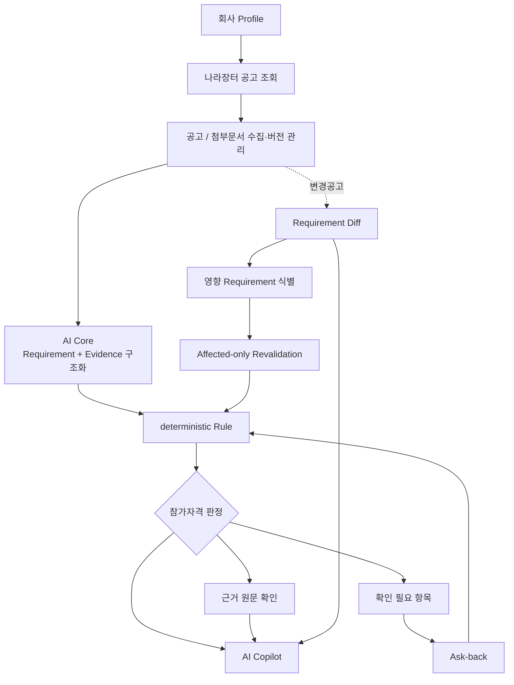

# 01. 프로젝트 개요

## 1. 해결하려는 문제

공공입찰 담당자는 하나의 공고를 검토할 때 업종·지역·실적·인증·기업 규모 등 여러 참가자격 조건을 공고문과 첨부문서에서 찾아 회사 정보와 대조합니다.

문제는 나라장터 공고가 최초 게시 이후에도 **정정·변경·취소**될 수 있다는 점입니다. 이미 검토한 공고의 조건이 바뀌면 기존 판단을 다시 확인해야 하지만, 실제 업무에서는 어떤 조건이 바뀌었고 기존 준비에 어떤 영향을 주는지 다시 대조하는 비용이 큽니다.

BidCheck는 이 과정을 다음과 같이 연결합니다.

> **공고문에서 참가자격과 근거를 구조화하고 → 회사 Profile과 Rule로 판정하고 → 공고가 바뀌면 영향받은 Requirement만 다시 검증한다.**

## 2. 제품 목표

사용자가 알고 싶은 것은 단순한 문서 요약이 아니라 다음 네 가지입니다.

1. **우리 회사가 현재 공고에 참가 가능한가?**
2. **그 판정은 공고문 어디를 근거로 하는가?**
3. **정보가 부족하다면 무엇을 추가 확인해야 하는가?**
4. **변경공고가 올라오면 기존 판정 중 무엇을 다시 봐야 하는가?**

따라서 프로젝트를 단순 RAG 챗봇이 아니라 **공고 Version과 판정 계보를 갖는 입찰 검토 시스템**으로 설계했습니다.

## 3. 사용자 흐름



## 4. 주요 Product 영역

| 영역 | 역할 |
| --- | --- |
| 공고 찾기 | 실제 나라장터 공고 조회와 Case 생성 |
| 참가자격 | Requirement와 회사 Profile을 비교한 현재 판정 |
| 확인 필요 | 사용자에게 안전하게 질문 가능한 UNKNOWN만 Ask-back |
| 근거 원문 | 판정 Requirement ↔ Evidence ↔ 실제 공고 원문 연결 |
| 변경 이력 | 이전/현재 Version의 Requirement Diff와 재검증 |
| 회사 Profile | 업종·실적·인증·기타 판정 입력 정보 관리 |
| AI Copilot | 저장 판정·회사정보 snapshot·공고 원문·변경 결과를 자연어로 탐색 |

## 5. 판정 상태

개별 Requirement:

```text
SATISFIED
UNSATISFIED
UNKNOWN
```

전체 판정:

```text
eligible
ineligible
insufficient_data
```

`PARTIAL`은 Analysis의 완전성을 나타내며 `UNKNOWN`과 같은 개념이 아닙니다.

## 6. 제품 불변조건

- 최종 참가자격은 **deterministic Rule**이 담당합니다.
- LLM이 추출하거나 설명한 내용만으로 참가 가능 상태를 새로 만들지 않습니다.
- 원문 근거를 찾지 못한 조건을 임의로 충족 처리하지 않습니다.
- `UNKNOWN != ASKABLE` 원칙을 유지합니다.
- 현재 회사 Profile과 과거 판정 당시의 `profile_snapshot`을 구분합니다.
- 변경 전 결과를 덮어쓰지 않고 Version / Analysis / Judgment 계보를 보존합니다.
- Copilot은 Product 판정을 설명하지만 별도 판정 엔진을 만들지 않습니다.

## 7. 프로젝트의 차별점

일반적인 문서 QA는 “이 문서에 무엇이 적혀 있는가?”에 집중합니다.

BidCheck는 여기에 다음을 추가했습니다.

```text
문서 사실
+ 회사 상태
+ 판정 규칙
+ 근거
+ 버전 변화
+ 재검증
+ 자연어 업무 인터페이스
```

즉 **문서 검색과 판정, 변경 대응을 하나의 제품 흐름으로 연결**한 것이 핵심입니다.

## 8. 관련 문서

- [시스템 아키텍처](./02-시스템-아키텍처.md)
- [데이터 수집·전처리](./데이터-수집-전처리.md)
- [AI Core / Copilot](./04-AI-Core-Copilot.md)
- [테스트·평가](./05-테스트-평가.md)
