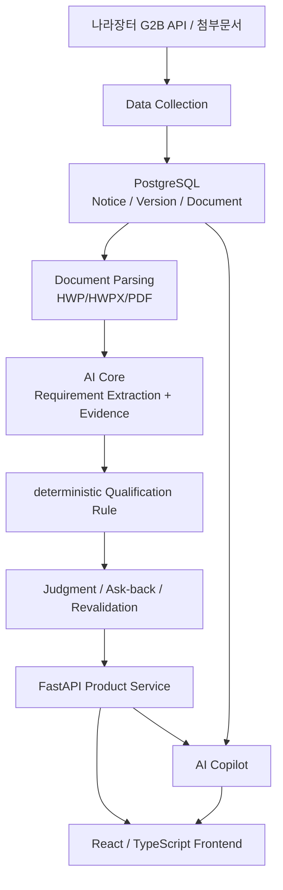
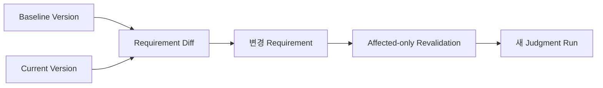
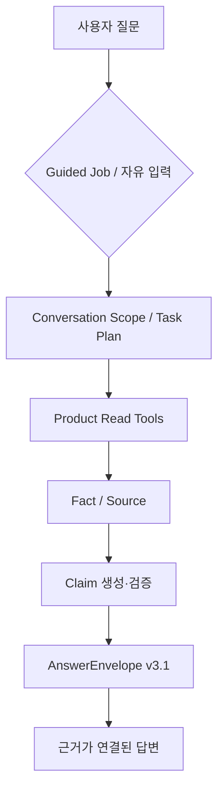

# 02. 시스템 아키텍처

## 1. 전체 구조



제품의 Source of Truth를 한 레이어에 몰지 않고 역할을 분리했습니다.

## 2. 레이어별 책임

### Data / DB

- 공고와 공고 Version 저장
- 첨부문서와 Extraction 상태 저장
- Company Profile 저장
- Analysis / Requirement / Evidence 저장
- Judgment / Answer / Revalidation 계보 저장

### AI Core

비정형 공고문을 deterministic Rule이 사용할 수 있는 구조로 바꿉니다.

```text
extracted_blocks
→ semantic chunking
→ section / keyword candidate selection
→ LLM structured extraction
→ source-grounding validation
→ normalization / canonical mapping
→ Requirement + Evidence
```

AI Core의 기본 후보 검색과 Copilot Document Retrieval은 같은 기능이 아닙니다.

### Qualification Rule

회사 Profile과 구조화 Requirement를 비교합니다.

- 동일 입력에 동일 결과를 반환하는 deterministic 판단
- 근거 부족 시 UNKNOWN
- Rule Version을 명시적으로 관리
- 현재 화면은 호환되는 Analysis/Judgment 관계만 사용

### Product Service

FastAPI에서 다음 기능을 연결합니다.

- Notice / Document
- Company Profile
- Preflight Case
- Qualification Analysis
- Qualification Judgment
- Ask-back
- Changed Notice Revalidation
- Matching
- AI Copilot

### Frontend

현재 Case Context를 중심으로 참가자격·확인 필요·근거 원문·변경 이력·회사 Profile을 연결합니다.

AI Copilot은 이 화면들을 대체하는 별도 ChatGPT clone이 아니라 **현재 Case를 사용하는 보조 Panel**입니다.

## 3. Case와 Run 계보

```text
BidNotice
└─ BidNoticeVersion
   ├─ NoticeDocument
   └─ QualificationAnalysisRun
      ├─ QualificationRequirement
      └─ QualificationEvidence

Company + PreflightCase + AnalysisRun
└─ QualificationJudgmentRun
   ├─ QualificationJudgment
   ├─ QualificationAnswer
   └─ QualificationRevalidationRun
```

화면과 Copilot은 “가장 최근에 생성된 값”을 무조건 사용하는 것이 아니라 현재 Case의 회사·공고 Version·Analysis·Judgment가 서로 호환되는지 확인합니다.

## 4. 변경공고 처리



기존 판정을 덮어쓰지 않고 새로운 Run으로 남겨 변경 전·후 상태를 비교할 수 있게 했습니다.

## 5. AI Copilot 위치



Copilot read tool:

```text
READ_JUDGMENT
READ_PROFILE
READ_CHECKS
READ_DOCUMENT
READ_CHANGES
```

write가 필요한 요청도 `/chat`에서 바로 실행하지 않고 Proposal로 분리합니다.

```text
/chat
→ Read / Explain / Action Proposal

/actions/confirm
→ 명시적 사용자 확인
→ 최신 provenance 재검증
→ 기존 Product Service 실행
```

## 6. Document Retrieval 경계

### AI Core

Requirement Extraction 후보 문맥 선택:

```text
section-aware + keyword fallback
```

### Copilot v3.1

현재 공고문 질문:

```text
Current Version Source Snapshot
→ index readiness 확인
→ READY + 일반 질문: Hybrid Retrieval
→ broad 질문: current sections
→ index/embedding 사용 어려움: lexical fallback
→ Fact / Source
→ Claim Validation
```

채팅 요청 중 새 문서 index를 자동 build하지 않습니다.

## 7. 주요 기술

| 영역 | 기술 |
| --- | --- |
| Frontend | React 19, TypeScript, Tailwind CSS |
| Backend | FastAPI, Python |
| DB | PostgreSQL 16, Supabase |
| AI | OpenAI Structured Output / LLM |
| Retrieval | AI Core section/keyword, Copilot Hybrid + fallback |
| Infra | Docker, Alembic |
| 협업 | GitHub, GitHub Projects, Discord, Notion, Figma |

## 8. 관련 문서

- [프로젝트 개요](./01-프로젝트-개요.md)
- [AI Core / Copilot](./04-AI-Core-Copilot.md)
- [테스트·평가](./05-테스트-평가.md)
