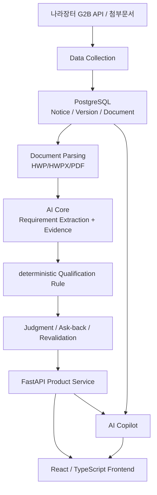
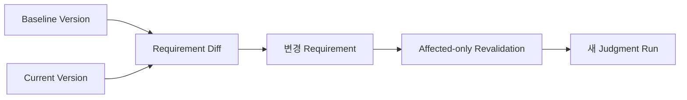
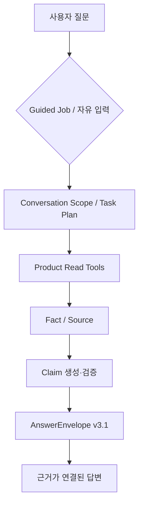

# 02. 시스템 아키텍처

## 1. 전체 구조



제품의 Source of Truth를 한 레이어에 몰지 않고 **Data → AI Core → Rule → Product Service → UI/Copilot**로 역할을 분리했습니다.

---

## 2. 레이어별 책임

### Data / DB

- 공고와 공고 Version
- 첨부문서와 Extraction 상태
- Company Profile
- Analysis / Requirement / Evidence
- Judgment / Answer / Revalidation 계보

### AI Core

비정형 공고문을 deterministic Rule이 사용할 수 있는 구조로 변환합니다.

```text
extracted_blocks
→ semantic chunking
→ section / keyword candidate selection
→ LLM structured extraction
→ source-grounding validation
→ normalization / canonical mapping
→ Requirement + Evidence
```

### Qualification Rule

회사 Profile과 구조화 Requirement를 비교합니다.

- 동일 입력에 동일 결과를 반환하는 deterministic 판단
- 근거 부족 시 `UNKNOWN`
- `UNKNOWN != ASKABLE`
- Rule Version 명시
- 현재 Rule / Analysis / Notice Version과 호환되는 Judgment만 사용

### Product Service

FastAPI가 현재 Case와 업무 상태를 소유합니다.

- Notice / Document
- Company Profile
- Preflight Case
- Qualification Analysis
- Qualification Judgment
- Ask-back
- Changed Notice Revalidation
- Matching
- AI Copilot API

### Frontend

현재 `caseId`를 기준으로 참가자격·확인 필요·근거 원문·변경 이력·회사 Profile을 연결합니다.

AI Copilot은 7개 Product 화면을 대체하는 별도 ChatGPT clone이 아니라 **현재 Case를 사용하는 보조 Panel**입니다.

---

## 3. 요구사항 ↔ 화면 ↔ API ↔ 데이터 ↔ AI 연결

| 사용자 기능 | 주요 화면 | Backend / API | 주요 데이터 | AI / Rule |
| --- | --- | --- | --- | --- |
| 공고 조회 | `/notices` | Notice / Matching | Notice, Version | - |
| 참가자격 검토 | `/qualification` | Analysis / Judgment | Requirement, Evidence, Judgment Run | AI Core + deterministic Rule |
| 확인 필요 | `/ask-back` | Questions / Answers | Askability, Answer, Judgment | Askability + Rule |
| 근거 원문 | `/evidence` | Document source / text / preview | Evidence, Document | Grounded Source |
| 평가 대응 | `/evaluation` | 현재 자격정보 연계 | Case / Requirement | 전용 Evaluation pipeline은 제한적 |
| 변경 이력 | `/changes` | Versions / Revalidation | Version, Diff, Revalidation Run | Requirement Diff + Rule |
| 회사 Profile | `/company` | Company CRUD | Company / performance / certification | Rule 입력 |
| AI Copilot | Copilot Panel | `/api/v1/copilot/*` | Product State + Conversation | Product Tools + Document Read + Claim Validation |

이 표를 기준으로 한 기능의 변경이 다른 레이어에 어떤 영향을 주는지 PR에서 함께 확인했습니다.

---

## 4. 핵심 데이터 계보

```text
BidNotice
└─ BidNoticeVersion
   ├─ NoticeDocument
   └─ QualificationAnalysisRun
      ├─ QualificationRequirement
      └─ QualificationEvidence

Company + PreflightCase + AnalysisRun
└─ QualificationJudgmentRun
   ├─ QualificationJudgment
   ├─ QualificationAnswer
   └─ QualificationRevalidationRun
```

화면과 Copilot은 “가장 최근 생성된 값”을 무조건 사용하지 않습니다.

현재 Case의:

```text
company
notice
notice version
analysis run
judgment run
rule version
```

이 서로 호환되는지 확인합니다.

---

## 5. 변경공고 처리



기존 판정을 덮어쓰지 않고 새 Run으로 남겨 변경 전·후 상태를 비교할 수 있게 했습니다.

### 왜 전체 재판정이 아닌 affected-only인가

변경되지 않은 Requirement까지 매번 다시 판정하면:

- 이전 결과 재현이 어려워지고
- 변경 영향 범위가 흐려지며
- 불필요한 계산이 증가합니다.

따라서 현재 Rule Version과 Source가 호환되는 경우 **영향받은 Requirement만 재판정**하고, Rule Version이 바뀌었거나 stale source라면 전체 재판정을 요구합니다.

---

## 6. AI Copilot 위치



Copilot read tool:

```text
READ_JUDGMENT
READ_PROFILE
READ_CHECKS
READ_DOCUMENT
READ_CHANGES
```

Copilot이 별도 Qualification Rule을 만들지 않도록 Product Read Tool을 통해 현재 저장 상태를 다시 읽습니다.

### Write 경계

```text
/chat
→ Read / Explain / Action Proposal

/actions/confirm
→ 명시적 사용자 확인
→ 최신 provenance 재검증
→ 기존 Product Service 실행
```

자연어 “응”만으로 저장·재검증을 실행하지 않습니다.

---

## 7. Retrieval 경계

### AI Core

Requirement Extraction 후보 문맥:

```text
section-aware + keyword fallback
```

### Copilot v3.1

현재 공고문 질문:

```text
Current Version Source Snapshot
→ index readiness 확인
→ READY + 일반 질문: Hybrid Retrieval
→ broad 질문: current sections
→ index/embedding 사용 어려움: lexical fallback
→ Fact / Source
→ Claim Validation
```

채팅 요청 중 새 Document Index를 자동 build하지 않습니다.

---

## 8. ERD 관점의 핵심 Domain

전체 테이블을 README에 복제하기보다 평가자가 이해해야 하는 Domain을 중심으로 나눴습니다.

| Domain | 대표 Entity |
| --- | --- |
| 공고 | BidNotice, BidNoticeVersion, NoticeDocument |
| 회사 | Company, Performance, Certification |
| 검토 건 | PreflightCase |
| AI 분석 | AnalysisRun, Requirement, Evidence |
| 판정 | JudgmentRun, Judgment |
| 확인 필요 | Question, Answer |
| 변경 대응 | RevalidationRun |
| 운영 | CollectionRun, Backfill Queue |

상세 Schema와 Migration은 구현 저장소의 Alembic / DB 문서를 Source of Truth로 사용합니다.

---

## 9. 주요 기술

| 영역 | 기술 |
| --- | --- |
| Frontend | React 19, TypeScript, Tailwind CSS |
| Backend | FastAPI, Python |
| DB | PostgreSQL 16, Supabase |
| AI | OpenAI Structured Output / LLM |
| Retrieval | AI Core section/keyword, Copilot Hybrid + fallback |
| Infra | Docker, Alembic |
| 협업 | GitHub, GitHub Projects, Discord, Notion, Figma |

---

## 10. 설계 원칙 요약

```text
LLM
= 비정형 문서를 구조화하고 설명

Rule
= 참가자격을 결정

Backend
= 현재 Case / Version / Run의 Source of Truth

Copilot
= 기존 사실과 근거를 안전하게 탐색
```

이 책임 분리를 통해 생성형 AI가 제품의 핵심 판정 로직을 직접 소유하지 않도록 했습니다.

## 관련 문서

- [프로젝트 개요](./01-프로젝트-개요.md)
- [데이터 수집·전처리](./데이터-수집-전처리.md)
- [AI Core / Copilot](./04-AI-Core-Copilot.md)
- [테스트·평가](./05-테스트-평가.md)
