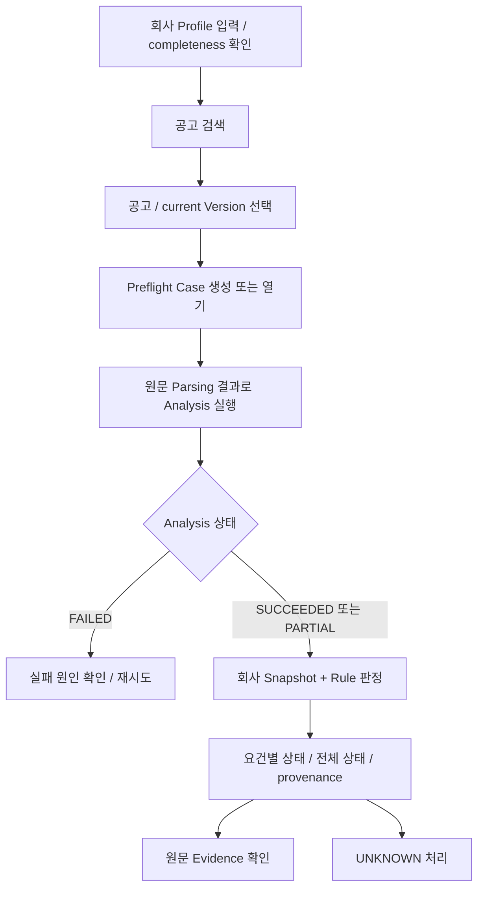
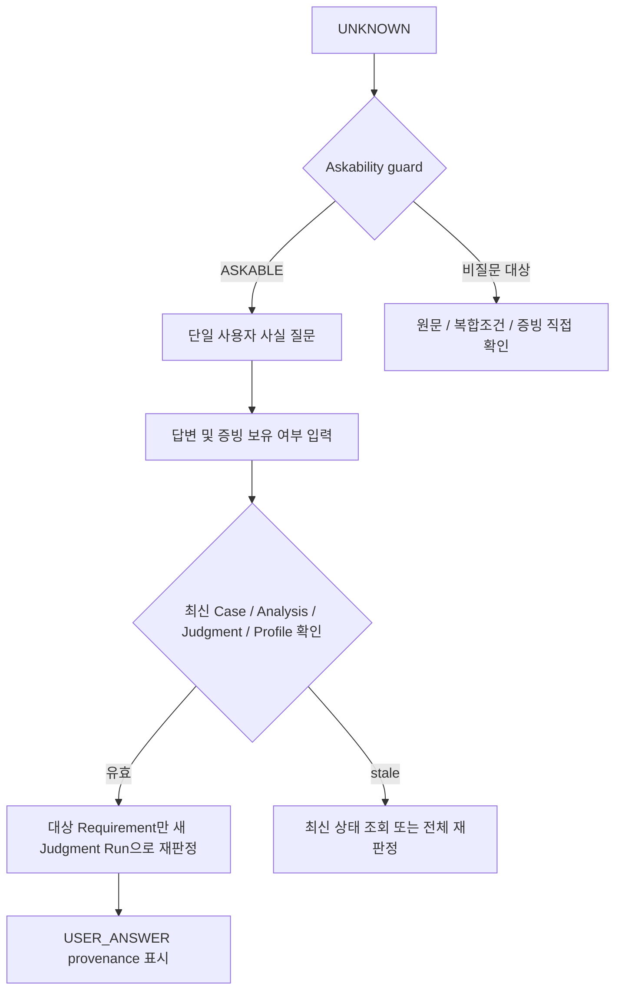
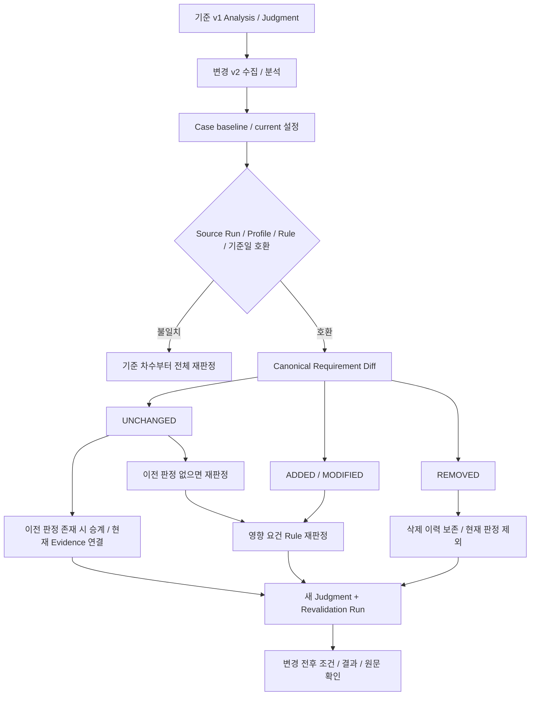

# 기능 흐름

> Status: Current / Human Click E2E Validation Pending
> Implementation Baseline: `gyuniverse-hq/bid-change-validator` `develop@36f1afba8e1a025006b0bfa1876502e6232b3d28`

## 1. 목적

사용자가 회사 정보와 공고를 선택한 뒤 판정 근거를 확인하고 변경공고의 영향을 재검증하는 순서를 설명합니다. 아래 흐름은 코드 연결 기준이며 사람이 전 과정을 클릭해 성공했다는 기록이 아닙니다. [시나리오와 검증 수준](../08_qa_reports/test-scenarios.md)을 함께 읽습니다.

## 2. 정상 흐름

1. `/company`에서 회사 기본정보·업종·실적·인증과 정보 완전성을 확인합니다. 증빙 보유 표시는 외부 기관의 사실 검증 완료가 아닙니다.
2. `/notices`에서 공고를 검색합니다. 분석되지 않은 공고를 참가 가능으로 표시하지 않습니다.
3. 공고번호에 연결된 Version을 선택하고 `preflight_case_id`를 확보합니다. `version_number`와 나라장터의 `bid_notice_order`는 서로 다른 식별자입니다.
4. `POST /api/v1/notices/{notice_id}/versions/{version_number}/qualification-analysis`로 분석합니다. 원문 요건과 Evidence·diagnostics를 저장합니다.
5. `POST /api/v1/preflight-cases/{case_id}/qualification-judgments`로 판정합니다. `analysis_run_id`, `profile_snapshot`, `rule_version`, `reference_date`를 결과에 보존합니다.
6. `/qualification`에서 결과를 보고 `/evidence`로 원문을 확인합니다. PARTIAL은 누락 가능성이 있어 전체 `eligible`로 올리지 않습니다.

## 3. UNKNOWN / Ask-back 흐름

`GET .../qualification-questions`와 `POST .../qualification-answers`는 Case 범위 API입니다. 답변 후 다른 Requirement는 승계하고 대상만 재계산합니다. `apply_to_profile=true`는 거부되므로 다음 공고에 회사 사실로 자동 재사용되지 않습니다. 답변이 항상 SATISFIED를 만든다는 뜻도 아닙니다.

## 4. 변경공고 흐름 — 제품 핵심

`POST .../qualification-revalidation`은 baseline과 current 분석, source와 result 판정, `changes`, `revalidated_keys`를 함께 기록합니다. 화면에서 선택한 일부 요건만 임의로 재검증하는 기능이 아니라 전체 Diff 중 영향을 받은 현재 요건 집합을 처리합니다.

v0.2의 과거 판정, 변경된 Profile 또는 기준일은 승계할 수 없습니다. `RULE_CHANGED_FULL_REJUDGMENT_REQUIRED`, `PROFILE_CHANGED_FULL_REJUDGMENT_REQUIRED` 등으로 전체 재판정을 요구합니다. 신규 Case의 baseline은 current보다 이전이어야 하며 동일 차수의 변경 재검증은 비활성화합니다.

## 5. Copilot 경로

현재 Case에서 판정 요약·사유·확인 필요 요건·Evidence·회사 정보·변경 내역을 조회합니다. “두 번째 조건”과 같은 표현은 제한된 문맥으로 해석하되 Backend 사실을 다시 읽습니다. 문서 QA는 별도 외부처리 동의 후 현재 Version만 검색합니다. 답변 반영·재검증은 Proposal → 사용자 확인 → 최신성 재검증 → 실행 순서입니다.

`/evaluation`은 제안서 위치 후보와 사용자 확인을 돕는 Partial 경로입니다. 평가기준 전용 추출이나 평가 점수 예측 완료를 정상 참가자격 흐름에 포함하지 않습니다.

## 6. 근거

- [Case Workspace](https://github.com/gyuniverse-hq/bid-change-validator/blob/36f1afba8e1a025006b0bfa1876502e6232b3d28/apps/web/lib/case-workspace.ts)
- [Judgment](https://github.com/gyuniverse-hq/bid-change-validator/blob/36f1afba8e1a025006b0bfa1876502e6232b3d28/apps/api/app/qualification/judgment.py), [Ask-back](https://github.com/gyuniverse-hq/bid-change-validator/blob/36f1afba8e1a025006b0bfa1876502e6232b3d28/apps/api/app/qualification/ask_back.py)
- [Diff](https://github.com/gyuniverse-hq/bid-change-validator/blob/36f1afba8e1a025006b0bfa1876502e6232b3d28/apps/api/app/qualification/rules/requirement_diff.py), [Revalidation](https://github.com/gyuniverse-hq/bid-change-validator/blob/36f1afba8e1a025006b0bfa1876502e6232b3d28/apps/api/app/qualification/revalidation.py)
