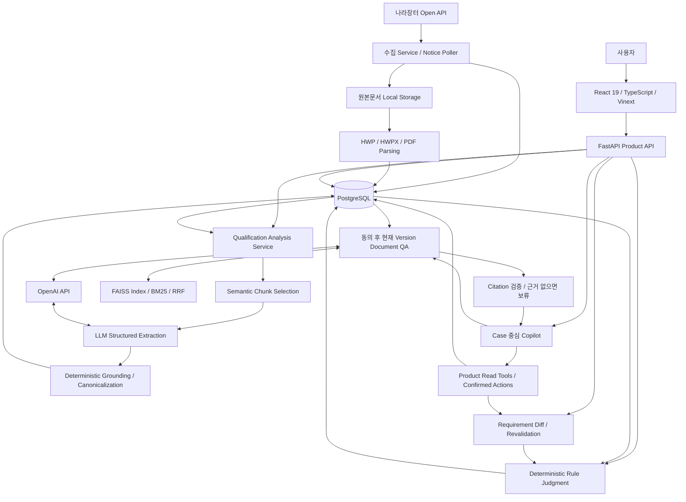

# 시스템 아키텍처

> Status: Current / 실행·배포 검증 상태는 별도
> Implementation Baseline: `gyuniverse-hq/bid-change-validator` `develop@36f1afba8e1a025006b0bfa1876502e6232b3d28`

## 1. 목적과 시스템 경계

나라장터 공고·첨부에서 참가자격 Requirement와 원문 Evidence를 만들고, 회사 정보로 판정한 뒤 **Changed Notice → Requirement Diff → Affected Requirement → affected-only Revalidation**을 수행하는 구성입니다. 사용자 순서는 [기능 흐름](functional-flow.md), 저장 관계는 [ERD](../04_contracts/db-erd-current.md), AI 내부 동작은 [LLM/RAG Pipeline](../03_ai/llm-rag-pipeline.md)에 분리했습니다.

## 2. 컴포넌트 연결

그림의 AI Core·Rule·Copilot은 FastAPI 애플리케이션 내부 모듈 경계입니다. 각각 별도 마이크로서비스로 배포된다는 뜻이 아닙니다.

## 3. 기술과 책임

| 계층 | 코드에서 확인한 기술 | 담당·산출물 |
| --- | --- | --- |
| Frontend | React 19.2.6, TypeScript, Vinext 1.0.0-beta.5, Vite, Tailwind CSS, shadcn/Base UI | 7개 제품 Route, Case 상태 선택, 사용자 입력과 결과 표시 |
| 원문 Viewer | `@rhwp/core`, document source/text/preview API | HWP/HWPX 등 원문과 locator 연결; 실제 문서별 화면 품질은 검수 대상 |
| API | Python, FastAPI, Pydantic, SQLAlchemy | 입력 검증, 인증 문맥, Company/Notice/Case, Run 저장, 오류 응답 |
| 수집 | requests, G2B Client, polling worker | 공고번호·차수·변경이력 수집, history backfill |
| Parsing | pypdf, olefile, ZIP/XML, Python stdlib | 원문 bytes → text/blocks/locator/hash |
| Extraction | OpenAI SDK Structured Outputs | 청크에서 구조화 요건 추출; 최종 판정은 하지 않음 |
| Grounding / Rule | Python 결정론적 로직 | 원문·위치·값 검증, Canonical 8유형, 3상태 Judgment |
| Document RAG | OpenAI Embedding, FAISS, BM25+Dense/RRF, LangChain Core ChatPromptTemplate | 현재 공고 Version의 공개 문서 검색·인용 답변 |
| DB | PostgreSQL 16, Alembic | 관계형 상태와 JSONB snapshot; migration head `022_notice_history_backfill` |
| Runtime | Docker / Docker Compose, Node.js >=22.13, pnpm | API·DB·migration·collector 실행, Frontend 별도 실행 |

모델명은 코드의 설정 기본값입니다. Extraction은 `OPENAI_MODEL_DEFAULT` 또는 `gpt-5.6-luna`, Document RAG embedding은 `text-embedding-3-small`입니다. 특정 모델의 서비스 제공 여부나 최종 운영 모델을 별도로 보증하지 않습니다.

## 4. 데이터와 판정 경계

- Company 현재 Profile과 Judgment Run의 `profile_snapshot`을 분리합니다.
- Analysis는 공고 Version에, Judgment는 Case·Analysis·Company·Version·Rule·기준일에 귀속됩니다.
- 개별 판정은 `SATISFIED / UNSATISFIED / UNKNOWN`; 답변 출처는 `basis_type` 등 provenance입니다.
- Ask-back은 `UNKNOWN` 중 Askability guard를 통과한 단일 사용자 사실만 받습니다. Profile 자동 저장은 지원하지 않습니다.
- 변경 시 기존 Profile·Rule·기준일을 재확인한 후 비변경 판정을 승계합니다. v0.3과 다른 과거 Rule 결과는 현재 판정 source로 쓰지 않습니다.
- Copilot의 문맥은 참조 해석용입니다. 판정·요건·Evidence·Version·Profile은 Backend에서 재조회합니다. Action은 제안 후 별도 확인 API로 실행합니다.

## 5. 실제 실행 구성과 미확정 사항

Compose에는 `db`, `migrate`, `api`, 선택 profile의 `notice-poller`, `master-data-import`가 있습니다. API/collector는 DB health와 migration 완료를 기다립니다. Frontend는 `apps/web`의 `pnpm dev`로 별도 실행합니다.

PostgreSQL은 `postgres_data`, 원본문서는 `notice_documents_data` 볼륨을 사용합니다. S3-compatible storage adapter는 구현돼 있으나 최종 운영 저장소 채택·운영 검증은 미확정입니다. RAG index는 기본 `data/document-rag`에 생성됩니다. Compose에 이 경로의 전용 영속 볼륨은 선언돼 있지 않으므로 컨테이너 재생성 후 index 보존을 가정하지 않습니다.

인증·소유권 guard는 있지만 `AUTH_REQUIRED=false`가 개발 기본값입니다. 최종 Web/API 배포 URL, 운영 인증 설정, backup/restore, RAG index 수명주기, Deployment Smoke는 Validation Pending입니다. 배포 도구 의존성 존재를 운영 배포 완료로 해석하지 않습니다.

## 6. 고정 근거

- [Compose](https://github.com/gyuniverse-hq/bid-change-validator/blob/36f1afba8e1a025006b0bfa1876502e6232b3d28/docker-compose.yml), [Frontend package](https://github.com/gyuniverse-hq/bid-change-validator/blob/36f1afba8e1a025006b0bfa1876502e6232b3d28/apps/web/package.json)
- [Backend dependencies](https://github.com/gyuniverse-hq/bid-change-validator/blob/36f1afba8e1a025006b0bfa1876502e6232b3d28/apps/api/requirements.txt), [API entrypoint](https://github.com/gyuniverse-hq/bid-change-validator/blob/36f1afba8e1a025006b0bfa1876502e6232b3d28/apps/api/app/main.py)
- [Case Workspace](https://github.com/gyuniverse-hq/bid-change-validator/blob/36f1afba8e1a025006b0bfa1876502e6232b3d28/apps/web/lib/case-workspace.ts), [Copilot Document QA](https://github.com/gyuniverse-hq/bid-change-validator/blob/36f1afba8e1a025006b0bfa1876502e6232b3d28/apps/api/app/copilot/document_qa.py)
