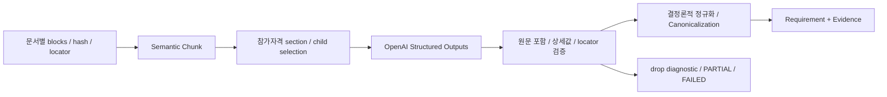

# LLM / RAG Pipeline

> Status: Current Implementation / 독립 품질 검증 일부 Pending
> Implementation Baseline: `gyuniverse-hq/bid-change-validator` `develop@36f1afba8e1a025006b0bfa1876502e6232b3d28`

## 1. 책임 경계

공고의 자연어를 구조화하고 원문으로 설명하는 데 LLM을 사용합니다. 회사의 참가자격은 결정론적 Rule이 판정합니다.

| 경로 | 입력 → 처리 → 출력 | 경계 |
| --- | --- | --- |
| Requirement Extraction | parsed blocks → Semantic Chunk Selection → LLM Structured Extraction → Deterministic Grounding/Validation → Canonical Requirement/Evidence | 회사 참가 가능/불가 결정 안 함 |
| Qualification Judgment | Canonical Requirement + Company Profile Snapshot + 기준일 → Rule → SATISFIED/UNSATISFIED/UNKNOWN | LLM으로 회사 사실 추정 안 함 |
| Document RAG | 현재 Version 공개 문서 → Retrieval → Copilot Document QA → 답변/Citation | qualification decision engine 아님 |
| Copilot | 현재 Case + 제한된 참조 → Backend tool 조회/설명/확인형 Action | 장기 기억 기반 General Agent 아님 |

전체 연결은 [시스템 아키텍처](../02_architecture/system-architecture.md), 측정치와 한계는 [Evaluation](../08_qa_reports/llm-rag-evaluation.md)에 둡니다.

## 2. Requirement Extraction

1. Backend의 QualificationDocumentInput은 document_id, file_sha256, extracted_text_sha256, extracted_blocks를 전달합니다. 문서마다 locator를 보존한 source block을 구성합니다.
2. 문서별 Semantic Chunk의 기본 최대 길이는 1,800자이며 분석 안에서 CHUNK-0000 형태로 ID를 부여합니다.
3. select_eligibility_chunks는 참가자격 section과 하위 항목을 선택합니다. 제목 위계와 문서 경계를 구분하며, 이 선택은 FAISS Document RAG와 별개입니다.
4. 본문 입력은 최대 32,000자입니다. 절단·거절 슬롯은 diagnostics 및 PARTIAL에 반영합니다.
5. OpenAIStructuredExtractor는 OpenAI SDK의 strict JSON-schema 응답을 요청합니다. 기본 모델은 OPENAI_MODEL_DEFAULT 또는 gpt-5.6-luna입니다. 모델명은 코드 설정값이며 운영 모델 확정이나 서비스 제공 여부를 별도로 검증한 것은 아닙니다.
6. validate_extracted_slot은 raw·세부값의 source 포함 여부를 검사합니다. 공백·호환 문장부호 정규화는 비교용이며 저장 raw는 보존합니다. 법령 인용을 문서 자체 조항 locator로 사용하지 않습니다.
7. 기본 max_retry=1은 검증 재시도 범위입니다. 모든 provider 예외를 재시도하는 것은 아니며 호출 실패는 FAILED로 처리합니다.
8. 숫자·기간 등을 코드로 정규화하고 Canonicalization합니다. 안전하게 표현하지 못하는 복합조건은 억지로 단순 유형에 넣지 않습니다.

Canonical 8유형은 PERFORMANCE_AMOUNT, PERFORMANCE_COUNT, INDUSTRY, REGION, STAFF, REGISTRATION_CERTIFICATION, EXPERIENCE_FIELD, COMPANY_SIZE입니다. Analysis 상태 SUCCEEDED/PARTIAL/FAILED는 개별 Judgment의 3상태와 다른 축입니다. confidence는 판정 확률이나 질문 생성 조건이 아닙니다.

## 3. Rule / Askability / 변경공고

현재 Rule은 qualification-rules-v0.3입니다. 개별 상태와 basis_type 등 provenance를 분리하고 전체 eligible/ineligible/insufficient_data를 계산합니다. PARTIAL 분석은 전체 eligible로 승격하지 않습니다.

**UNKNOWN != ASKABLE**입니다. askability.py와 clause safety는 지원 유형·연산자·단일 사실·구조화 값·복합조건을 확인합니다. 답변은 Case의 USER_ANSWER로 사용하며 apply_to_profile=true는 거부합니다.

Changed Notice → Requirement Diff → Affected Requirement → affected-only Revalidation이 핵심입니다. Profile·Rule·기준일이 source와 호환될 때만 비변경 판정을 승계합니다. 현재 요건에 이전 판정이 없으면 재판정하고, 삭제 요건은 이력에만 남깁니다. [기능 흐름](../02_architecture/functional-flow.md)에 상세 예외를 정리했습니다.

## 4. Version-scoped Document RAG

| 단계 | 실제 구현 |
| --- | --- |
| 입력 | 현재 Notice Version에 귀속된 공개 문서 text/blocks + locator/hash |
| Embedding | OpenAI text-embedding-3-small 기본값 |
| Vector 저장 | 정규화 벡터, FAISS IndexFlatIP, Version별 manifest.json/index.faiss |
| Index 수명주기 | 파일이 있으면 로드; 부재·읽기 실패면 구축. 최초 QA 요청에 구축이 발생할 수 있음 |
| 제품 Retrieval | retrieve(method="hybrid", k=4, fetch_k=12), BM25+Dense/RRF, 중복·목차형 청크 후처리 |
| 생성 | LangChain Core ChatPromptTemplate에 질문/SOURCE 구성 → OpenAI SDK 호출 |
| 검증 | 제공된 [S1] 참조인지, index/hit/citation의 Version이 현재 Version인지 검사 |
| 보류 | 0-hit이면 생성 안 함. 유효 Citation 없는 생성 문장은 제품 답변으로 노출 안 함 |

RAG의 원본 hash와 추출 text hash를 혼동하지 않습니다. Citation 존재·Version 무결성은 의미상 정답과 다릅니다. 동일 Version 원문 변경의 자동 감지·증분 재색인·컨테이너 재생성 후 index 영속성은 완료된 기능으로 표현하지 않습니다. 기본 index 경로는 data/document-rag이고 Compose의 전용 영속 볼륨 선언은 없습니다.

Hybrid+LLM rerank는 실험에서 Recall을 개선했지만 latency·추가 호출 비용 때문에 기본 제품 경로에 미채택했습니다.

## 5. Copilot

현재 Case의 저장 판정·사유·확인 필요 요건·Evidence·회사 정보·변경 내역 조회를 지원합니다. “두 번째 조건” 등은 제한된 대화 문맥으로 해석하되 Requirement·판정·Version·Profile 사실은 Backend에서 재조회합니다.

의미분류 동의와 Document RAG 외부처리 동의는 별개입니다. 답변 반영·재검증은 Proposal → 사용자 확인 → 최신성 검사 → 실행입니다. Document QA 자체는 별도 자격판정이나 쓰기 제안을 만들지 않습니다. 미지원 요청은 지원 범위·필요 문맥을 안내합니다.

## 6. 공식 과제 대응과 미검증 영역

FAISS 벡터 저장·검색, OpenAI 연결, LangChain Core prompt 구성은 코드로 확인했습니다. LangChain 전체 Agent framework 사용을 주장하지 않습니다. 규칙·schema·SOURCE 제한 prompt를 사용하며, 문서 조항 번호 예시를 독립 One-shot/Few-shot 비교 실험으로 간주하지 않습니다. 가이드의 One-shot/Few-shot 실험 근거는 추가 확인·보강 대상입니다.

독립 holdout Extraction F1, 의미상 Citation 정확도, Copilot 사용자 Task 성공률, G2 Human Ground Truth는 미확정입니다. 합성 harness나 Rule 회귀로 대체하지 않습니다.

## 7. 고정 근거

- [Extraction selection / validation](https://github.com/gyuniverse-hq/bid-change-validator/blob/36f1afba8e1a025006b0bfa1876502e6232b3d28/apps/api/app/ai/qualification/extraction/requirement_extraction.py), [Analysis pipeline](https://github.com/gyuniverse-hq/bid-change-validator/blob/36f1afba8e1a025006b0bfa1876502e6232b3d28/apps/api/app/ai/qualification/extraction/analysis_pipeline.py)
- [OpenAI provider](https://github.com/gyuniverse-hq/bid-change-validator/blob/36f1afba8e1a025006b0bfa1876502e6232b3d28/apps/api/app/ai/providers/openai.py)
- [RAG store](https://github.com/gyuniverse-hq/bid-change-validator/blob/36f1afba8e1a025006b0bfa1876502e6232b3d28/apps/api/app/document_rag/store.py), [Retrieval](https://github.com/gyuniverse-hq/bid-change-validator/blob/36f1afba8e1a025006b0bfa1876502e6232b3d28/apps/api/app/document_rag/retrieval.py), [Answer prompt](https://github.com/gyuniverse-hq/bid-change-validator/blob/36f1afba8e1a025006b0bfa1876502e6232b3d28/apps/api/app/document_rag/answer.py)
- [Copilot](https://github.com/gyuniverse-hq/bid-change-validator/tree/36f1afba8e1a025006b0bfa1876502e6232b3d28/apps/api/app/copilot)
