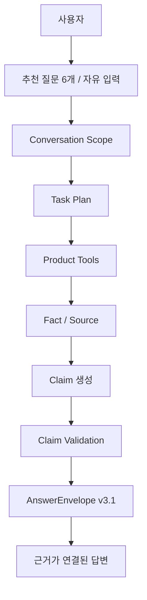

# 04. AI Core · AI Copilot

## 1. AI를 두 영역으로 분리한 이유

프로젝트 초기에 “LLM/RAG”라는 하나의 영역으로 생각하기 쉬웠지만, 실제 제품에서는 서로 다른 두 문제가 있었습니다.

### AI Core

> 공고문에서 **판정에 사용할 Requirement와 Evidence를 얼마나 정확하고 안전하게 구조화할 것인가?**

### AI Copilot

> 이미 계산된 Product 결과와 현재 공고문 근거를 사용자가 **자연어로 어떻게 안전하게 탐색할 것인가?**

이 둘을 분리함으로써 Copilot이 별도의 참가자격 판정기를 만드는 구조를 피했습니다.

---

## 2. AI Core

### 입력

- 공고 메타데이터
- 첨부문서
- extracted_blocks

### 처리 흐름

```text
Document Parsing
→ Semantic Chunking
→ Eligibility Section / Keyword Candidate
→ LLM Structured Extraction
→ Grounding Validation
→ Canonical Mapping / Normalization
→ Requirement + Evidence
```

### 출력

- Requirement
- Evidence
- 분석 상태 / diagnostic
- deterministic Rule의 입력

### 핵심 안전 원칙

- 원문에 없는 세부값을 만들지 않음
- 근거를 추적할 수 없는 Requirement는 확정적으로 사용하지 않음
- 복합·예외 조건을 단순화해 잘못된 확정 판정으로 연결하지 않음
- 최종 자격상태는 AI Core가 아니라 Rule Engine이 결정

---

## 3. AI Copilot의 역할

Copilot은 저장된 Product 상태를 업무 언어로 연결합니다.

사용자가 실제로 묻는 질문:

- “우리 회사 참가 가능해?”
- “왜 확인 필요야?”
- “두 번째 조건의 원문 보여줘.”
- “무엇이 바뀌었어?”
- “우리 회사에는 어떤 영향이 있어?”
- “준비해야 하는 서류와 기한은?”
- “아직 확인하지 못한 건 뭐야?”

## 4. Current Copilot 구조



### Product Read Tool

```text
READ_JUDGMENT
READ_PROFILE
READ_CHECKS
READ_DOCUMENT
READ_CHANGES
```

## 5. Guided Job 2종 · 질문 6개

### 변경 공고 대응

1. 무엇이 바뀌었나요?
2. 우리 회사에 어떤 영향이 있나요?
3. 무엇을 확인해야 하나요?

### 입찰 참여 준비

1. 필요한 서류·기한·방법은?
2. 준비 순서는?
3. 아직 확인하지 못한 것은?

추천 질문의 Tool 범위와 완료 조건은 Frontend 버튼이 아니라 서버 계약에서 관리합니다.

자유 입력도 함께 지원합니다.

---

## 6. Conversation / Context

v3.1은 대화를 단순 문자열 history로만 다루지 않습니다.

```text
Scope
Fact
Source
Target
Claim
Conversation Revision
```

을 구분합니다.

예를 들어 사용자가:

> “두 번째는 왜?”

라고 물었을 때 과거 메시지 전체를 사실로 믿는 대신, 직전 응답에서 실제로 보여준 Target을 확인하고 현재 Product Source를 다시 읽습니다.

Scope가 달라졌거나 자료가 갱신되면 과거 target을 그대로 연결하지 않습니다.

---

## 7. Fact / Source / Claim Validation

### Fact

```text
SERVER_RESULT
NOTICE_FACT
PROFILE_FACT
USER_ASSERTION
ASSUMPTION
```

### Source

```text
DOCUMENT
PRODUCT
TURN
```

### Claim Validation

```text
SUPPORTED
CONTRADICTED
INSUFFICIENT
UNCHECKED
```

모델이 작성한 문장이 fact ID를 갖고 있다는 이유만으로 신뢰하지 않습니다.

- 참조가 실제 존재하는지
- 같은 Case / Company / Version인지
- 해당 Source가 그 Fact에 연결되는지
- 수치·단위·기간·부정·예외·주어가 맞는지

를 검사합니다.

지원되지 않는 Claim은 제거하거나 PARTIAL로 반환합니다.

---

## 8. Product Judgment와 Document Retrieval의 경계

### 참가 가능 여부

Source of Truth:

```text
저장된 Qualification Judgment Run
```

### 공고문 일반 질문

Current v3.1:

```text
현재 Version Source Snapshot
→ index readiness
→ READY + 일반 질문: Hybrid
→ broad 질문: current sections
→ 필요 시 lexical fallback
→ Fact / Source
→ Claim Validation
```

즉 “RAG가 회사 참가 가능 여부를 결정”하지 않습니다.

---

## 9. Write Safety

Copilot은 대화 중 사용자의 자연어를 바로 저장 명령으로 취급하지 않습니다.

```text
/chat
→ Read / Explain / Proposal

/actions/confirm
→ 명시적 확인
→ 최신 provenance 확인
→ Product Service 실행
```

따라서:

- “응”만으로 저장하지 않음
- stale Proposal 재사용 방지
- 저장 성공 여부가 불명확하면 자동 재실행하지 않음
- Ask-back / Revalidation의 기존 Product Service 재사용

을 유지합니다.

---

## 10. 개발 과정

```text
Prototype
판정과 서술 분리
↓
v1
Product Tool + Proposal / Confirm
↓
E0
자유입력 기준선 측정
↓
E1
bounded UX / deterministic 개선
↓
E2
Semantic Routing
↓
E3
Document Retrieval / Prompt 개선
↓
v3.1
Fact / Source / Claim Validation
↓
Current
Guided Job 2종·6문항 + 자유입력
```

## 11. 핵심 문장

> **판정은 코드가 담당하고, Copilot은 검증된 사실과 근거를 조회·설명·연결한다.**

## 12. 관련 문서

- [시스템 아키텍처](./02-시스템-아키텍처.md)
- [테스트·평가](./05-테스트-평가.md)
- [트러블슈팅](./07-트러블슈팅.md)
