# DB ERD · Current

> Status: Current Model / Migration Reference · 운영 DB 적용 상태 미검증
> Implementation Baseline: `gyuniverse-hq/bid-change-validator` `develop@36f1afba8e1a025006b0bfa1876502e6232b3d28`

## 1. 기준과 범위

SQLAlchemy Model과 Alembic migration을 기준으로 핵심 저장 관계를 설명합니다. 개발 ERD 문서의 001~009 요약은 과거 범위이며 현재 repository migration head는 **`022_notice_history_backfill`**입니다. 코드에 migration이 있다는 사실과 공용·운영 DB에 적용됐다는 사실은 구분합니다.

아래 선은 **실제 FK만** 그린 핵심 ERD입니다. FK 하나의 부모는 1개, 부모당 자식은 0개 이상이며 nullable·unique 관계는 별도로 표시합니다. 가독성을 위해 전체 컬럼과 보조 FK는 표에서 보충합니다.

## 2. 핵심 ERD

```mermaid
erDiagram
    bid_notices ||--o{ bid_notice_versions : notice_id
    bid_notice_versions ||--o{ notice_documents : notice_version_id
    bid_notice_versions ||--o{ qualification_analysis_runs : notice_version_id
    qualification_analysis_runs ||--o{ qualification_requirements : analysis_run_id
    qualification_analysis_runs ||--o{ qualification_evidence : analysis_run_id
    companies |o--o{ preflight_cases : company_id
    bid_notices ||--o{ preflight_cases : notice_id
    bid_notice_versions ||--o{ preflight_cases : current_version_id
    bid_notice_versions |o--o{ preflight_cases : baseline_version_id
    preflight_cases ||--o{ proposal_documents : case_id
    preflight_cases ||--o{ qualification_judgment_runs : preflight_case_id
    qualification_analysis_runs ||--o{ qualification_judgment_runs : analysis_run_id
    companies ||--o{ qualification_judgment_runs : company_id
    bid_notice_versions ||--o{ qualification_judgment_runs : notice_version_id
    qualification_judgment_runs ||--o{ qualification_judgments : judgment_run_id
    preflight_cases ||--o{ qualification_answers : preflight_case_id
    qualification_judgment_runs ||--o{ qualification_answers : source_judgment_run_id
    qualification_judgment_runs |o--o{ qualification_answers : result_judgment_run_id
    preflight_cases ||--o{ qualification_revalidation_runs : preflight_case_id
    qualification_judgment_runs ||--o{ qualification_revalidation_runs : source_judgment_run_id
    qualification_judgment_runs ||--o{ qualification_revalidation_runs : result_judgment_run_id
    qualification_analysis_runs ||--o{ qualification_revalidation_runs : baseline_analysis_run_id
    qualification_analysis_runs ||--o{ qualification_revalidation_runs : current_analysis_run_id
    companies ||--o{ company_industries : company_id
    companies ||--o{ company_performances : company_id
    company_performances ||--o{ company_performance_fields : performance_id
    companies ||--o{ company_certifications : company_id
    companies ||--o| company_staff : company_id
    companies ||--o{ company_staff_roles : company_id
    companies ||--o| company_qualification_profile_completeness : company_id
    bid_notices ||--o| notice_history_backfill_jobs : notice_id
    bid_notice_versions ||--o{ notice_facts : notice_version_id
```



## 3. 물리 FK와 논리적 원문 추적 구분

```text
Notice → Version → Document
                 → Analysis → Requirement / Evidence
Company + Case + Analysis → Judgment Run → Judgment
                          → Answer → result Judgment Run
baseline/current Analysis + source Judgment → Revalidation → result Judgment
```

| 연결 | 실제 저장·해석 |
| --- | --- |
| Document → Analysis | 직접 FK 없음. 동일 `notice_version_id`의 문서 blocks를 Analysis 입력으로 사용 |
| Requirement → Evidence | `evidence_keys` JSONB의 논리 참조. 두 테이블은 각각 `analysis_run_id` FK를 가짐 |
| Evidence → Document | `document_id`는 Text이며 FK가 아님. source type·Version·hash·location과 함께 코드에서 검증 |
| Judgment → Requirement | `requirement_key` Text + Run의 `analysis_run_id`로 해석. 직접 Requirement FK 없음 |
| Answer → Judgment | source/result **Judgment Run** FK. 개별 Judgment row의 자식 테이블로 그리지 않음 |
| Revalidation → Answer | 직접 FK 없음. 재검증은 source Judgment provenance를 승계할 수 있으나 Answer가 필수 단계는 아님 |

## 4. 주요 키·제약·상태

| Entity | 핵심 보존값·제약 |
| --- | --- |
| `bid_notices` | 공고번호 `bid_notice_no` unique |
| `bid_notice_versions` | notice별 version_number / payload_hash / bid_notice_order 각각 unique. version_number > 0 |
| `notice_documents` | Version FK, 원문 저장 key, download/extraction 상태, file hash와 text hash |
| `qualification_analysis_runs` | Version FK, contract_version, analysis_kind, target_chunk_ids, diagnostics, dropped_requirements. 상태 SUCCEEDED/PARTIAL/FAILED |
| `qualification_requirements` | (analysis_run_id, requirement_key) unique; Canonical type/operator/value, role, complexity, raw, evidence_keys |
| `qualification_evidence` | (analysis_run_id, evidence_key) unique; document/chunk/location/quote와 원문·text hash |
| `qualification_judgment_runs` | Case/Analysis/Company/Version FK, rule_version, reference_date, profile_snapshot, analysis_status, overall_status |
| `qualification_judgments` | (judgment_run_id, requirement_key) unique; 3상태 + basis_type + value_source + evidence_status + unknown_reason |
| `qualification_answers` | (source_judgment_run_id, requirement_key) unique; answer_json, normalized_value, evidence_held, apply_to_profile, nullable result Run |
| `qualification_revalidation_runs` | baseline/current Analysis와 source/result Judgment FK; changes, revalidated_keys |
| `notice_history_backfill_jobs` | notice_id unique; PENDING/RUNNING/COMPLETED/FAILED, attempts, next_attempt_at, error |
| `notice_collection_runs` | 수집 실행 계수·기간·실패 건수. Notice마다 하나의 FK 자식인 것처럼 표현하지 않음 |

개별 Judgment는 `SATISFIED / UNSATISFIED / UNKNOWN`, 전체는 `eligible / ineligible / insufficient_data`입니다. `basis_type=PROFILE / USER_ANSWER / NONE`은 결과 상태와 별개입니다. `evidence_status=declared`는 증빙 보유 진술이지 독립 검증이 아닙니다. `unknown_reason`은 UNKNOWN일 때 반드시 존재하도록 check constraint가 있습니다.

## 5. Company Current Profile ≠ Historical Judgment Profile Snapshot

현재 회사의 업종·실적·인증·인력·completeness를 JSON snapshot으로 고정해 Judgment Run에 저장합니다. 회사 테이블을 수정해도 기존 snapshot은 소급 변경하지 않습니다. 재검증은 현재 snapshot과 source snapshot을 비교하며 다르면 전체 재판정을 요구합니다. Rule v0.3과 기준일도 함께 검사합니다.

Ask-back의 `apply_to_profile` 컬럼이 존재해도 `true`가 제품에서 허용된다는 뜻은 아닙니다. 현재 서비스는 이를 거부하고 답변을 Case의 `USER_ANSWER` 근거로 기록합니다.

## 6. Migration 범위와 보조 Entity

| Revision 범위 | 도입·변경 |
| --- | --- |
| 001~005 | 회사 Profile, Notice/Version, 원문 저장, text extraction, Case/Proposal |
| 006~009 | Analysis/Requirement/Evidence, Judgment, Answer, Revalidation |
| 010~014 | 회사 SW 인력, 계약 위험조항 저장·분류, 지체상금, dropped requirements |
| 015~016 | 재공고 관계 `notice_relations`, Version별 `notice_facts` |
| 017~018 | Requirement role/complexity, Judgment provenance/unknown reason, Profile 사실 확장 |
| 019~021 | 인증 테이블, 공고 변경이력, 사용자·회사 연결 |
| 022 | 차수 unique, durable history backfill, 수집 failed_item_count |

마스터 업종·품목·기관 코드, auth user/session, 계약 위험조항과 변경이력은 실제 보조 모델입니다. `notice_relations`의 API_FIELD/NAME_AGENCY_PRICE/MANUAL 및 CONFIRMED/SUGGESTED 허용값만으로 모든 매칭 전략이 제품에서 사용된다고 주장하지 않습니다. 실제 수집 흐름은 [전처리 문서](data-preprocessing.md)를 따릅니다.

## 7. 검증 근거와 한계

- [기본 모델](https://github.com/gyuniverse-hq/bid-change-validator/blob/36f1afba8e1a025006b0bfa1876502e6232b3d28/apps/api/app/models.py)
- [Analysis 모델](https://github.com/gyuniverse-hq/bid-change-validator/blob/36f1afba8e1a025006b0bfa1876502e6232b3d28/apps/api/app/analysis_models.py), [Judgment 모델](https://github.com/gyuniverse-hq/bid-change-validator/blob/36f1afba8e1a025006b0bfa1876502e6232b3d28/apps/api/app/judgment_models.py)
- [Answer 모델](https://github.com/gyuniverse-hq/bid-change-validator/blob/36f1afba8e1a025006b0bfa1876502e6232b3d28/apps/api/app/ask_back_models.py), [Revalidation 모델](https://github.com/gyuniverse-hq/bid-change-validator/blob/36f1afba8e1a025006b0bfa1876502e6232b3d28/apps/api/app/revalidation_models.py)
- [Migration 001~022](https://github.com/gyuniverse-hq/bid-change-validator/tree/36f1afba8e1a025006b0bfa1876502e6232b3d28/apps/api/alembic/versions)

PR #135 통합 CI의 임시 PostgreSQL에서 022까지 upgrade된 로그를 확인했습니다. 공용·운영 DB의 live schema, 데이터 건수, backup 복원은 이번 문서 작업에서 조회·실행하지 않았습니다.
