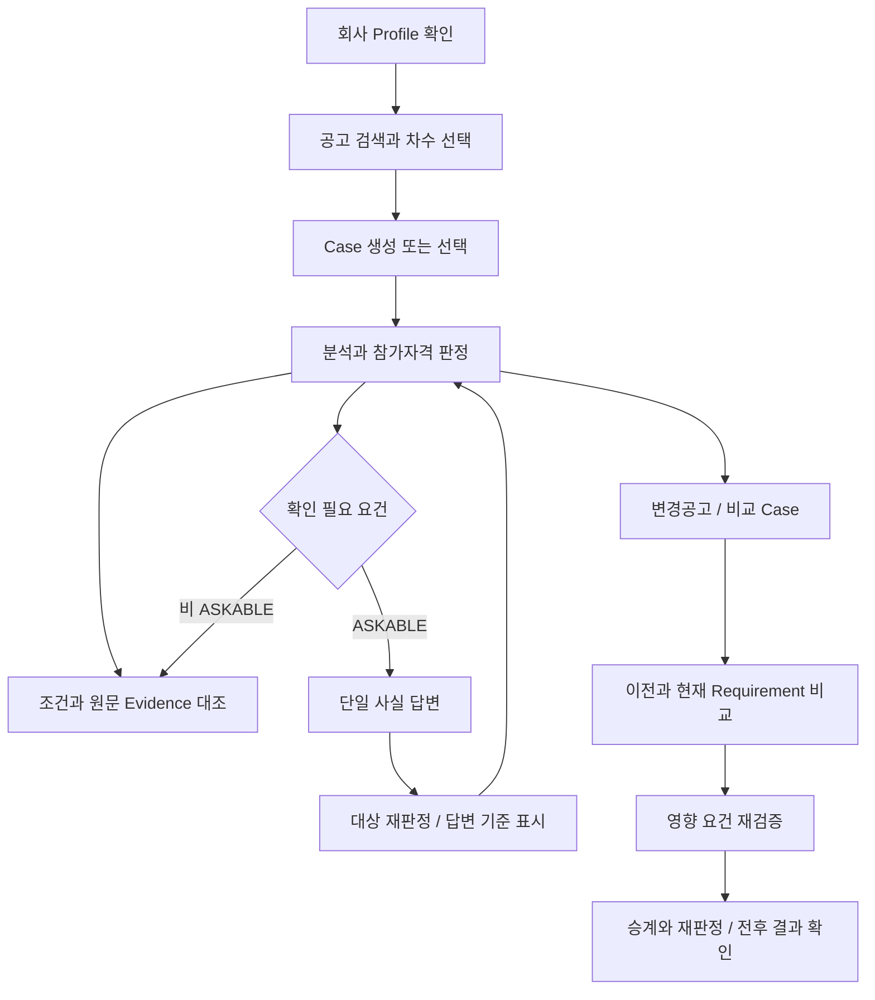

# UX Flow · Case 중심 검토

> Status: Current code reference / Human Click E2E·화면 증거 Validation Pending
> Implementation Baseline: `gyuniverse-hq/bid-change-validator` `develop@36f1afba8e1a025006b0bfa1876502e6232b3d28`

## 1. 목적과 읽는 범위

화면마다 사용자가 확인하는 정보와 다음 행동을 설명합니다. 처리 순서·재검증 guard는 [기능 흐름](../02_architecture/functional-flow.md), 실제 캡처 조건은 [화면 증거 계획](screenshots.md)을 따릅니다. 아래 내용은 현재 코드 확인 결과이며 브라우저에서 모든 흐름을 직접 완료했다는 실행 기록은 아닙니다.

## 2. 화면과 사용자 행동

| Route | 사용자 목적·입력 | 표시·다음 행동 | 구현·검증 경계 |
| --- | --- | --- | --- |
| `/company` | 회사 업종·지역·실적·인력·인증 등 Profile 관리 | 현재 Profile과 completeness 확인 → 공고 탐색 | 저장된 현재 정보와 과거 Judgment snapshot은 별개; 실제 기업 연동 검증은 Pending |
| `/notices` | 공고 검색·상세·차수·Profile Matching 확인 | 회사와 공고 선택 → 검토 Case | 같은 공고의 변경 차수와 취소 여부 확인 필요; 매칭 목록이 최종 참가 판정은 아님 |
| `/qualification?caseId=…` | 선택 Case의 참가자격 검토 | Analysis 진단·전체 결론·개별 조건·회사 값·근거 → Ask-back 또는 원문 | 미분석이면 검토 실행; 일부 분석과 확인 필요를 참가 가능으로 과장하지 않음 |
| `/ask-back?caseId=…` | 안전하게 답할 수 있는 누락 사실 응답 | 질문·답변 → 대상 재판정 → 답변 기준 결과 확인 | UNKNOWN 전체를 질문하지 않음; 답변으로 Profile을 자동 수정하지 않음 |
| `/evidence?caseId=…` | Requirement와 원문 대조 | 인용·문서·위치·원문/추출 텍스트 확인 | `evidence` query로 대상 선택 가능; 문서별 locator·viewer 품질 Human 확인 필요 |
| `/changes?caseId=…` | 이전/현재 조건과 판정 변화 확인 | Diff → 영향 조건 → 재검증 결과·전후 상태 | baseline/current Analysis 필요; Rule·Profile·기준일 불일치 시 전체 재판정 필요 |
| `/evaluation?caseId=…` | 제안서 참고 검토 | 업로드·원문·키워드 후보·사용자 확인 | **Partial**. 전용 평가기준 추출·점수화 없음. 사용자 확인은 화면 로컬 상태이며 확정 평가 결과 저장으로 표현하지 않음 |

이는 7개 제품 Route의 표입니다. `/login`, `/workbench` 등 보조 Route도 코드에 있으므로 애플리케이션 전체 Route가 7개뿐이라는 뜻은 아닙니다.

## 3. 화면 이동

변경 대응에서 사용자가 읽어야 할 것은 단순 Requirement ID가 아니라 **어떤 조건이 달라졌고 기존 준비 상태에 어떤 영향을 주는지**입니다. 비변경 판정 승계와 추가·변경 요건 재판정을 구분하며 삭제는 변경 이력으로 남깁니다. 과거 판정이 없는 비변경 요건은 새로 판정합니다.

## 4. Case·Version과 상태 표시

02~06 화면은 `caseId`를 공유합니다. 공통 loader는 Case → 공고/Version/회사 → current/baseline Analysis → 호환 Judgment → 질문을 조회합니다. Case 변경 시 이전 Case 내용을 표시하지 않도록 응답 세대를 검사합니다. 갱신 실패 시 마지막 확인 내용을 유지할 수 있으며 오류를 함께 표시합니다.

화면에 쓸 Judgment는 현재 선택 Analysis·Version·Company 및 `qualification-rules-v0.3`과 일치해야 합니다. Backend 재검증 guard가 Profile snapshot·기준일 등 추가 조건을 검증합니다. Frontend의 단순 최신 생성순 선택만으로 모든 호환성을 보장한다고 설명하지 않습니다.

| 층위 | 사용자 표시·행동 |
| --- | --- |
| Loading / Empty / Error | 조회·검토 진행과 결과 없음, 조회 실패를 구분. 빈 요건 목록에서 검토 실행 동선 제공 |
| Analysis | SUCCEEDED 분석 완료 / PARTIAL 일부만 읽음 / FAILED 첨부 읽기 실패. 누락 진단을 결과와 함께 확인 |
| 개별 Judgment | SATISFIED 충족 / UNSATISFIED 미달 / UNKNOWN 확인 필요 |
| 미판정 UI | UNJUDGED 미판정은 화면 표현이며 네 번째 Domain Judgment가 아님 |
| Provenance | PROFILE 회사 프로필 기준 / USER_ANSWER 귀사 답변 기준 / NONE 근거 없음 |
| 전체 결론 | eligible 참가 가능 / ineligible 참가 불가 / insufficient_data 확인 필요. PARTIAL을 참가 가능으로 승격하지 않음 |
| Evidence 위치 | Backend `location.display` → clause label → 실제 page 순으로 표시. 없는 PDF page를 HWP에 만들어 붙이지 않음 |

## 5. Copilot 보조 흐름

현재 Case를 사용하는 Copilot panel과 action card가 구현돼 있습니다. 현재 판정·누락 정보·근거·변경 관련 지원 범위는 [시나리오 D](../08_qa_reports/test-scenarios.md)와 [AI Pipeline](../03_ai/llm-rag-pipeline.md)에 정리했습니다.

문서 QA는 현재 Version 범위의 공개 첨부를 사용하며 필요 시 동의를 받습니다. 상태 변경 작업은 제안 후 확인 단계로 실행합니다. 대화 문맥은 참조 해석용이며 사실은 Backend에서 다시 조회합니다. 사용자 Task 성공률·모든 실패 복구 동선·최종 화면 증거는 Validation Pending입니다.

## 6. 근거와 남은 검수

- [공통 Case loader](https://github.com/gyuniverse-hq/bid-change-validator/blob/36f1afba8e1a025006b0bfa1876502e6232b3d28/apps/web/lib/case-workspace.ts), [상태 문구](https://github.com/gyuniverse-hq/bid-change-validator/blob/36f1afba8e1a025006b0bfa1876502e6232b3d28/apps/web/lib/status-copy.ts)
- [화면 코드](https://github.com/gyuniverse-hq/bid-change-validator/tree/36f1afba8e1a025006b0bfa1876502e6232b3d28/apps/web/app), [Copilot components](https://github.com/gyuniverse-hq/bid-change-validator/tree/36f1afba8e1a025006b0bfa1876502e6232b3d28/apps/web/components/copilot)
- [개발 화면 계약](https://github.com/gyuniverse-hq/bid-change-validator/blob/36f1afba8e1a025006b0bfa1876502e6232b3d28/docs/05_ui_ux/frontend-screen-contract.md)은 v0.2 Rule 및 Copilot Proposed 문구가 남아 있어 해당 부분은 현재 코드로 대체했습니다.

Phase 2에서 Case 이동, 새로고침, PARTIAL/오류, Ask-back 후 provenance, 실제 HWP/PDF 원문 이동, 변경 전후 표시를 직접 확인하고 [Human 시나리오](../08_qa_reports/test-scenarios.md)의 결과와 캡처를 연결합니다.
